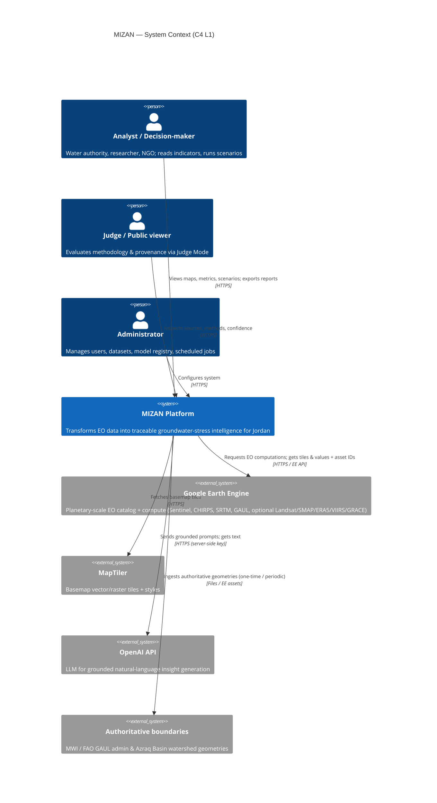
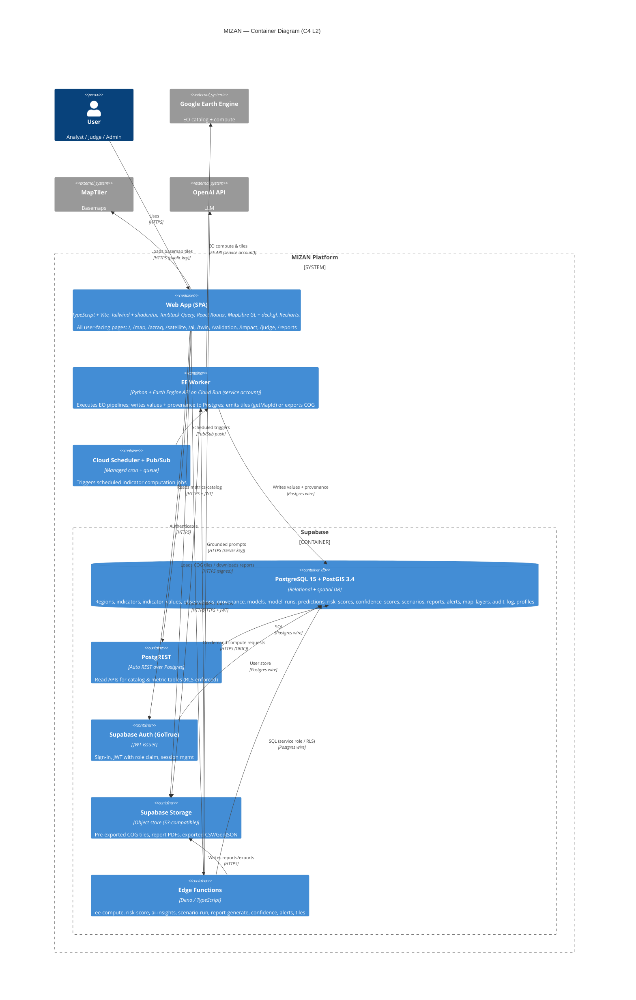
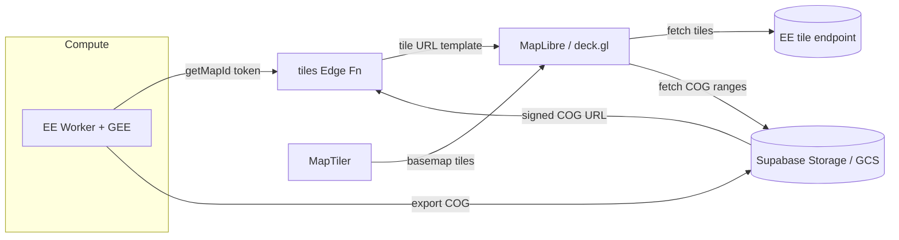
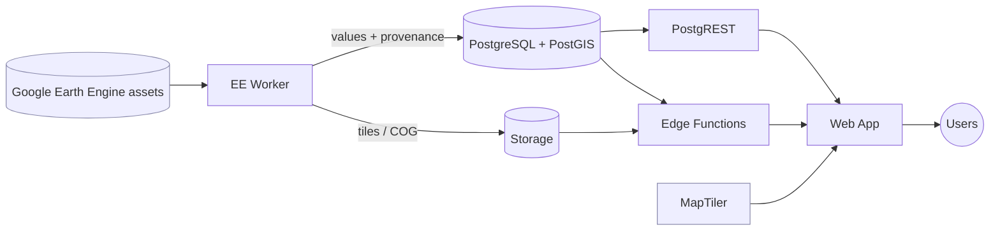
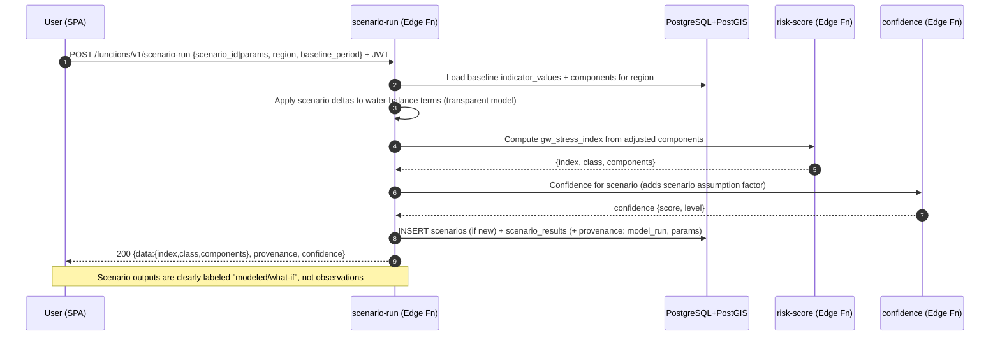
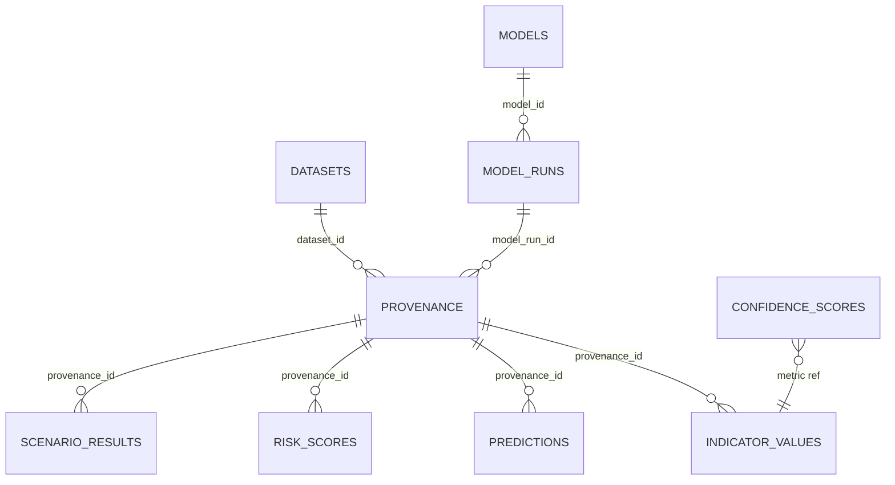
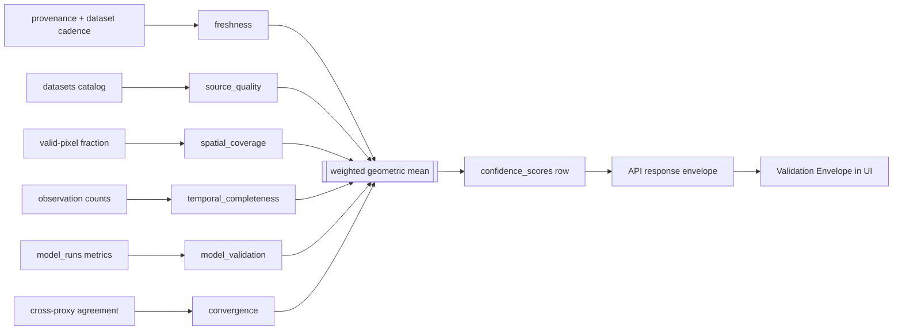

# 03 — System Architecture

| | |
|---|---|
| **Document** | 03 — System Architecture |
| **Project** | MIZAN — Earth Observation Environmental Intelligence for Jordan |
| **Version** | 0.1 (Draft) |
| **Status** | Phase 1 — Specification |
| **Last updated** | 2026-06-10 |
| **Related** | [01-project-overview](./01-project-overview.md) · [02-problem-definition](./02-problem-definition.md) · [04-data-sources](./04-data-sources.md) · [05-earth-engine-pipelines](./05-earth-engine-pipelines.md) · [07-machine-learning](./07-machine-learning.md) · [08-risk-scoring](./08-risk-scoring.md) · [09-confidence-engine](./09-confidence-engine.md) · [10-digital-twin](./10-digital-twin.md) · [11-database-schema](./11-database-schema.md) · [12-api-specification](./12-api-specification.md) · [15-report-generator](./15-report-generator.md) · [16-validation-framework](./16-validation-framework.md) · [17-security](./17-security.md) · [18-deployment](./18-deployment.md) |

**Purpose.** This document defines the end-to-end system architecture for MIZAN (Arabic: ميزان, "balance/scale"), the platform that transforms Earth Observation (EO) data into transparent environmental intelligence for Jordan, with a primary focus on **groundwater-stress monitoring** and a demonstration focus on the **Azraq Basin**. It is the authoritative reference for how the frontend, the Supabase backend, the Google Earth Engine (GEE) compute tier, the AI proxy, and the mapping/tiling stack fit together; how data flows from satellite assets to user-facing metrics; and how **provenance** and **confidence** are carried through every layer. It is a contract document: sibling docs (data sources, pipelines, schema, API, security, deployment) refine the components named here but must not contradict the boundaries, names, and flows defined here.

**Deliverables mapping.** Supports AstroCode deliverables: **Functional Prototype** (component & deployment topology), **Data Explanation** (provenance backbone), **AI/Analytics Method** (compute & ML tiers), **Results Visualization** (frontend & tile pipeline), **Jordanian Use Case** (Azraq + national flows), **Impact Statement** (traceability that makes outputs trustworthy for decision-makers).

---

## 1. Architectural goals & principles

MIZAN's architecture is shaped by one overriding scientific stance (see [02-problem-definition](./02-problem-definition.md)): **MIZAN never directly observes groundwater, wells, the water table, or aquifer pressure.** It *estimates* stress **indicators** from EO proxies combined with a transparent water-balance / risk model. Every architectural decision below serves the goal of making those estimates **traceable, reproducible, and honestly bounded**.

| # | Principle | Architectural consequence |
|---|-----------|---------------------------|
| P1 | **Provenance is mandatory, not optional** | Every stored value (`indicator_values`, `predictions`, `risk_scores`) carries a non-null `provenance_id`. No write path exists that bypasses provenance. See §7. |
| P2 | **Confidence travels with the number** | Every value-returning API response includes a confidence object (score + level + factor breakdown). See §8 and [09-confidence-engine](./09-confidence-engine.md). |
| P3 | **Never fabricate** | The only sources of numbers are: Google Earth Engine, stored datasets, or MIZAN model outputs (themselves derived from the former). No synthetic/placeholder data reaches a user-visible metric. The AI tier is *strictly grounded* over stored metrics + provenance. |
| P4 | **Separation of compute from serving** | Heavy/long-running EO compute runs in an isolated **EE Worker** (Cloud Run). The serving tier (Supabase) stays responsive and stateless-per-request. |
| P5 | **Stateless edge, stateful core** | Edge Functions are stateless orchestrators; durable state lives only in PostgreSQL + Storage. |
| P6 | **Defense in depth + least privilege** | Row-Level Security (RLS) on every table; service-role keys never reach the browser; the GEE service account and OpenAI key live only server-side. Detail deferred to [17-security](./17-security.md). |
| P7 | **Reproducibility** | Provenance records `processing_version`, `parameters` (jsonb), and `ee_asset_id`, so any metric can be recomputed deterministically. |
| P8 | **Graceful degradation** | If EE is slow/unavailable, cached tiles and last-known stored metrics still render, clearly labeled with freshness; confidence's freshness factor drops accordingly. See §13. |
| P9 | **Bilingual, accessible by design** | i18n (EN + AR, RTL) is a first-class concern in the frontend, not an afterthought. |

---

## 2. System context (C4 Level 1)

MIZAN sits between external EO/data providers and three classes of human users (decision-makers/analysts, the public/judges, and administrators). The context diagram shows the system as a single box and its external dependencies.



**Key context facts**
- All external calls that carry secrets (GEE service account, OpenAI key) originate **server-side** (EE Worker or Edge Functions), never the browser.
- MapTiler is the only external service the **browser** talks to directly (for basemap tiles), authenticated with a domain-restricted public key.
- Authoritative boundaries are ingested deliberately and recorded as datasets with provenance; they are **never fabricated** (see [04-data-sources](./04-data-sources.md) §Azraq).

---

## 3. Container architecture (C4 Level 2)



### 3.1 Container responsibilities at a glance

| Container | Runtime | Owns | Does NOT own |
|-----------|---------|------|--------------|
| Web App (SPA) | Browser | Rendering, client cache, map/chart interaction, i18n | Secrets, business rules for scoring, data persistence |
| PostgreSQL + PostGIS | Supabase | Source of truth: all metrics, geometry, provenance, audit | Heavy EO compute |
| PostgREST | Supabase | Auto-generated read API over RLS-protected tables | Mutations to derived metric tables (those go via Edge/Worker) |
| Auth (GoTrue) | Supabase | JWT issuance, role claim, sessions | Authorization rules (those are RLS + function checks) |
| Storage | Supabase | COG tiles, report PDFs, CSV/GeoJSON exports | Tabular metrics |
| Edge Functions | Deno | Orchestration, grounding, validation, response envelope assembly | Long EO compute (delegated to EE Worker) |
| EE Worker | Cloud Run (Python) | EO pipeline execution, tile/COG production, value + provenance writes | Serving user traffic directly |
| Scheduler + Pub/Sub | GCP | Cron cadence, decoupled job delivery | Compute logic |

---

## 4. Component descriptions

### 4.1 Frontend (Web App / SPA)
- **Stack:** React 18 + TypeScript, built with Vite; styling via Tailwind + shadcn/ui (Lovable-generated components); server-state via **TanStack Query**; routing via **React Router**; mapping via **MapLibre GL JS** (vector basemaps from MapTiler) with **deck.gl** overlays for high-volume layers (e.g., point clouds, large polygon sets, heatmaps); charts via **Recharts**; internationalization (**EN + AR**, including RTL layout flipping).
- **Pages** (detailed in [13-ui-pages](./13-ui-pages.md)): `/` National Command Center, `/map`, `/azraq`, `/satellite`, `/ai`, `/twin`, `/validation`, `/impact`, `/judge`, `/reports`.
- **State/caching:** TanStack Query caches PostgREST and Edge-Function responses with per-endpoint `staleTime`/`gcTime`. Query keys encode `(region, indicator, dateRange, lang)`. Mutations (scenario run, report generate) invalidate dependent queries.
- **Responsibility boundary:** The SPA *renders* provenance + confidence that the backend provides; it never *computes* a score or *invents* a number. Every metric widget shows the Validation Envelope (Source, Date, Methodology, Confidence, Explanation).
- **Security posture:** Holds only the Supabase **anon/publishable** key and the MapTiler public key. JWT from Auth is attached to PostgREST/Edge calls. No service-role key, no GEE/OpenAI secret.

### 4.2 Supabase — PostgreSQL 15 + PostGIS 3.4
- The system of record. Stores regions (with PostGIS `geometry`), the datasets and indicators catalogs, time-series `indicator_values`, raw `observations`, `provenance`, the `models`/`model_runs` registry, `predictions`, `risk_scores`, `confidence_scores`, `scenarios`/`scenario_results`, `reports`/`report_sections`, `validation_records`, `alerts`, `map_layers`, `audit_log`, and `public.profiles` (role ∈ {viewer, analyst, admin, judge}).
- Spatial features: GIST indexes on geometry, ST_* functions for AOI clipping and area computation (e.g., `surface_water_extent_km2`), SRID 4326 storage with on-the-fly reprojection where needed.
- Full DDL, indexes, enums, RLS overview, and seed data are specified in [11-database-schema](./11-database-schema.md).

### 4.3 Supabase — Auth
- GoTrue issues JWTs containing a `role` claim mirrored from `public.profiles.role`. RLS policies and Edge Functions read this claim to authorize access. Anonymous read is permitted only for explicitly public, non-sensitive catalog/metric data needed by Judge Mode; everything else requires a valid session. Detail in [17-security](./17-security.md).

### 4.4 Supabase — Storage
- Object buckets for: pre-exported **COG** raster tiles (used when EE `getMapId` ephemeral tiles are undesirable for latency/cost), generated **report PDFs**, and **CSV/GeoJSON** exports. Access is via signed URLs scoped by RLS-equivalent bucket policies.

### 4.5 Supabase — Edge Functions (Deno / TypeScript)
Stateless orchestrators exposed under `/functions/v1/`. Each validates JWT + role, performs its task (often delegating to the EE Worker or OpenAI), assembles the **standard response envelope** (data + provenance + confidence), and may write durable rows + an `audit_log` entry. The eight functions:
1. **ee-compute** — kick off / fetch results of an EO computation for an AOI/region (delegates to EE Worker; persists `indicator_values` + `provenance`).
2. **risk-score** — compute/return `gw_stress_index` (0–100) and class for a region/period from stored components (see [08-risk-scoring](./08-risk-scoring.md)).
3. **ai-insights** — generate grounded natural-language explanations strictly over stored metrics + provenance (OpenAI proxy; server-side key).
4. **scenario-run** — apply user "what-if" parameters to the water-balance/risk model; persist `scenario_results`.
5. **report-generate** — assemble a report (sections + figures) and export a PDF to Storage.
6. **confidence** — compute the weighted geometric-mean confidence for a metric (see [09-confidence-engine](./09-confidence-engine.md)).
7. **alerts** — evaluate alert rules against latest metrics; create `alerts` rows.
8. **tiles** — broker map tiles: return an EE `getMapId` tile template or a signed COG URL for `map_layers`.

Full request/response schemas: [12-api-specification](./12-api-specification.md).

### 4.6 Supabase — PostgREST
- Auto-generates RESTful read endpoints (`/rest/v1/<table>`) over RLS-protected tables. Used by the SPA for catalog reads and metric queries with filtering, ordering, pagination, and embedded resource expansion (e.g., a metric joined to its provenance). Mutations to *derived* tables are restricted; they flow through Edge Functions / EE Worker so provenance is always attached.

### 4.7 EE Worker (Cloud Run + Google Earth Engine)
- A containerized **Python** service authenticated to GEE with a **service account**. It is the only component that talks to the Earth Engine compute backend. Responsibilities:
  - Build and execute EO pipelines (cloud masking, speckle filtering, indices, anomalies, classification, water-balance terms) per [05-earth-engine-pipelines](./05-earth-engine-pipelines.md) and [06-remote-sensing-methods](./06-remote-sensing-methods.md).
  - Run EE-side ML (`smileRandomForest`) and/or Python ML (scikit-learn / xgboost / IsolationForest, SHAP TreeExplainer) per [07-machine-learning](./07-machine-learning.md).
  - Produce visualization tiles via EE **`getMapId`** (ephemeral) or **export COG** to Cloud Storage / Supabase Storage.
  - Persist results: write `indicator_values` / `predictions` / `model_runs` plus a **provenance** row capturing `ee_asset_id`, `period_start/end`, `processing_method`, `processing_version`, `parameters`, `computed_by`, `created_at`.
- Invoked two ways: **scheduled** (Cloud Scheduler → Pub/Sub → Cloud Run) and **on-demand** (Edge Function `ee-compute` → authenticated HTTPS/OIDC).

### 4.8 OpenAI proxy (within ai-insights Edge Function)
- The OpenAI API key lives only server-side inside the `ai-insights` Edge Function. The function constructs prompts **strictly grounded** on stored metrics + provenance (retrieval, not generation, supplies the facts), forbids fabrication, and attaches the same provenance + confidence envelope to its output so the user can audit the basis of any statement.

### 4.9 MapTiler (external)
- Supplies basemap styles + vector/raster tiles consumed directly by MapLibre GL in the browser, using a domain-restricted public key. MIZAN's own data layers are drawn on top via deck.gl / MapLibre sources fed by the **tiles** Edge Function (EE `getMapId` templates or COG URLs).

### 4.10 Tile pipeline (cross-component)
Two complementary paths (see also §11 caching and [05-earth-engine-pipelines](./05-earth-engine-pipelines.md)):
- **Dynamic path:** EE Worker computes an image → returns a `getMapId` token → `tiles` Edge Function exposes the tile URL template → MapLibre/deck.gl fetch tiles directly from EE's tile endpoint. Best for fresh, parameterized layers.
- **Pre-exported path:** EE Worker exports a **COG** to Storage → a `map_layers` row records its URL/bounds/legend → `tiles` returns a signed COG URL → client renders via a COG/raster source. Best for stable layers needing low latency / predictable cost.



---

## 5. End-to-end data flow (overview)

At the highest level, data moves left-to-right from external EO assets, through compute, into the durable store, and out to users — with provenance and confidence attached at the moment of computation and preserved on every read.



The following subsections give **sequence diagrams** for the five canonical flows.

### 5.1 Scheduled indicator computation
Runs on a cadence (e.g., per Sentinel revisit / CHIRPS update; see [04-data-sources](./04-data-sources.md) freshness) to keep stored indicators current.

```mermaid
sequenceDiagram
  autonumber
  participant CS as Cloud Scheduler
  participant PS as Pub/Sub
  participant EEW as EE Worker (Cloud Run)
  participant GEE as Google Earth Engine
  participant PG as PostgreSQL+PostGIS
  participant CF as confidence (Edge Fn)

  CS->>PS: Publish job {region_set, indicator_set, period}
  PS->>EEW: Push message (OIDC-auth)
  EEW->>PG: Read region geometries + datasets catalog
  EEW->>GEE: Build & run pipeline (cloud mask, speckle filter, indices, anomalies)
  GEE-->>EEW: Reduced values per region (+ ee_asset_id, params)
  EEW->>PG: INSERT provenance {ee_asset_id, period, method, version, params, computed_by}
  EEW->>PG: INSERT indicator_values {region,indicator,date,value,provenance_id}
  EEW->>CF: Request confidence for each new metric
  CF->>PG: Read freshness/coverage/completeness/validation inputs
  CF-->>EEW: confidence {score, level, factors}
  EEW->>PG: UPDATE indicator_values.confidence + INSERT confidence_scores
  EEW->>PG: INSERT audit_log {action: scheduled_compute, counts}
  Note over EEW,PG: Failure at any step → retry w/ backoff; partial writes are transactional per region
```

### 5.2 On-demand AOI analysis
A user draws/selects an Area of Interest and requests fresh indicators.

```mermaid
sequenceDiagram
  autonumber
  participant U as User (SPA)
  participant EC as ee-compute (Edge Fn)
  participant EEW as EE Worker
  participant GEE as Google Earth Engine
  participant PG as PostgreSQL+PostGIS
  participant CF as confidence (Edge Fn)

  U->>EC: POST /functions/v1/ee-compute {aoi GeoJSON, indicators, period} + JWT
  EC->>EC: Validate JWT + role (analyst/admin), validate AOI bounds
  EC->>PG: Upsert ad-hoc region (AOI) row (+ geom)
  EC->>EEW: POST compute {region_id, indicators, period} (OIDC)
  EEW->>GEE: Run pipeline on AOI
  GEE-->>EEW: Values + ee_asset_id + params
  EEW->>PG: INSERT provenance + indicator_values
  EEW-->>EC: {indicator_values[], provenance_ids[]}
  EC->>CF: Compute confidence for results
  CF-->>EC: confidence per metric
  EC->>PG: Persist confidence_scores; audit_log
  EC-->>U: 200 {data:[{value,...}], provenance:[...], confidence:[...]}
  Note over EC,U: If EE Worker exceeds timeout → 202 Accepted + job id; client polls or subscribes
```

### 5.3 AI insight (grounded)
Natural-language explanation that is strictly grounded over stored metrics + provenance.

```mermaid
sequenceDiagram
  autonumber
  participant U as User (SPA)
  participant AI as ai-insights (Edge Fn)
  participant PG as PostgreSQL+PostGIS
  participant OA as OpenAI API

  U->>AI: POST /functions/v1/ai-insights {region, period, question} + JWT
  AI->>AI: Validate JWT + role
  AI->>PG: Retrieve metrics + provenance + confidence for region/period
  AI->>AI: Build grounded prompt (facts injected; "do not fabricate" guardrails)
  AI->>OA: Chat completion (server-side key)
  OA-->>AI: Draft text
  AI->>AI: Post-check: every claim maps to a retrieved fact; strip ungrounded statements
  AI->>PG: Log prompt hash + sources used (audit_log)
  AI-->>U: 200 {data:{text}, provenance:[sources cited], confidence:{aggregate}}
  Note over AI: No stored metric retrieved ⇒ respond "insufficient data", never invent
```

### 5.4 Scenario run (what-if)
User adjusts drivers (e.g., +X% irrigated area, −Y% rainfall) and gets recomputed stress.



### 5.5 Report generation
Assemble a multi-section report (with figures + provenance appendix) and export a PDF.

```mermaid
sequenceDiagram
  autonumber
  participant U as User (SPA)
  participant RG as report-generate (Edge Fn)
  participant PG as PostgreSQL+PostGIS
  participant AI as ai-insights (Edge Fn)
  participant TF as tiles (Edge Fn)
  participant ST as Storage

  U->>RG: POST /functions/v1/report-generate {region, period, sections[], lang} + JWT
  RG->>PG: Gather metrics, risk_scores, validation_records, provenance
  RG->>AI: (optional) Grounded narrative per section
  AI-->>RG: Section text + cited sources
  RG->>TF: Resolve figure tiles/COG snapshots
  TF-->>RG: Image URLs
  RG->>RG: Render report (sections + figures + provenance appendix + confidence)
  RG->>ST: Upload PDF (+ optional CSV/GeoJSON)
  RG->>PG: INSERT reports + report_sections (status, storage_path); audit_log
  RG-->>U: 200 {data:{report_id, url}, provenance:[...], confidence:{aggregate}}
```

---

## 6. Provenance & traceability backbone

Provenance is the spine of MIZAN (Principle P1). The **`provenance`** table records, for every computed value: the originating `source`, the `dataset_id`, the precise `ee_asset_id`, the `period_start`/`period_end`, the `processing_method`, a `processing_version` string, a `parameters` JSONB blob (all tunable inputs), an optional `model_run_id`, who/what computed it (`computed_by`), and `created_at`.



**Guarantees**
- Every value-bearing row (`indicator_values`, `predictions`, `risk_scores`, `scenario_results`) has a **NOT NULL** `provenance_id` FK. The schema in [11-database-schema](./11-database-schema.md) enforces this.
- Because provenance stores `processing_version` + `parameters` + `ee_asset_id` + period, any number is **reproducible**: re-running the same version with the same parameters against the same asset/period yields the same value (subject to EE asset stability).
- The **Validation Envelope** surfaced to users (Source, Date, Methodology, Confidence, Explanation) is assembled directly from provenance + the linked `confidence_scores` row.
- Judge Mode (`/judge`, see [14-judge-mode](./14-judge-mode.md)) renders this backbone so evaluators can trace any displayed number to its asset and method.

---

## 7. Confidence flow

Confidence (Principle P2) is computed by the **confidence** Edge Function (and/or inline in the EE Worker) and stored in `confidence_scores`, with the score also denormalized onto the value row for fast reads. See [09-confidence-engine](./09-confidence-engine.md) for the authoritative algorithm; summarized here for architectural completeness.

**Formula:** weighted **geometric mean** of six factors, each ∈ [0,1]:

| Factor | Weight | Intuition | Primary input |
|--------|--------|-----------|---------------|
| freshness | 0.20 | How recent vs. expected cadence | provenance period vs. dataset cadence ([04](./04-data-sources.md)) |
| source_quality | 0.20 | Sensor/dataset reliability | datasets catalog |
| spatial_coverage | 0.20 | Fraction of region validly observed | EE valid-pixel fraction |
| temporal_completeness | 0.15 | Fraction of expected obs present | observation counts |
| model_validation | 0.15 | Validated model skill | model_runs metrics |
| convergence | 0.10 | Agreement across independent proxies | cross-indicator agreement |

```
confidence = Π_i (factor_i ^ weight_i)        (Σ weight_i = 1.0)
level = High if confidence ≥ 0.80
        Medium if 0.50 ≤ confidence < 0.80
        Low if confidence < 0.50
```



A geometric mean is chosen deliberately so that **any single near-zero factor collapses overall confidence** — e.g., stale data or near-empty spatial coverage cannot be masked by other strong factors.

---

## 8. Caching overview

Caching is layered to keep the UI fast while respecting freshness and provenance.

| Layer | What it caches | Keying | Invalidation | Notes |
|-------|----------------|--------|--------------|-------|
| Browser — TanStack Query | PostgREST + Edge responses | `(endpoint, region, indicator, dateRange, lang)` | `staleTime` expiry; mutation-triggered invalidation | Confidence/provenance cached with the value so envelopes stay consistent |
| HTTP / CDN | Static SPA assets; immutable COG tiles; basemap tiles | URL + content hash | Content-hashed filenames; long max-age for immutable assets | MapTiler tiles cached per its headers |
| Tile layer | EE `getMapId` templates; signed COG URLs | `(layer_id, params, version)` | Token/URL TTL; `map_layers.version` bump | Dynamic vs. pre-exported per §4.10 |
| Database — materialized views | "Latest value per region/indicator", "latest risk per region" | view definition | Refreshed post-ingest (scheduled) | Speeds National Command Center & map |
| Edge memoization | Short-TTL idempotent compute results | request hash | TTL | Prevents duplicate EE Worker calls for identical AOIs in a burst |

**Freshness vs. cache:** caches never hide staleness from the user — the confidence **freshness** factor and the displayed `Date` reflect the *underlying data's* recency, independent of cache age.

---

## 9. Observability overview

(Operational detail in [18-deployment](./18-deployment.md); security-relevant logging in [17-security](./17-security.md).)

- **Application audit:** `audit_log` table records significant actions (scheduled computes, on-demand analyses, scenario runs, report generation, AI calls, admin changes) with actor, action, target, and counts — an in-database, queryable trail aligned with provenance.
- **Logs:** Edge Functions and the EE Worker emit structured JSON logs (request id, region, indicator, duration, EE asset ids, outcome). Cloud Run + Supabase function logs are the primary sinks.
- **Metrics:** request latency/error rates per Edge Function; EE Worker job duration/success; scheduled-job lag; tile cache hit ratio; DB query timings on hot paths.
- **Tracing:** a correlation id is propagated SPA → Edge → EE Worker so a user action can be reconstructed end-to-end.
- **Alerting on the platform itself** (distinct from environmental `alerts`): failed scheduled jobs, EE quota exhaustion, elevated 5xx, and freshness SLO breaches.

---

## 10. Security overview

Summarized here; full treatment in [17-security](./17-security.md).

- **AuthN:** Supabase Auth issues JWTs; the SPA attaches them to PostgREST/Edge calls.
- **AuthZ:** **RLS on every table** keyed on the JWT `role` claim ({viewer, analyst, admin, judge}); Edge Functions additionally enforce role checks before side effects.
- **Secret isolation:** Service-role key, GEE service-account credentials, and OpenAI key exist **only** server-side (Edge Functions / EE Worker / GCP secret manager). The browser holds only the anon key + MapTiler public key (domain-restricted).
- **Worker auth:** Edge → EE Worker calls use OIDC/identity tokens; Cloud Run requires authenticated invocation.
- **Transport:** HTTPS everywhere; signed URLs for Storage objects.
- **AI safety:** ai-insights is grounded-only and logs sources; it cannot return ungrounded claims.
- **Input validation:** AOI GeoJSON size/extent limits, parameter schema validation, and rate limiting on Edge Functions.

---

## 11. Cross-cutting concerns

| Concern | Approach |
|---------|----------|
| **Internationalization** | EN + AR with RTL; all user-facing strings localized; numeric/date formatting locale-aware; AI insights generated in the requested language. |
| **Accessibility** | shadcn/ui components with semantic markup; keyboard navigation; sufficient color contrast for map legends. |
| **Error handling** | Uniform error model (codes + messages) across PostgREST and Edge Functions; see [12-api-specification](./12-api-specification.md). |
| **Idempotency** | On-demand compute keyed by `(aoi hash, indicators, period, version)` to dedupe; report/scenario creation returns existing artifact when inputs match. |
| **Versioning** | API versioned via path (`/rest/v1`, `/functions/v1`); pipeline outputs versioned via `processing_version`; map layers via `map_layers.version`. |
| **Config & secrets** | Environment-scoped config; secrets in GCP Secret Manager / Supabase secrets; never in client bundles. |
| **Data governance** | Dataset licenses/attribution tracked in the datasets catalog ([04](./04-data-sources.md)); authoritative boundaries recorded with provenance. |
| **Time & units** | UTC timestamps in storage; indicators carry canonical units from the indicators catalog ([11](./11-database-schema.md)). |
| **Reproducibility** | `processing_version` + `parameters` + `ee_asset_id` enable deterministic recompute (P7). |

---

## 12. Key architecture decisions (ADR-style)

| ID | Decision | Rationale | Alternatives considered | Trade-offs |
|----|----------|-----------|-------------------------|------------|
| ADR-01 | **Supabase (Postgres+PostGIS) as the core** | One managed platform gives relational + spatial DB, Auth, Storage, REST, and Edge Functions with RLS — minimal ops for a hackathon-to-product trajectory. | Self-hosted Postgres + custom API; Firebase (no PostGIS); raw GCP stack. | Vendor coupling; mitigated by standard Postgres/PostGIS underneath (portable). |
| ADR-02 | **Isolate EO compute in an EE Worker on Cloud Run** | GEE access needs Python + a service account and can be long-running; isolating it protects serving latency and centralizes provenance writes. | Call EE directly from Edge (no mature Deno EE client; secret/runtime mismatch); client-side EE (insecure, infeasible). | Extra hop + deployment surface; justified by security + scalability. |
| ADR-03 | **Provenance + confidence as first-class, mandatory** | The product's credibility rests on traceability and honest uncertainty; enforcing them in schema + envelopes prevents drift. | Best-effort/optional provenance. | Slightly more write complexity; non-negotiable per mission (P1–P3). |
| ADR-04 | **Geometric-mean confidence with six weighted factors** | Penalizes any single weak factor; transparent and explainable to judges. | Arithmetic mean (hides weak factors); opaque ML confidence. | Requires all factor inputs; acceptable and documented in [09](./09-confidence-engine.md). |
| ADR-05 | **Dual tile pipeline (getMapId + pre-exported COG)** | Balances freshness (dynamic) vs. latency/cost (static). | getMapId only (cost/latency); COG only (staleness). | Two code paths; managed via `map_layers` + `tiles` function. |
| ADR-06 | **AI strictly grounded via Edge proxy** | Prevents fabrication; keeps key server-side; every claim auditable. | Client-side LLM calls (key exposure, ungrounded); no AI. | Added retrieval/guardrail logic; essential for trust. |
| ADR-07 | **MapLibre GL + MapTiler + deck.gl** | Open, performant vector maps + GPU overlays for large EO layers; avoids proprietary lock-in. | Mapbox GL (license); Leaflet (weaker vector/3D); Google Maps (cost/fit). | deck.gl learning curve; strong fit for EO visualization. |
| ADR-08 | **Cloud Scheduler → Pub/Sub → Cloud Run for cadence** | Decoupled, retryable, scalable scheduled compute aligned with satellite revisit cadence. | Cron inside one VM (single point of failure); Edge cron (long jobs unfit). | More GCP wiring; pays off in reliability (§13). |
| ADR-09 | **TanStack Query for client server-state** | Caching, dedupe, background refresh, and invalidation out of the box; pairs cleanly with provenance-bearing responses. | Redux/manual fetch; SWR. | Library dependency; standard in the React ecosystem. |
| ADR-10 | **SRID 4326 storage + on-the-fly reprojection** | Interoperability with GeoJSON/EE/clients; PostGIS handles area/area-on-sphere computations. | Storing in a projected CRS. | Reprojection cost on area queries; acceptable, indexed. |

---

## 13. Scalability, availability & failure modes

### 13.1 Scalability
- **Compute scales horizontally:** Cloud Run autoscaling for the EE Worker; Pub/Sub buffers bursts; idempotency dedupes redundant AOI requests. EE's planetary backend does the heavy lifting; MIZAN scales the orchestration around it.
- **Serving scales with Supabase:** PostgREST + Edge Functions scale per the managed tier; read-heavy hot paths use materialized views and client/CDN caching.
- **Spatial scaling:** GIST-indexed geometry + region partitioning of large time-series tables (e.g., `indicator_values` by date range) keep queries fast as history grows.
- **Tiles:** pre-exported COGs + CDN absorb map traffic without re-hitting EE.

### 13.2 Availability
- **Degraded-but-useful:** if the EE Worker or GEE is unavailable, the SPA still serves the **last stored** metrics + cached tiles, clearly labeled by date with reduced freshness confidence — the platform never goes dark for reads.
- **Stateless edge:** Edge Functions hold no session state, so instances are freely replaceable.
- **Durable core:** Postgres + Storage are the only stateful tiers and rely on the managed platform's backups/replication ([18-deployment](./18-deployment.md)).

### 13.3 Failure modes & responses

| Failure | Detection | Response |
|---------|-----------|----------|
| GEE quota/timeout on a job | EE Worker error / duration SLO | Retry with backoff; on-demand returns 202 + job id; scheduled job re-queued via Pub/Sub redelivery; freshness confidence reflects staleness. |
| EE Worker down | Cloud Run health/5xx | Edge `ee-compute` returns graceful error; reads fall back to stored metrics; alert raised on platform. |
| OpenAI unavailable | ai-insights HTTP error | Return metrics + provenance without narrative ("AI explanation temporarily unavailable"); never block the underlying data. |
| Partial pipeline write | Transaction boundary per region | Per-region transactions; failed regions retried; audit_log records partial counts. |
| Stale data beyond SLO | Freshness factor + platform alert | Confidence drops to Low; UI flags "data may be outdated"; scheduler investigated. |
| Tile token expiry | Tile fetch 401/403 | `tiles` re-issues getMapId / re-signs COG URL transparently. |
| RLS/authz error | 401/403 from PG/Edge | Standard error envelope; no data leakage; audited. |
| Bad AOI input | Schema/extent validation | 400 with clear message; no EE call made. |

---

## 14. Document references

- Data lineage & licenses: [04-data-sources](./04-data-sources.md)
- Pipeline internals & tiling: [05-earth-engine-pipelines](./05-earth-engine-pipelines.md), [06-remote-sensing-methods](./06-remote-sensing-methods.md)
- ML & SHAP: [07-machine-learning](./07-machine-learning.md)
- Risk model: [08-risk-scoring](./08-risk-scoring.md)
- Confidence algorithm: [09-confidence-engine](./09-confidence-engine.md)
- Digital twin / scenarios: [10-digital-twin](./10-digital-twin.md)
- Schema & DDL: [11-database-schema](./11-database-schema.md)
- API contracts: [12-api-specification](./12-api-specification.md)
- UI pages: [13-ui-pages](./13-ui-pages.md)
- Judge Mode: [14-judge-mode](./14-judge-mode.md)
- Reports: [15-report-generator](./15-report-generator.md)
- Validation: [16-validation-framework](./16-validation-framework.md)
- Security: [17-security](./17-security.md)
- Deployment/ops: [18-deployment](./18-deployment.md)
- AstroCode compliance: [19-astrocode-compliance](./19-astrocode-compliance.md)
- Limitations: [20-limitations](./20-limitations.md)
