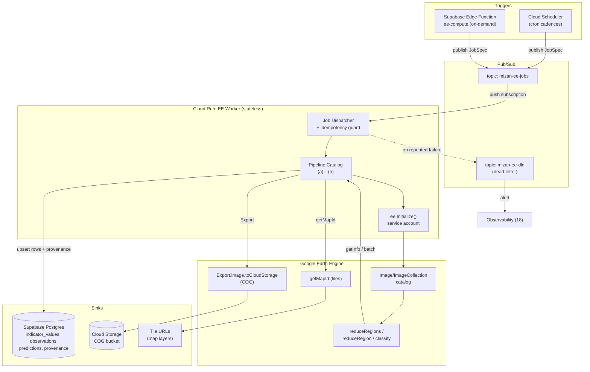
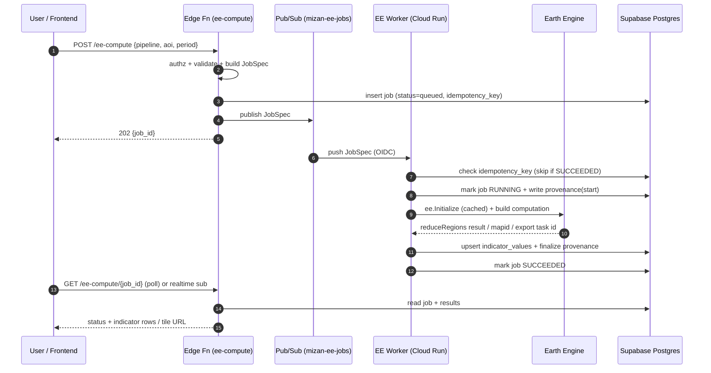

# 05 — Earth Engine Pipelines

| Field | Value |
|---|---|
| Document | 05 — Earth Engine Pipelines |
| Project | MIZAN — Earth Observation Environmental Intelligence for Jordan |
| Version | 0.1 (Draft) |
| Status | Phase 1 — Specification |
| Last updated | 2026-06-10 |
| Related | [03 — System Architecture](./03-system-architecture.md), [04 — Data Sources](./04-data-sources.md), [06 — Remote Sensing Methods](./06-remote-sensing-methods.md), [07 — Machine Learning](./07-machine-learning.md), [08 — Risk Scoring](./08-risk-scoring.md), [09 — Confidence Engine](./09-confidence-engine.md), [11 — Database Schema](./11-database-schema.md), [12 — API Specification](./12-api-specification.md), [16 — Validation Framework](./16-validation-framework.md), [18 — Observability & Operations](./18-observability-operations.md) |

## Purpose

This document specifies the **Google Earth Engine (GEE) compute layer** of MIZAN: how the **EE Worker** is deployed, authenticated, orchestrated, and how every individual analytical **pipeline** ingests Earth Observation imagery, derives the indicators defined in the canonical architecture contract, and writes traceable results (with full provenance) into Supabase Postgres. It is the operational counterpart to the scientific methodology in [06 — Remote Sensing Methods](./06-remote-sensing-methods.md): document 06 defines *what* each algorithm computes and *why*; this document defines *how* it runs at scale, on schedule, and under cost/quota constraints.

**Scientific stance reminder.** MIZAN *estimates* groundwater-stress **indicators** from EO proxies. None of these pipelines observe groundwater, wells, or aquifer pressure directly. Every pipeline is constrained by the **non-negotiable rule**: *never fabricate data; every number originates from Earth Engine / stored datasets / model outputs and is traceable via the `provenance` table.* Literature values appear only as `[ref]` external context.

**Deliverables mapping.** This document supports the ASTROCODE deliverables: **Functional Prototype** (the EE Worker and pipeline catalog), **Data Explanation** (input asset specifications per pipeline), **AI/Analytics Method** (RF / feature-export pipelines feeding [07](./07-machine-learning.md)), and **Results Visualization** (`getMapId` tiles + COG exports).

---

## 1. EE Worker Architecture

### 1.1 Overview

The **EE Worker** is a stateless, containerized service on **Google Cloud Run** that holds an authenticated Earth Engine session and exposes a small internal HTTP surface plus a Pub/Sub-triggered execution path. It is the *only* component in MIZAN permitted to call the Earth Engine Python API. All EE access funnels through it so that authentication, quota accounting, idempotency, and provenance capture are centralized.



### 1.2 Runtime and deployment

- **Platform:** Cloud Run service `mizan-ee-worker` (region `europe-west1` or nearest with EE+GCS locality; AOI is Jordan).
- **Concurrency:** `--concurrency=1` per instance. EE batch/interactive calls are heavyweight and stateful per-session; serializing requests per instance avoids interleaving long `getInfo()` blocking calls and makes quota accounting deterministic. Horizontal scale-out (multiple instances) handles parallel jobs; min instances `0` (scale-to-zero) for cost, with optional `min-instances=1` during scheduled batch windows.
- **CPU/memory:** 2 vCPU / 4–8 GiB. EE does the heavy lifting server-side; worker memory is dominated by result marshalling (`getInfo` payloads) and tabular post-processing.
- **Timeout:** Cloud Run request timeout set to the max (3600 s) for batch jobs; long EE **Export** tasks are *not* awaited synchronously (see §1.8).
- **Container:** Python 3.11 base, `earthengine-api`, `google-cloud-pubsub`, `google-cloud-storage`, `supabase` (or `psycopg`), `numpy`, `scipy` (gamma fit for SPI). Tabular ML libs (`xgboost`, `scikit-learn` IsolationForest, `shap`) are also installed here because per the contract **tabular ML runs in the worker**, not in EE.

### 1.3 Service-account authentication and `ee.Initialize`

EE is authenticated via a **GEE-registered service account**. The service-account key is **not** baked into the image; it is mounted from **Secret Manager** at runtime. Initialization is performed once per process (cold start) and reused across requests handled by that instance.

```python
# ee_session.py  (ILLUSTRATIVE)
import ee, json, os
from google.oauth2 import service_account

_INITIALIZED = False

def init_ee():
    """Idempotent EE initialization with a GEE service account.
    Key is injected via Secret Manager -> env var (never committed)."""
    global _INITIALIZED
    if _INITIALIZED:
        return
    sa_info = json.loads(os.environ["EE_SA_KEY_JSON"])   # from Secret Manager
    scopes = [
        "https://www.googleapis.com/auth/earthengine",
        "https://www.googleapis.com/auth/devstorage.read_write",  # COG export
    ]
    creds = service_account.Credentials.from_service_account_info(sa_info, scopes=scopes)
    ee.Initialize(
        credentials=creds,
        project=os.environ["GCP_PROJECT_ID"],
        opt_url="https://earthengine-highvolume.googleapis.com",  # high-volume endpoint
    )
    _INITIALIZED = True
```

> **High-volume endpoint.** Batch `reduceRegions` over many features and many dates is throughput-bound. The `earthengine-highvolume.googleapis.com` endpoint is used for automated/parallel workloads; the standard endpoint is reserved for low-rate interactive needs. This choice is recorded in `provenance.parameters` (`{"ee_endpoint": "highvolume"}`).

### 1.4 Job specification (JobSpec) contract

Every unit of work is a **JobSpec** JSON message. It is the single source of truth for what a job does and is echoed (verbatim, minus secrets) into `provenance.parameters`.

```jsonc
// JobSpec (published to Pub/Sub topic mizan-ee-jobs)
{
  "job_id": "uuid-v4",                  // unique per logical request
  "idempotency_key": "s2-indices:azraq:2026-05:v1.3.0", // deterministic
  "pipeline": "s2_indices_composite",    // one of the catalog ids
  "aoi": { "type": "gaul", "level": 2, "code": "JO.11.* " }, // or geojson
  "period_start": "2026-05-01",
  "period_end":   "2026-05-31",
  "parameters": { "scale_m": 10, "cloud_prob_max": 40, "composite": "median" },
  "outputs": ["indicator_values", "mapid"], // requested sinks
  "processing_version": "1.3.0",         // pipeline code version (semver)
  "priority": "batch",                    // "batch" | "interactive"
  "requested_by": "scheduler|edge|user:<id>"
}
```

### 1.5 Orchestration: Cloud Scheduler → Pub/Sub, and on-demand `ee-compute`

There are exactly **two ingress paths**, both converging on the same Pub/Sub topic so the execution path is identical:

1. **Scheduled (batch).** **Cloud Scheduler** jobs (one per pipeline cadence; see the catalog) publish a JobSpec to **Pub/Sub** topic `mizan-ee-jobs`. Cadences are pipeline-specific (e.g., S2 composites monthly, CHIRPS aggregation daily/pentad, GRACE monthly).
2. **On-demand (interactive).** The **Supabase Edge Function `ee-compute`** validates and authorizes a user request (e.g., "compute MNDWI map for Azraq for this month"), then publishes the same JobSpec shape to `mizan-ee-jobs` with `priority: "interactive"`. The Edge Function does **not** call EE itself; it only enqueues, returning `202 Accepted` + `job_id` so the frontend can poll job status / subscribe to the resulting `indicator_values` rows or tile URL.

Pub/Sub delivers via a **push subscription** to the Cloud Run worker's `/pubsub` endpoint (authenticated with an OIDC token bound to a dedicated invoker service account). Push (vs pull) gives Cloud Run native autoscaling on backlog.



### 1.6 Idempotency keys

Pub/Sub guarantees **at-least-once** delivery; Cloud Scheduler can fire duplicates; users can double-click. The worker MUST be idempotent.

- The **`idempotency_key`** is deterministic from `(pipeline, aoi_signature, period, processing_version, salient_parameters)`. Example: `s2-indices:JO.11.*:2026-05:scale10:cloud40:v1.3.0`.
- A unique index on `jobs(idempotency_key)` (see [11](./11-database-schema.md)) provides a guard. On receipt:
  1. `INSERT ... ON CONFLICT (idempotency_key) DO NOTHING RETURNING id`.
  2. If no row returned and the existing job is `SUCCEEDED`, **ack and skip** (return 200 so Pub/Sub stops redelivering).
  3. If the existing job is `RUNNING` and younger than the lease timeout, **ack and skip** (another instance owns it).
  4. If `RUNNING` but stale (lease expired) or `FAILED`, **take over** / retry.
- Writes to `indicator_values` use **upsert** keyed on `(indicator_code, aoi_id, period_start, period_end, processing_version)` so a re-run overwrites rather than duplicates.

```python
def acquire_job(db, spec):
    row = db.rpc("acquire_job", {            # ILLUSTRATIVE; SQL behind RPC
        "p_idempotency_key": spec["idempotency_key"],
        "p_job_id": spec["job_id"],
        "p_lease_seconds": 3600,
    }).execute().data
    # returns one of: {"action":"run"} | {"action":"skip","reason":"succeeded"}
    #                 | {"action":"skip","reason":"running"} | {"action":"takeover"}
    return row
```

### 1.7 Retries, backoff, and the dead-letter queue

Two distinct retry domains:

- **Transient EE / network errors** (HTTP 429 quota, 500/503, `ee.EEException: Earth Engine memory capacity exceeded`, timeouts): retried **inside** the worker with **exponential backoff + full jitter**, capped attempts. Some errors are *non-retryable* by backoff alone (memory capacity exceeded) and instead trigger a **degradation strategy** (coarser `scale`, tiling the AOI, splitting the date range) before a final failure.
- **Whole-job failures:** if the worker NACKs (raises), Pub/Sub redelivers per the subscription's retry policy. After `max_delivery_attempts` (e.g., 5), the message is routed to the **dead-letter topic** `mizan-ee-dlq`, which alerts Observability ([18](./18-observability-operations.md)) and records the failure in `provenance` / `jobs` with the captured exception.

```python
import random, time
RETRYABLE = (429, 500, 502, 503, 504)

def with_backoff(fn, max_attempts=5, base=2.0, cap=60.0):
    for attempt in range(max_attempts):
        try:
            return fn()
        except ee.ee_exception.EEException as e:
            code = classify_ee_error(e)   # parse HTTP status / message
            if code == "memory":
                raise DegradeRequested(e) # caller coarsens scale / tiles AOI
            if code not in RETRYABLE or attempt == max_attempts - 1:
                raise
            sleep = min(cap, base * (2 ** attempt))
            time.sleep(random.uniform(0, sleep))   # full jitter
```

### 1.8 Quota, cost management, and asset caching

EE enforces concurrency and compute quotas; runaway `getInfo` over huge regions is the main cost/risk. Controls:

- **Scale discipline.** Always pass an explicit `scale` to reducers (native 10 m for S2 indices over Azraq; coarser, e.g. 250–1000 m, for national reductions and for GRACE/CHIRPS which are inherently coarse). Recorded in `provenance.parameters.scale_m`.
- **`bestEffort` + `maxPixels`.** `reduceRegion(..., bestEffort=True, maxPixels=1e9, tileScale=4)` to avoid "Too many pixels" failures; `tileScale` trades memory for time on heavy reductions.
- **Region batching.** For national `FAO/GAUL/2015/level2` reductions, use `reduceRegions` over a **FeatureCollection** (one server-side call) rather than per-feature loops.
- **Interactive vs batch separation.** `priority:"interactive"` jobs run small (single AOI, single date) to keep p95 latency low; large national sweeps are `priority:"batch"` on the scheduler.
- **Computed-asset caching.** Expensive intermediate products (e.g., a seasonal greenest-pixel composite, the CHIRPS climatology baseline, RF training feature stacks) are **materialized once** and reused:
  - **EE asset cache:** `Export.image.toAsset(...)` to a project asset (e.g., `projects/mizan/assets/composites/s2_JJA_2025`) with a deterministic asset id derived from the idempotency key. Subsequent pipelines load the cached asset instead of recomputing.
  - **COG cache:** large rasters exported as **Cloud-Optimized GeoTIFF** to GCS for the visualization layer and for offline/Landsat-harmonization reuse.
  - **Result cache:** `indicator_values` rows themselves act as a cache — the idempotency guard prevents recompute for an already-SUCCEEDED `(pipeline, aoi, period, version)`.
- **Cost telemetry.** Each job records `image_count`, wall-clock, and (where available) EE `EECU`-seconds proxy into `provenance.parameters` for cost dashboards ([18](./18-observability-operations.md)).

### 1.9 Provenance capture (every job)

Per the contract, **every job records** a provenance row. Provenance is written in two phases: a **start** record (status RUNNING) and a **finalize** update (SUCCEEDED/FAILED) so partial/failed runs are still auditable.

```python
def write_provenance(db, spec, *, source, ee_asset_id, image_count,
                     processing_method, status, extra=None):
    db.table("provenance").upsert({
        "job_id": spec["job_id"],
        "source": source,                       # e.g. "COPERNICUS/S2_SR_HARMONIZED"
        "ee_asset_id": ee_asset_id,             # resolved collection/asset id(s)
        "period_start": spec["period_start"],
        "period_end": spec["period_end"],
        "image_count": image_count,             # number of scenes contributing
        "processing_method": processing_method, # human/short algorithm tag
        "processing_version": spec["processing_version"],
        "parameters": {**spec["parameters"], **(extra or {}),
                       "ee_endpoint": "highvolume",
                       "aoi": spec["aoi"]},
        "status": status,                       # RUNNING|SUCCEEDED|FAILED
    }, on_conflict="job_id").execute()
```

Provenance fields captured for *every* pipeline below: **`source`, `ee_asset_id`, `period_start`, `period_end`, `image_count`, `processing_method`, `processing_version`, `parameters`**. This is what makes each indicator value defensible and is consumed by the [09 — Confidence Engine](./09-confidence-engine.md) and surfaced in the [16 — Validation Framework](./16-validation-framework.md) (Source/Date/Methodology/Confidence/Explanation envelope).

### 1.10 The reduceRegions → Supabase write path (shared)

All zonal-statistics pipelines share one write path. A reduction over an AOI FeatureCollection produces one feature per zone with reducer outputs; these are marshalled to `indicator_values` rows with a foreign key to the AOI and to the provenance row.

```python
def reduce_and_write(db, spec, image, fc, *, reducers, indicator_map, scale):
    """Generic zonal reduction -> indicator_values upsert.
    image: ee.Image with bands named exactly as indicator codes.
    fc:    ee.FeatureCollection of AOI zones (GAUL level1/level2).
    indicator_map: {band_name: indicator_code}.
    """
    reduced = image.reduceRegions(
        collection=fc,
        reducer=reducers,        # e.g. ee.Reducer.mean().combine(stdDev(), '', True)
        scale=scale,
        tileScale=4,
    ).getInfo()                  # marshalled to worker

    rows, n = [], 0
    for feat in reduced["features"]:
        props = feat["properties"]
        aoi_id = props["aoi_id"]                  # carried on the FeatureCollection
        for band, code in indicator_map.items():
            val = props.get(f"{band}_mean", props.get(band))
            if val is None:
                continue                          # masked AOI -> no fabrication
            rows.append({
                "indicator_code": code,
                "aoi_id": aoi_id,
                "value": float(val),
                "stddev": props.get(f"{band}_stdDev"),
                "period_start": spec["period_start"],
                "period_end": spec["period_end"],
                "processing_version": spec["processing_version"],
                "job_id": spec["job_id"],
            })
            n += 1
    db.table("indicator_values").upsert(
        rows,
        on_conflict="indicator_code,aoi_id,period_start,period_end,processing_version",
    ).execute()
    return n   # number of indicator values written
```

> **No-data is data.** When a zone is fully cloud-masked or has zero valid pixels, the value is `None` and **no fabricated number** is written. The job still records `image_count` and the masked-fraction in `provenance.parameters` so the confidence engine can downweight or flag the period.

### 1.11 Raster visualization: `getMapId` tiles

For map layers, the worker calls `getMapId` on a styled image and stores the returned tile-template URL (and its expiry) for the frontend. Tile URLs are ephemeral; long-lived layers are backed by COGs (§1.12).

```python
def make_mapid(image, vis):
    m = image.getMapId(vis)   # vis: {min, max, palette/bands}
    return {
        "tile_url": m["tile_fetcher"].url_format,  # {z}/{x}/{y} template
        "mapid": m["mapid"],
    }
# Example NDVI vis stored alongside the indicator for the UI legend:
# vis = {"min": 0.0, "max": 0.8, "palette": ["#b35a2b","#fdfd9e","#1a9641"]}
```

### 1.12 Large exports: COG to Cloud Storage

Large or archival rasters (seasonal composites, classification maps, surface-water masks for animation) are exported as **COG** to GCS. These are **asynchronous** EE batch tasks: the worker starts the task, records the task id + target URI in `provenance`, and a separate **export-monitor** (Cloud Scheduler → worker `/export-status`) polls task completion and flips status. The originating request is *not* blocked.

```python
def export_cog(image, spec, uri_prefix):
    task = ee.batch.Export.image.toCloudStorage(
        image=image,
        description=spec["idempotency_key"].replace(":", "_")[:100],
        bucket=os.environ["COG_BUCKET"],
        fileNamePrefix=f"{uri_prefix}/{spec['job_id']}",
        region=resolve_geom(spec["aoi"]),
        scale=spec["parameters"].get("scale_m", 10),
        maxPixels=1e13,
        fileFormat="GeoTIFF",
        formatOptions={"cloudOptimized": True},
    )
    task.start()
    return {"export_task_id": task.id,
            "cog_uri": f"gs://{os.environ['COG_BUCKET']}/{uri_prefix}/{spec['job_id']}.tif"}
```

---

## 2. Pipeline Catalog

Each pipeline below follows the same template: **Inputs** (asset / bands / date-range / AOI) · **Preprocessing** · **Algorithm steps** · **Reducers** · **Outputs** (tables + provenance) · **Schedule/cadence** · **Illustrative EE pseudocode**. Algorithm rationale and equations live in [06](./06-remote-sensing-methods.md); cross-references are given inline.

> **AOI convention.** `AOI = Azraq Basin` (demo) and `AOI = Jordan national` via `FAO/GAUL/2015/level1` (Jordan) and `level2` (governorates / districts). The Azraq Basin polygon is a stored asset (`projects/mizan/assets/aoi/azraq_basin`) derived hydrologically; zonal national stats use GAUL features carrying an `aoi_id`.

### 2.a — S2 Spectral Indices & Seasonal Composites

| Aspect | Specification |
|---|---|
| **Indicators** | `ndvi`, `evi`, `savi`, `ndwi`, `mndwi`, (feeds `ndvi_anomaly`) |
| **Inputs** | `COPERNICUS/S2_SR_HARMONIZED` (B2,B3,B4,B5–B7,B8,B11,B12); `COPERNICUS/S2_CLOUD_PROBABILITY` (s2cloudless); SCL band for shadow/cloud classes |
| **Date range** | Rolling monthly + seasonal (DJF/MAM/JJA/SON) windows |
| **AOI** | Azraq Basin (10 m) + national GAUL L2 (10 m, batched) |

**Preprocessing.** Join S2 SR with s2cloudless probability by system index; build cloud mask where `probability > cloud_prob_max` (default 40%); add **cloud-shadow** mask via SCL classes {3 = cloud shadow, 8/9/10 = clouds/cirrus} and a directional shadow projection from cloud pixels along the solar azimuth (see [06 §2](./06-remote-sensing-methods.md)); scale SR reflectance (÷10000). Mask, then composite.

**Algorithm steps.**
1. Filter collection by AOI bounds and date; pre-filter `CLOUDY_PIXEL_PERCENTAGE < 60` to cut volume.
2. Join with cloud-probability collection; apply cloud + shadow mask per scene.
3. Compute indices per scene with exact contract formulas (NDVI, NDWI [McFeeters], MNDWI [Xu], SAVI L=0.5, EVI).
4. **Composite:** `median()` (robust) for monthly indices; **greenest-pixel** (`qualityMosaic('ndvi')`) for seasonal vegetation layers.
5. Cache the composite as an EE asset (idempotent id) for reuse by 2.f/2.g.

**Reducers.** `reduceRegions` with `mean` + `stdDev` (+ `count` for valid-pixel fraction) over AOI zones, `scale=10`.

**Outputs.** `indicator_values` (ndvi, evi, savi, ndwi, mndwi per zone+period; stddev stored); optional COG of the composite; `getMapId` NDVI/MNDWI tiles. **Provenance:** source=`COPERNICUS/S2_SR_HARMONIZED` (+cloud prob id in `ee_asset_id` array), image_count = scenes in composite, processing_method=`s2_cloudmask_s2cloudless_scl_median|greenest`, parameters={cloud_prob_max, composite, scale_m}.

**Schedule.** Monthly (day 3, after month close, for stable SR) via Cloud Scheduler; seasonal composites at season end.

```python
# pipeline_s2_indices.py  (ILLUSTRATIVE)
def s2_indices(aoi, start, end, cloud_prob_max=40):
    s2  = (ee.ImageCollection("COPERNICUS/S2_SR_HARMONIZED")
             .filterBounds(aoi).filterDate(start, end)
             .filter(ee.Filter.lt("CLOUDY_PIXEL_PERCENTAGE", 60)))
    cld = (ee.ImageCollection("COPERNICUS/S2_CLOUD_PROBABILITY")
             .filterBounds(aoi).filterDate(start, end))
    join = ee.Join.saveFirst("cloud").apply(
        s2, cld, ee.Filter.equals(leftField="system:index", rightField="system:index"))

    def mask_and_index(img):
        img = ee.Image(img)
        prob = ee.Image(img.get("cloud")).select("probability")
        scl  = img.select("SCL")
        is_cloud  = prob.gt(cloud_prob_max).Or(scl.eq(8)).Or(scl.eq(9)).Or(scl.eq(10))
        is_shadow = scl.eq(3)                 # + projected shadow (see 06 §2)
        mask = is_cloud.Or(is_shadow).Not()
        sr = img.updateMask(mask).divide(10000)
        nir, red, green = sr.select("B8"), sr.select("B4"), sr.select("B3")
        blue, swir1     = sr.select("B2"), sr.select("B11")
        ndvi  = nir.subtract(red).divide(nir.add(red)).rename("ndvi")
        ndwi  = green.subtract(nir).divide(green.add(nir)).rename("ndwi")          # McFeeters
        mndwi = green.subtract(swir1).divide(green.add(swir1)).rename("mndwi")     # Xu
        L = 0.5
        savi  = (nir.subtract(red).divide(nir.add(red).add(L))).multiply(1+L).rename("savi")
        evi   = nir.subtract(red).multiply(2.5).divide(
                  nir.add(red.multiply(6)).subtract(blue.multiply(7.5)).add(1)).rename("evi")
        return ee.Image.cat([ndvi, evi, savi, ndwi, mndwi]).copyProperties(img, ["system:time_start"])

    masked = ee.ImageCollection(join).map(mask_and_index)
    composite = masked.median()                      # monthly; or .qualityMosaic("ndvi")
    n = masked.size()
    return composite, n
```

### 2.b — S1 Backscatter, RVI & Soil-Moisture Proxy

| Aspect | Specification |
|---|---|
| **Indicators** | `s1_vv`, `s1_vh`, `s1_rvi`, `soil_moisture_proxy` |
| **Inputs** | `COPERNICUS/S1_GRD` (VV, VH; mode IW; ascending & descending tracked separately) |
| **Date range** | Rolling monthly; per orbit pass |
| **AOI** | Azraq Basin + national GAUL L2 |

**Preprocessing.** Filter to IW, VV+VH, instrument GRD; **border-noise** removal (mask invalid scene edges); **speckle filtering** (Refined Lee or focal median in dB/linear — see [06 §3](./06-remote-sensing-methods.md)); keep ascending/descending separate (different incidence/azimuth ⇒ different backscatter) and record `orbitProperties_pass`; optional radiometric-terrain consideration noted as a limitation (GRD is already terrain-corrected to ellipsoid; angle effects remain).

**Algorithm steps.**
1. Filter collection; split by orbit pass.
2. Apply border-noise + speckle filter; convert VV/VH to linear for ratio math, keep dB for backscatter indicators.
3. `RVI = 4·VH / (VV + VH)` (linear power) per contract.
4. `soil_moisture_proxy`: change-detection / normalized VV approach (e.g., min–max or anomaly of VV linear vs local dry/wet reference) — documented as a **relative proxy**, not absolute volumetric SM (SMAP 2.h provides coarse absolute context).
5. Monthly mean composite per orbit pass.

**Reducers.** `reduceRegions` mean (+stdDev) over AOI zones; `scale=10` (Azraq) / coarser national.

**Outputs.** `indicator_values` (s1_vv, s1_vh dB; s1_rvi; soil_moisture_proxy). **Provenance:** source=`COPERNICUS/S1_GRD`, image_count, processing_method=`s1_bordernoise_speckle_refinedlee_rvi`, parameters={polarizations, orbit_pass, speckle_filter, scale_m}.

**Schedule.** Monthly; S1 revisit ~6–12 days supports sub-monthly if needed.

```python
# pipeline_s1.py  (ILLUSTRATIVE)
def s1_backscatter(aoi, start, end, orbit_pass="ASCENDING"):
    s1 = (ee.ImageCollection("COPERNICUS/S1_GRD")
            .filterBounds(aoi).filterDate(start, end)
            .filter(ee.Filter.eq("instrumentMode", "IW"))
            .filter(ee.Filter.listContains("transmitterReceiverPolarisation", "VV"))
            .filter(ee.Filter.listContains("transmitterReceiverPolarisation", "VH"))
            .filter(ee.Filter.eq("orbitProperties_pass", orbit_pass)))

    def prep(img):
        edge = img.lt(-30.0)                 # border-noise heuristic
        img  = img.updateMask(edge.Not())
        vv_db, vh_db = img.select("VV"), img.select("VH")
        vv_lin = ee.Image(10).pow(vv_db.divide(10))
        vh_lin = ee.Image(10).pow(vh_db.divide(10))
        # speckle: focal median (Refined Lee in production; see 06 §3)
        vv_s = vv_db.focalMedian(50, "circle", "meters").rename("s1_vv")
        vh_s = vh_db.focalMedian(50, "circle", "meters").rename("s1_vh")
        rvi  = vh_lin.multiply(4).divide(vv_lin.add(vh_lin)).rename("s1_rvi")
        # relative soil-moisture proxy from VV (documented as relative)
        smp  = vv_lin.unitScale(0.0, 0.3).clamp(0, 1).rename("soil_moisture_proxy")
        return ee.Image.cat([vv_s, vh_s, rvi, smp]).copyProperties(img, ["system:time_start"])

    out = s1.map(prep)
    return out.mean(), out.size()
```

### 2.c — CHIRPS Rainfall, Climatology, Anomaly & SPI

| Aspect | Specification |
|---|---|
| **Indicators** | `precip_mm`, `precip_anomaly_pct`, `spi_1`, `spi_3`, `spi_6`, `spi_12` |
| **Inputs** | `UCSB-CHG/CHIRPS/DAILY` (aggregation) and `UCSB-CHG/CHIRPS/PENTAD` (faster monthly/seasonal sums) |
| **Date range** | Current period + **baseline climatology 1991–2020** (30-yr) |
| **AOI** | Azraq Basin + national GAUL L1/L2 (CHIRPS ~5 km) |

**Preprocessing.** Sum daily precipitation to the analysis window; build a **per-calendar-month climatology** (mean and the **fitted gamma parameters**) from the 1991–2020 baseline once and cache it as an EE asset / stored table.

**Algorithm steps.**
1. **Aggregation:** `precip_mm` = sum of CHIRPS over `[start,end]`.
2. **Climatology baseline:** mean monthly precip over baseline → `P̄_m`.
3. **`precip_anomaly_pct`** = `100·(P − P̄_m)/P̄_m`.
4. **SPI(k)** for k ∈ {1,3,6,12} months: accumulate k-month precip, **fit a gamma distribution** to the baseline accumulation per calendar period, compute the CDF of the current accumulation, then map to the standard normal quantile (`SPI = Φ⁻¹(G(x))`); apply the mixed-distribution correction for zero-rainfall months (common in arid Jordan). Classes per contract: ≥2 extremely wet … ≤−2 extremely dry. Full method in [06 §6](./06-remote-sensing-methods.md). The gamma fit (`scipy.stats.gamma`) runs **in the worker** on baseline arrays reduced from EE; the resulting SPI is written as an indicator.

**Reducers.** `reduceRegions` mean over AOI zones; baseline reductions produce per-zone monthly arrays.

**Outputs.** `indicator_values` (precip_mm, precip_anomaly_pct, spi_1/3/6/12). **Provenance:** source=`UCSB-CHG/CHIRPS/DAILY` (+PENTAD), image_count=days/pentads summed, processing_method=`chirps_sum_gamma_spi`, parameters={baseline=`1991-2020`, k_months, distribution=`gamma`}.

**Schedule.** Daily (rolling precip + short SPI) and monthly (SPI 3/6/12) via Cloud Scheduler.

```python
# pipeline_chirps_spi.py  (ILLUSTRATIVE; gamma fit in worker)
import numpy as np
from scipy.stats import gamma, norm

def chirps_sum(aoi, start, end):
    ic = (ee.ImageCollection("UCSB-CHG/CHIRPS/DAILY")
            .filterBounds(aoi).filterDate(start, end).select("precipitation"))
    return ic.sum().rename("precip_mm"), ic.size()

def spi_from_accumulations(current_x, baseline_xs):
    """SPI for one zone. baseline_xs: array of k-month sums for the same calendar
    period across the 1991-2020 baseline. current_x: this period's k-month sum."""
    x = np.asarray(baseline_xs, dtype=float)
    q = float((x == 0).mean())                      # prob. of zero (arid correction)
    nz = x[x > 0]
    a, loc, scale = gamma.fit(nz, floc=0)           # fit gamma to non-zeros
    def cdf(v):
        if v == 0:
            return q
        return q + (1 - q) * gamma.cdf(v, a, loc=0, scale=scale)
    return float(norm.ppf(np.clip(cdf(current_x), 1e-6, 1 - 1e-6)))
```

### 2.d — Reference ET (FAO-56 Penman-Monteith) & Crop ET

| Aspect | Specification |
|---|---|
| **Indicators** | `tmax_c`, `tmin_c`, `rh_pct`, `wind_2m`, `srad_mj`, `et0_pm_mm`, `etc_mm` |
| **Inputs** | `ECMWF/ERA5_LAND/HOURLY` and `/DAILY_AGGR` (temperature, dewpoint, u/v wind, net radiation/solar); SRTM `USGS/SRTMGL1_003` (elevation → pressure) |
| **Date range** | Daily → aggregated to monthly/seasonal |
| **AOI** | Azraq Basin + national GAUL L2 (ERA5-Land ~9 km) |

**Preprocessing.** Map ERA5-Land variables to FAO-56 inputs (units!): `T` from 2 m temperature (K→°C), `Tmax/Tmin` from daily aggregates; `ea` from 2 m **dewpoint** temperature; `u2` from 10 m `u/v` components → wind speed → adjusted to 2 m via the FAO log-law; `Rn`/`Rs` from ERA5-Land radiation (J m⁻² → MJ m⁻² d⁻¹); `G ≈ 0` for daily step; atmospheric pressure from SRTM elevation. Full variable definitions, units, and the ERA5-Land mapping table are in [06 §4](./06-remote-sensing-methods.md).

**Algorithm steps.**
1. Compute slope of saturation vapor pressure curve `Δ`, psychrometric constant `γ`, `es`, `ea`.
2. Apply FAO-56 Penman-Monteith for `ET₀` (contract equation).
3. `ETc = Kc · ET₀`, with `Kc` selected by **crop class** (from 2.f) and **growth stage** (phenology, [06 §8](./06-remote-sensing-methods.md)).
4. Aggregate daily ET₀ to the reporting window (sum mm).

**Reducers.** `reduceRegions` mean for climate vars; sum for ET₀/ETc over the window.

**Outputs.** `indicator_values` (tmax_c, tmin_c, rh_pct, wind_2m, srad_mj, et0_pm_mm, etc_mm). `ETc` and `etc_mm` feed the **water-balance abstraction estimate** ([08](./08-risk-scoring.md)). **Provenance:** source=`ECMWF/ERA5_LAND/DAILY_AGGR` (+HOURLY, SRTM), processing_method=`fao56_penman_monteith`, parameters={kc_source, crop_classes, elevation_pressure}.

**Schedule.** Daily compute, monthly roll-up via Cloud Scheduler.

```python
# pipeline_et0.py  (ILLUSTRATIVE; FAO-56 PM; see 06 §4 for full derivation)
def et0_fao56(aoi, date):
    d = (ee.ImageCollection("ECMWF/ERA5_LAND/DAILY_AGGR")
           .filterBounds(aoi).filterDate(date, ee.Date(date).advance(1, "day")).first())
    tmax = d.select("temperature_2m_max").subtract(273.15).rename("tmax_c")
    tmin = d.select("temperature_2m_min").subtract(273.15).rename("tmin_c")
    tmean = tmax.add(tmin).divide(2)
    tdew = d.select("dewpoint_temperature_2m").subtract(273.15)
    u10  = d.select("u_component_of_wind_10m"); v10 = d.select("v_component_of_wind_10m")
    ws10 = u10.hypot(v10)
    u2   = ws10.multiply(4.87).divide(ee.Image(67.8).multiply(10).subtract(5.42).log())  # FAO log-law
    rn   = d.select("surface_net_solar_radiation_sum").divide(1e6)                        # J->MJ
    elev = ee.Image("USGS/SRTMGL1_003")
    P    = ee.Image(101.3).multiply(((ee.Image(293).subtract(elev.multiply(0.0065)))
                                     .divide(293)).pow(5.26))
    es   = sat_vp(tmax).add(sat_vp(tmin)).divide(2)
    ea   = sat_vp(tdew)
    delta = es_slope(tmean)
    gamma = P.multiply(0.000665)
    G    = ee.Image(0)
    num  = delta.multiply(0.408).multiply(rn.subtract(G)).add(
             gamma.multiply(900).divide(tmean.add(273)).multiply(u2).multiply(es.subtract(ea)))
    den  = delta.add(gamma.multiply(u2.multiply(0.34).add(1)))
    return num.divide(den).rename("et0_pm_mm")

def sat_vp(t):  # 0.6108*exp(17.27*T/(T+237.3))
    return t.multiply(17.27).divide(t.add(237.3)).exp().multiply(0.6108)
def es_slope(t):  # Δ
    return sat_vp(t).multiply(4098).divide(t.add(237.3).pow(2))
```

### 2.e — Surface-Water Extent (Azraq Oasis) via MNDWI/Otsu + JRC GSW

| Aspect | Specification |
|---|---|
| **Indicators** | `surface_water_extent_km2` (and `mndwi` water mask) |
| **Inputs** | S2 `COPERNICUS/S2_SR_HARMONIZED` (B3,B11) for MNDWI; `JRC/GSW1_4/GlobalSurfaceWater` (occurrence/seasonality) for context & validation |
| **Date range** | Monthly (and historical back-series for decline trend) |
| **AOI** | Azraq Oasis / wetland sub-polygon within Azraq Basin |

**Preprocessing.** Cloud-mask S2 (as 2.a); compute MNDWI; restrict to the Azraq Oasis polygon.

**Algorithm steps.**
1. Compute MNDWI over masked composite.
2. **Otsu thresholding** on the MNDWI histogram (per scene/period) to separate water/non-water adaptively (method in [06 §5](./06-remote-sensing-methods.md)); fall back to fixed threshold (≈0) if histogram is degenerate.
3. Convert water mask to area: `surface_water_extent_km2 = pixelArea over water / 1e6`.
4. **JRC GSW context:** intersect with GSW seasonality/occurrence to flag permanent vs seasonal water and to validate the extent against the long-term water record (NOT to fabricate present-day water).

**Reducers.** `reduceRegion` sum of `pixelArea()` over the water mask within the oasis polygon.

**Outputs.** `indicator_values` (surface_water_extent_km2); `observations` (decline trend); COG/`getMapId` of the water mask for visualization. **Provenance:** source=`COPERNICUS/S2_SR_HARMONIZED` + `JRC/GSW1_4/GlobalSurfaceWater`, processing_method=`mndwi_otsu_area`, parameters={threshold_method=`otsu`, jrc_context=true}.

**Schedule.** Monthly; plus an annual historical reprocessing for the decline narrative.

```python
# pipeline_surface_water.py  (ILLUSTRATIVE)
def surface_water_km2(oasis, start, end):
    comp, _ = s2_indices(oasis, start, end)        # reuse 2.a (masked composite)
    mndwi = comp.select("mndwi")
    thr = otsu_threshold(mndwi, oasis, scale=10)   # see 06 §5
    water = mndwi.gt(thr)
    area_img = water.multiply(ee.Image.pixelArea())
    km2 = ee.Number(area_img.reduceRegion(
        reducer=ee.Reducer.sum(), geometry=oasis, scale=10,
        maxPixels=1e10, bestEffort=True).get("mndwi")).divide(1e6)
    # JRC context
    gsw = ee.Image("JRC/GSW1_4/GlobalSurfaceWater").select("seasonality")
    return km2, water, gsw
```

### 2.f — Crop Classification: Feature Export + Random Forest (smileRandomForest)

| Aspect | Specification |
|---|---|
| **Indicators** | `crop_class`, `cropland_area_ha` (and feeds `agri_expansion_pct`) |
| **Inputs** | S2 monthly indices (2.a) stacked across the growing season; S1 (2.b) optional; topographic (SRTM); training polygons (stored labeled FeatureCollection) |
| **Date range** | One agricultural season (multi-month feature stack) |
| **AOI** | Azraq Basin (irrigated farms) + national cropland |

**Preprocessing.** Build a multi-temporal **feature stack**: per-month NDVI/EVI/SAVI/NDWI/MNDWI + S1 VV/VH/RVI + elevation/slope + phenology metrics (amplitude, peak month, season length — [06 §8](./06-remote-sensing-methods.md)). Sample at labeled training points.

**Algorithm steps (in EE, per contract `ee.Classifier.smileRandomForest`):**
1. Export/sample training features (`sampleRegions`).
2. Train `ee.Classifier.smileRandomForest(numberOfTrees=...)`.
3. Classify the feature stack → `crop_class` map.
4. Accuracy via withheld split / `confusionMatrix()` ([16](./16-validation-framework.md)).
5. `cropland_area_ha` = sum of cropland pixel area.

**Reducers.** Area reduction per zone; class histogram per zone.

**Outputs.** `predictions` (crop_class map metadata, per-zone class areas); `indicator_values` (cropland_area_ha, agri_expansion_pct via inter-annual diff); classification COG. Detailed RF config, hyperparameters, and accuracy reporting are owned by [07](./07-machine-learning.md). **Provenance:** source=`COPERNICUS/S2_SR_HARMONIZED` (+S1, SRTM, training asset id), processing_method=`smileRandomForest`, parameters={n_trees, features[], train/test split, oa, kappa}.

**Schedule.** Seasonal / annual (after season composite ready).

```python
# pipeline_crop_rf.py  (ILLUSTRATIVE; RF in EE per contract)
def crop_classify(aoi, season_start, season_end, training_fc):
    stack = build_seasonal_feature_stack(aoi, season_start, season_end)   # 2.a/2.b + phenology
    samples = stack.sampleRegions(collection=training_fc, properties=["class"],
                                  scale=10, tileScale=4)
    split = samples.randomColumn("r")
    train = split.filter(ee.Filter.lt("r", 0.7))
    test  = split.filter(ee.Filter.gte("r", 0.7))
    rf = ee.Classifier.smileRandomForest(numberOfTrees=300).train(
        features=train, classProperty="class", inputProperties=stack.bandNames())
    classified = stack.classify(rf).rename("crop_class")
    cm = test.classify(rf).errorMatrix("class", "classification")
    return classified, cm   # cm.accuracy(), cm.kappa() -> provenance/16
```

### 2.g — Irrigation Detection: Feature Export for XGBoost

| Aspect | Specification |
|---|---|
| **Indicators** | `irrigated_area_ha` (binary irrigated/rainfed per field) |
| **Inputs** | S2 indices time series (2.a), S1 VV/VH (2.b), CHIRPS precip (2.c), ET₀/ETc (2.d) — the irrigation signal = green/wet vegetation *decoupled* from rainfall |
| **Date range** | Season / dry-season window |
| **AOI** | Azraq Basin farms + national irrigated zones |

**Preprocessing.** Per-field (or per-pixel) **tabular feature export** via `reduceRegions`/`sampleRegions`: dry-season NDVI mean & persistence, NDWI, S1 backscatter, cumulative precip, ET₀ deficit (`ETc − effective_rain`). Export to the worker; **XGBoost trains/infers in the worker** (per contract — tabular ML is *not* in EE).

**Algorithm steps.**
1. EE: assemble per-field feature table; export (small) to worker as a FeatureCollection `getInfo()` or to GCS for larger sets.
2. Worker: `xgboost` classifier → irrigated probability per field; threshold → irrigated mask; IsolationForest for anomalous water-use fields; SHAP for explanation ([07](./07-machine-learning.md), [09](./09-confidence-engine.md)).
3. `irrigated_area_ha` = sum of irrigated field areas.

**Reducers.** `reduceRegions` to build the feature table (mean per field).

**Outputs.** `predictions` (irrigated probability per field, SHAP top features); `indicator_values` (irrigated_area_ha per zone). **Provenance:** EE export job records source assets + `processing_method=irrigation_feature_export`; the worker model run records `processing_method=xgboost_infer`, `processing_version` (model version), parameters={threshold, model_uri}.

**Schedule.** Seasonal; dry-season pass is the primary groundwater-dependence signal.

```python
# pipeline_irrigation_features.py  (ILLUSTRATIVE; EE exports features, worker runs XGB)
def export_irrigation_features(fields_fc, dry_start, dry_end):
    ndvi = s2_indices(fields_fc.geometry(), dry_start, dry_end)[0].select("ndvi")
    s1   = s1_backscatter(fields_fc.geometry(), dry_start, dry_end)[0]
    pr   = chirps_sum(fields_fc.geometry(), dry_start, dry_end)[0]
    feat_img = ee.Image.cat([ndvi.rename("dry_ndvi"), s1, pr])
    table = feat_img.reduceRegions(collection=fields_fc, reducer=ee.Reducer.mean(),
                                   scale=10, tileScale=4)
    return table   # -> worker: xgboost.predict(...) -> irrigated_area_ha + predictions
```

### 2.h — GRACE TWS Ingest (gws_anomaly_cm)

| Aspect | Specification |
|---|---|
| **Indicators** | `gws_anomaly_cm` (coarse regional terrestrial-water-storage anomaly context) |
| **Inputs** | `NASA/GRACE/MASS_GRIDS_V03/MASCON_CRI` (liquid water equivalent thickness anomaly) |
| **Date range** | Monthly (GRACE/-FO cadence; gaps expected) |
| **AOI** | Regional / national only — GRACE mascons are ~300 km; **not** valid at Azraq-farm scale |

**Preprocessing.** Select LWE thickness anomaly band; convert to cm; clip to Jordan/region. Flag and **do not interpolate across** the GRACE/GRACE-FO data gap unless explicitly documented.

**Algorithm steps.**
1. Filter to month; select anomaly band; convert m→cm.
2. `reduceRegion` mean over national/regional polygon (single coarse value).
3. Store with an explicit **coarse-resolution / regional-context** caveat for the confidence engine.

**Reducers.** `reduceRegion` mean over national polygon.

**Outputs.** `indicator_values` (gws_anomaly_cm, national/regional). Used as *context* in [08](./08-risk-scoring.md), heavily caveated by [09](./09-confidence-engine.md). **Provenance:** source=`NASA/GRACE/MASS_GRIDS_V03/MASCON_CRI`, image_count, processing_method=`grace_tws_regional_mean`, parameters={band, scale_km≈300, gap_flag}.

**Schedule.** Monthly.

```python
# pipeline_grace.py  (ILLUSTRATIVE; regional context only)
def grace_tws(region, start, end):
    ic = (ee.ImageCollection("NASA/GRACE/MASS_GRIDS_V03/MASCON_CRI")
            .filterDate(start, end).select("lwe_thickness"))
    img = ic.mean().multiply(100).rename("gws_anomaly_cm")   # m -> cm
    val = img.reduceRegion(ee.Reducer.mean(), region, scale=25000,
                           bestEffort=True, maxPixels=1e9).get("gws_anomaly_cm")
    return ee.Number(val), ic.size()
```

---

## 3. Cross-Cutting Concerns

### 3.1 Pipeline → sink → provenance summary

| # | Pipeline | Primary indicators | Tables written | Key provenance `processing_method` |
|---|---|---|---|---|
| a | S2 indices/composites | ndvi, evi, savi, ndwi, mndwi | indicator_values, (COG, mapid) | `s2_cloudmask_..._median\|greenest` |
| b | S1 backscatter/RVI/SM | s1_vv, s1_vh, s1_rvi, soil_moisture_proxy | indicator_values | `s1_bordernoise_speckle_rvi` |
| c | CHIRPS/anomaly/SPI | precip_mm, precip_anomaly_pct, spi_1/3/6/12 | indicator_values | `chirps_sum_gamma_spi` |
| d | ET₀ / ETc | tmax_c…et0_pm_mm, etc_mm | indicator_values | `fao56_penman_monteith` |
| e | Surface water (Azraq) | surface_water_extent_km2 | indicator_values, observations, (COG) | `mndwi_otsu_area` |
| f | Crop RF | crop_class, cropland_area_ha, agri_expansion_pct | predictions, indicator_values | `smileRandomForest` |
| g | Irrigation XGB features | irrigated_area_ha | predictions, indicator_values | `irrigation_feature_export` + `xgboost_infer` |
| h | GRACE TWS | gws_anomaly_cm | indicator_values | `grace_tws_regional_mean` |

Derived/secondary indicators (`ndvi_anomaly`, `recharge_proxy_mm`, `abstraction_estimate_mcm`, `water_balance_mcm`, `gw_stress_index`, `gw_stress_class`) are computed downstream from these primaries in the worker / risk-scoring layer ([08](./08-risk-scoring.md)) and inherit provenance via `job_id` lineage.

### 3.2 Error handling & monitoring

This subsection coordinates with [16 — Validation Framework](./16-validation-framework.md) (scientific correctness / accuracy gates) and [18 — Observability & Operations](./18-observability-operations.md) (operational health, alerting, dashboards).

**Failure taxonomy & handling.**

| Failure | Detection | Handling |
|---|---|---|
| EE quota / 429 | exception classifier | backoff + jitter (§1.7); demote to batch endpoint |
| "Too many pixels" / memory | EE exception message | degrade: coarsen `scale`, raise `tileScale`, tile AOI, split dates (§1.7/1.8) |
| Empty/over-clouded period (`image_count==0`) | `size()==0` | write **no** indicator value; record `image_count=0` + reason in provenance; confidence engine flags gap ([09](./09-confidence-engine.md)) |
| Degenerate Otsu histogram | histogram check | fall back to fixed threshold; record fallback in parameters |
| GRACE gap month | empty collection | skip; flag `gap_flag=true`; never interpolate silently |
| Export task failed | export-monitor poll | mark COG job FAILED; retry once; alert (18) |
| Repeated job failure | Pub/Sub delivery count | route to `mizan-ee-dlq` → alert (18) |
| Duplicate delivery | idempotency guard (§1.6) | ack + skip |

**Monitoring signals emitted (to [18](./18-observability-operations.md)).** Per job: status, duration, `image_count`, masked/valid-pixel fraction, retry count, EE error class, degradation events, and a cost proxy. SLO examples: interactive `ee-compute` p95 enqueue→result < 90 s for single-AOI/single-date; batch national sweep completion within the scheduled window; DLQ rate ≈ 0. Every SUCCEEDED job's `provenance` row is the audit record consumed by the [16](./16-validation-framework.md) Source/Date/Methodology/Confidence/Explanation envelope.

**Data-integrity invariants (enforced, non-negotiable).**
- No `indicator_values` row without a corresponding `provenance` row (FK + check).
- No fabricated/interpolated values written as observations (gaps stay gaps).
- Every value carries `processing_version`; changing an algorithm bumps the version and *adds* rows (no silent overwrite of historical method).
- `parameters` always echo the salient JobSpec inputs so any value is reproducible from its provenance alone.

---

## 4. Open Questions / Phase-2 Notes

- **Refined Lee speckle filter** is heavier than focal median; benchmark cost vs accuracy for S1 (link [16](./16-validation-framework.md)).
- **ET₀ validation** against any available Jordanian meteo-station ET (sparse) — treat as `[ref]` external context only.
- **SPI baseline length** sensitivity (1981–2010 vs 1991–2020) for arid zero-inflated months.
- **GRACE downscaling** is explicitly *out of scope*; keep as regional context to avoid over-claiming at farm scale.
- **Computed-asset cache eviction** policy and GCS lifecycle rules for COGs.

> This document specifies operations and orchestration. For the scientific definitions, equations, band mappings, and uncertainty of each method, see [06 — Remote Sensing Methods](./06-remote-sensing-methods.md).
