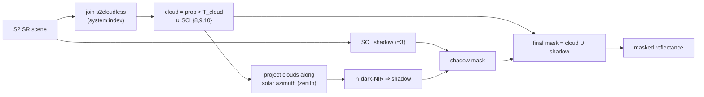
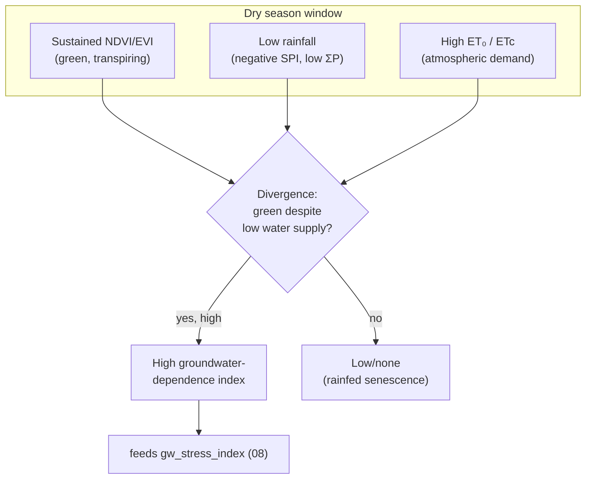

# 06 — Remote Sensing Methods

| Field | Value |
|---|---|
| Document | 06 — Remote Sensing Methods |
| Project | MIZAN — Earth Observation Environmental Intelligence for Jordan |
| Version | 0.1 (Draft) |
| Status | Phase 1 — Specification |
| Last updated | 2026-06-10 |
| Related | [04 — Data Sources](./04-data-sources.md), [05 — Earth Engine Pipelines](./05-earth-engine-pipelines.md), [07 — Machine Learning](./07-machine-learning.md), [08 — Risk Scoring](./08-risk-scoring.md), [09 — Confidence Engine](./09-confidence-engine.md), [16 — Validation Framework](./16-validation-framework.md) |

## Purpose

This document is the **scientific methodology reference** for MIZAN. It defines, rigorously and with units, every remote-sensing algorithm used to derive the MIZAN indicators: spectral indices, cloud/shadow masking and compositing, SAR backscatter processing, the full FAO-56 Penman-Monteith reference-ET derivation and crop-ET, surface-water mapping, rainfall aggregation and SPI, and the **vegetation–water divergence** method that operationalizes the central MIZAN hypothesis (vegetation staying green through the dry season despite low rainfall ⇒ groundwater dependence). For each method we state the equation(s), the exact sensor band mapping, the parameters, and a per-method **accuracy & uncertainty** discussion. Implementation, orchestration, and provenance capture live in [05 — Earth Engine Pipelines](./05-earth-engine-pipelines.md).

**Scientific stance (binding).** MIZAN **estimates groundwater-stress indicators from EO proxies**. No method here observes groundwater, wells, or aquifer pressure directly. The water-balance and groundwater-dependence outputs are **transparent estimates with explicitly quantified uncertainty**, never measurements, and make **no legal determination**. The non-negotiable rule applies throughout: **never fabricate data**; every number originates from Earth Engine / stored datasets / model outputs and is traceable via `provenance`. Literature values are cited only as `[ref]` external context (e.g., FAO-56 Allen et al. `[ref]`; CHIRPS Funk et al. `[ref]`; s2cloudless `[ref]`; McFeeters NDWI `[ref]`; Xu MNDWI `[ref]`; JRC GSW Pekel et al. `[ref]`).

**Deliverables mapping.** This document underpins the ASTROCODE deliverables **Data Explanation** (what each band/index means), **AI/Analytics Method** (the science behind the [07](./07-machine-learning.md) models and the [08](./08-risk-scoring.md) indices), and the **Jordanian Use Case** (Azraq Basin groundwater stress, surface-water decline, irrigation expansion). Every method ends mapped to indicators and to the Source/Date/Methodology/Confidence/Explanation validation envelope ([16](./16-validation-framework.md)).

---

## 1. Spectral Indices

### 1.1 Sensor band mapping

All optical indices are computed primarily from **Sentinel-2 SR** (`COPERNICUS/S2_SR_HARMONIZED`) and, for temporal back-extension and cross-checking, from **Landsat 8/9 L2** (`LANDSAT/LC08/C02/T1_L2`, `LANDSAT/LC09/C02/T1_L2`). Wavelength-equivalent bands:

| Spectral region | Sentinel-2 band | Landsat 8/9 OLI band | Native res. |
|---|---|---|---|
| Blue | B2 | SR_B2 | 10 m / 30 m |
| Green | B3 | SR_B3 | 10 m / 30 m |
| Red | B4 | SR_B4 | 10 m / 30 m |
| Red Edge | B5, B6, B7 | — (no equivalent) | 20 m / — |
| NIR | B8 (B8A narrow) | SR_B5 | 10 m / 30 m |
| SWIR1 | B11 | SR_B6 | 20 m / 30 m |
| SWIR2 | B12 | SR_B7 | 20 m / 30 m |

> **Scaling.** S2 SR digital numbers are reflectance ×10000 (divide by 10000). Landsat C02 L2 surface reflectance uses scale `0.0000275` and offset `−0.2` (`SR = DN·0.0000275 − 0.2`). Both are converted to physical reflectance [0,1] before indices. Band-pass differences between S2 NIR/SWIR and Landsat NIR/SWIR introduce a small systematic offset addressed by harmonization (§2.5).

### 1.2 Index definitions (exact contract formulas)

Let R, G, B, NIR, SWIR1 denote surface reflectance in the respective bands.

**NDVI — Normalized Difference Vegetation Index**
$$\mathrm{NDVI}=\frac{\mathrm{NIR}-\mathrm{Red}}{\mathrm{NIR}+\mathrm{Red}}$$
Range [−1, 1]; green vegetation ≳ 0.3–0.9; bare/soil ~0.1–0.2; water < 0. Primary vegetation-vigor signal and the backbone of the dry-season divergence method (§7).

**EVI — Enhanced Vegetation Index** (reduces soil & atmosphere influence, resists saturation in dense canopy)
$$\mathrm{EVI}=2.5\cdot\frac{\mathrm{NIR}-\mathrm{Red}}{\mathrm{NIR}+6\cdot\mathrm{Red}-7.5\cdot\mathrm{Blue}+1}$$
Gain 2.5; coefficients C1=6, C2=7.5; canopy-background adjustment L=1.

**SAVI — Soil-Adjusted Vegetation Index** (minimizes soil-brightness in sparse arid canopies — important for Jordan's drylands)
$$\mathrm{SAVI}=\frac{\mathrm{NIR}-\mathrm{Red}}{\mathrm{NIR}+\mathrm{Red}+L}\,(1+L),\qquad L=0.5$$
L=0.5 is the standard intermediate-cover value `[ref]`.

**NDWI — Normalized Difference Water Index (McFeeters `[ref]`)** — open-water delineation
$$\mathrm{NDWI}=\frac{\mathrm{Green}-\mathrm{NIR}}{\mathrm{Green}+\mathrm{NIR}}$$
Water > 0; vegetation/soil < 0. (Distinct from the vegetation-liquid-water "NDWI" of Gao which uses NIR/SWIR — MIZAN uses McFeeters for surface water and a separate vegetation-water signal via SWIR where needed.)

**MNDWI — Modified NDWI (Xu `[ref]`)** — improved water/built-up separation using SWIR1; **primary surface-water index for the Azraq Oasis** (§5)
$$\mathrm{MNDWI}=\frac{\mathrm{Green}-\mathrm{SWIR1}}{\mathrm{Green}+\mathrm{SWIR1}}$$

**RVI — Radar Vegetation Index** (SAR; §3)
$$\mathrm{RVI}=\frac{4\cdot\mathrm{VH}}{\mathrm{VV}+\mathrm{VH}}$$
Computed in **linear power** (not dB). Range ~[0,4/3·…]; higher ⇒ more volume scattering (vegetation).

### 1.3 Index accuracy & uncertainty

- **NDVI saturation** at high LAI (dense canopy) — mitigated by EVI for irrigated, well-watered fields.
- **Soil background** dominates sparse arid pixels — SAVI preferred for rangeland; mixed pixels at 10 m still blur small field edges.
- **Sub-pixel water / turbid water** depresses MNDWI; sediment/algae shift thresholds (handled by adaptive Otsu, §5).
- **BRDF / illumination** residuals after L2 atmospheric correction add a few-percent reflectance noise; reduced by compositing (§2) and by mean reduction over zones.
- **S2 vs Landsat offsets** in NIR/SWIR propagate to indices; harmonization (§2.5) reduces but does not eliminate them — cross-sensor time series carry a slightly larger uncertainty band ([09](./09-confidence-engine.md)).

---

## 2. Cloud/Shadow Masking & Compositing

### 2.1 Why masking dominates index quality

Over Jordan clouds are seasonal (wet winter), but residual clouds, cirrus, and especially **cloud shadows** bias indices (shadows depress NIR/Red ⇒ false low NDVI; bright cloud edges ⇒ spurious values). Robust masking is the single largest control on index reliability.

### 2.2 s2cloudless probability threshold

MIZAN joins each S2 SR scene to its **`COPERNICUS/S2_CLOUD_PROBABILITY`** (s2cloudless `[ref]`) counterpart by `system:index`. Pixels with `probability > T_cloud` are flagged cloud. Default **`T_cloud = 40%`** (parameterized in the JobSpec). Lower thresholds mask more aggressively (fewer false clears, more data loss); higher thresholds retain more pixels (risk of cloud contamination). The threshold is recorded in provenance so any value's masking regime is auditable.

### 2.3 SCL classes

The S2 **Scene Classification Layer (SCL)** is used jointly with s2cloudless:

| SCL value | Class | MIZAN treatment |
|---|---|---|
| 3 | Cloud shadow | mask |
| 8 | Cloud medium probability | mask |
| 9 | Cloud high probability | mask |
| 10 | Thin cirrus | mask |
| 11 | Snow/ice | mask (rare; high terrain) |
| 1 | Saturated/defective | mask |
| 2 | Dark area / shadow | inspect (can over-mask dark soils — combine with shadow projection) |
| 4,5,6,7 | Vegetation/bare/water/unclassified | keep |

The union of `s2cloudless > T_cloud` and SCL cloud/cirrus/shadow classes forms the cloud mask. Using both reduces s2cloudless omission (thin cirrus) and SCL commission errors.

### 2.4 Cloud-shadow projection

Cloud shadows are not always captured by SCL=3. MIZAN projects shadows **geometrically**: for each cloud pixel, project along the **solar azimuth** by a distance set by cloud height and **solar zenith** (`shadow_offset = cloud_height · tan(zenith)`), then intersect the projected zone with **dark-NIR** pixels (low B8) to confirm shadow. This directional projection (Zhu & Woodcock-style `[ref]`) catches shadows the SCL misses.

### 2.5 Compositing, gap-filling & S2↔Landsat harmonization

**Compositing.** After per-scene masking, scenes in the window are reduced to a single composite:
- **Median composite** — robust default for monthly indices; resistant to residual cloud/shadow outliers.
- **Greenest-pixel (max-NDVI) composite** — `qualityMosaic('ndvi')` for seasonal vegetation layers; selects the date of peak greenness per pixel (good for phenology peak, biased toward clear-sky max — used deliberately, not for anomaly baselines).

**Gap-filling.** If a pixel is fully masked across the window (persistent cloud), it remains **no-data**; the zonal reducer reports valid-pixel `count`. Temporal gaps are *not* silently interpolated for observations (non-fabrication rule). Where a continuous field is required (e.g., feature stacks for classification), a documented temporal interpolation (linear between nearest clear dates) may be used as a **derived feature** and flagged as such; it never overwrites an observed indicator value.

**S2↔Landsat harmonization.** To extend series before/around S2 (or fill S2 gaps), Landsat 8/9 reflectance is adjusted toward the S2 spectral response using published per-band **OLI→MSI linear transforms** (slope/intercept, e.g., Roy et al. `[ref]`) before computing indices. Harmonized Landsat indices carry an added uncertainty term and are tagged by source in provenance so [09](./09-confidence-engine.md) can widen confidence on cross-sensor segments.

### 2.6 Masking/compositing accuracy & uncertainty

- **Residual contamination** after masking is the dominant index error; median compositing suppresses it but very cloudy months (few clear scenes) yield noisy/sparse composites — surfaced via low `image_count`/valid-pixel fraction.
- **Over-masking** dark soils/water (SCL=2) can shrink valid area; shadow-projection + dark-NIR confirmation limits this.
- **Composite-date ambiguity:** a median/greenest value has no single acquisition date — provenance records the date *range* and contributing scene count, and the validation envelope's "Date" is the period, not a single timestamp.

---

## 3. SAR Methodology (Sentinel-1)

### 3.1 Product and preprocessing

MIZAN uses **`COPERNICUS/S1_GRD`** (Ground Range Detected), **IW** mode, dual-pol **VV + VH**, with ascending and descending orbits tracked separately. The EE GRD product is already calibrated to **σ⁰ backscatter in dB** and terrain-corrected to the ellipsoid via the S1 toolbox preprocessing chain (orbit file, thermal-noise removal, radiometric calibration, range-Doppler terrain correction) `[ref]`. MIZAN adds:

1. **Border-noise / edge masking.** Invalid low-backscatter scene edges (≈ < −30 dB artefacts) are masked to prevent spurious low values.
2. **Speckle filtering.** SAR speckle (multiplicative noise) is reduced with a **Refined Lee** filter (adaptive, edge-preserving) `[ref]`; a focal-median fallback is used where compute is constrained (see [05 §2.b](./05-earth-engine-pipelines.md)). Filtering is applied consistently (same window) so multi-temporal comparisons are valid.
3. **Linear vs dB.** Ratios/indices (RVI, soil-moisture proxy) are computed in **linear power** (`lin = 10^(dB/10)`); backscatter indicators `s1_vv`, `s1_vh` are reported in **dB**.

### 3.2 VV/VH for soil moisture and irrigation

- **Soil moisture (relative proxy).** VV backscatter increases with surface soil moisture (higher dielectric constant) on bare/sparse soils. MIZAN derives `soil_moisture_proxy` as a **relative, normalized** VV signal (change/anomaly vs a local dry reference), **not** absolute volumetric soil moisture. Absolute context comes from **SMAP** (`NASA/SMAP/SPL4SMGP/007`, ~9 km) — coarse, used for sanity bounds, not field-scale truth.
- **Irrigation signal.** Irrigated fields show (a) elevated VH/RVI from developed canopy volume scattering and (b) elevated VV from wet soil, *decoupled from rainfall timing*. Combined with optical dry-season NDVI (§7), SAR strengthens the irrigation/groundwater-dependence inference (feature export → XGBoost, [07](./07-machine-learning.md), [05 §2.g](./05-earth-engine-pipelines.md)).

### 3.3 SAR accuracy, incidence-angle & roughness limitations

- **Incidence angle** varies across swath and between ascending/descending; backscatter depends on it ⇒ MIZAN keeps orbits separate and records `orbitProperties_pass`; cross-orbit values are not naively averaged.
- **Surface roughness & vegetation confound soil moisture:** σ⁰ responds to roughness and canopy as well as moisture; the soil-moisture proxy is therefore relative and most reliable on low-vegetation, stable-roughness surfaces.
- **Speckle residual** remains after filtering; multi-temporal averaging and zonal reduction reduce variance.
- **Terrain effects** (layover/shadow) are minor over Azraq's flat basin but flagged for sloped national zones.

---

## 4. FAO-56 Penman-Monteith Reference ET (full derivation) & Crop ET

### 4.1 Governing equation

MIZAN computes daily **grass reference evapotranspiration** ET₀ per **FAO-56** (Allen et al. `[ref]`):

$$\mathrm{ET_0}=\frac{0.408\,\Delta\,(R_n-G)+\gamma\,\dfrac{900}{T+273}\,u_2\,(e_s-e_a)}{\Delta+\gamma\,(1+0.34\,u_2)}$$

with ET₀ in **mm day⁻¹**. The term `0.408` converts net radiation MJ m⁻² d⁻¹ to mm; `900` and `0.34` are the daily grass-reference coefficients.

### 4.2 Variable definitions, units & ERA5-Land mapping

Climate inputs come from **`ECMWF/ERA5_LAND/DAILY_AGGR`** (and `/HOURLY` where finer aggregation is needed); elevation from **`USGS/SRTMGL1_003`**.

| Symbol | Quantity | Units | Source / mapping |
|---|---|---|---|
| `T` | mean air temp at 2 m | °C | ERA5-Land `temperature_2m` (K−273.15); or (Tmax+Tmin)/2 |
| `Tmax`,`Tmin` | daily max/min temp | °C | `temperature_2m_max/min` (K−273.15) |
| `Δ` | slope of saturation VP curve at T | kPa °C⁻¹ | derived (eq. 4.3) |
| `R_n` | net radiation at crop surface | MJ m⁻² d⁻¹ | from ERA5-Land net solar + net thermal radiation sums (J m⁻² → ÷1e6) |
| `G` | soil heat flux | MJ m⁻² d⁻¹ | ≈ 0 for daily step (FAO-56) |
| `γ` | psychrometric constant | kPa °C⁻¹ | `γ = 0.000665·P` |
| `P` | atmospheric pressure | kPa | from elevation z: `P = 101.3·((293−0.0065z)/293)^5.26` |
| `u_2` | wind speed at 2 m | m s⁻¹ | from ERA5-Land 10 m `u/v` → speed → 2 m via log-law (eq. 4.5) |
| `e_s` | saturation vapor pressure | kPa | mean of e°(Tmax), e°(Tmin) (eq. 4.4) |
| `e_a` | actual vapor pressure | kPa | e°(Tdew) from `dewpoint_temperature_2m` |
| `R_s` | incoming solar radiation | MJ m⁻² d⁻¹ | ERA5-Land `surface_solar_radiation_downwards_sum` (÷1e6) |

### 4.3 Slope of the saturation vapor pressure curve

$$e^{\circ}(T)=0.6108\,\exp\!\left(\frac{17.27\,T}{T+237.3}\right)\quad[\mathrm{kPa}]$$
$$\Delta=\frac{4098\,\Big[0.6108\,\exp\!\big(\tfrac{17.27\,T}{T+237.3}\big)\Big]}{(T+237.3)^2}\quad[\mathrm{kPa\,°C^{-1}}]$$

### 4.4 Vapor pressures

$$e_s=\frac{e^{\circ}(T_{max})+e^{\circ}(T_{min})}{2},\qquad e_a=e^{\circ}(T_{dew})$$
The vapor-pressure deficit is `VPD = e_s − e_a`. Using Tdew for `e_a` is the recommended FAO-56 approach when dewpoint is available (ERA5-Land provides it directly).

### 4.5 Wind adjustment to 2 m

ERA5-Land wind is at 10 m; convert to 2 m over a reference grass surface (FAO-56 log-law):
$$u_2=u_z\,\frac{4.87}{\ln(67.8\,z-5.42)},\qquad z=10\ \mathrm{m}\;\Rightarrow\;u_2\approx 0.748\,u_{10}$$
with `u_z = sqrt(u² + v²)` from the wind components.

### 4.6 Net radiation

`R_n = R_ns − R_nl`, net shortwave minus net longwave. MIZAN takes net radiation directly from ERA5-Land radiation **sum** bands (converting J m⁻² → MJ m⁻² d⁻¹). Where only `R_s` is available, the FAO-56 procedure (albedo 0.23 for `R_ns`; Stefan-Boltzmann longwave with humidity and cloudiness terms for `R_nl`) is applied — documented as an alternative path. `G ≈ 0` at the daily step.

### 4.7 Crop ET (ETc) and Kc

$$\mathrm{ET_c}=K_c\cdot\mathrm{ET_0}$$
`Kc` (crop coefficient) varies by **crop type** (from classification, §8 / [05 §2.f](./05-earth-engine-pipelines.md)) and **growth stage** (from phenology, §8). Illustrative single-Kc values (FAO-56 `[ref]`; refined per local calendar):

| Crop (Jordan/Azraq context) | Kc_ini | Kc_mid | Kc_end |
|---|---|---|---|
| Vegetables (e.g., tomato) | 0.6 | 1.15 | 0.80 |
| Wheat/barley (winter) | 0.30 | 1.15 | 0.40 |
| Alfalfa (forage) | 0.40 | 1.20 | 1.15 |
| Olives (tree) | 0.65 | 0.70 | 0.70 |
| Stone/citrus fruit | 0.60 | 0.85 | 0.75 |

Growth-stage assignment uses the NDVI phenology curve (green-up → peak → senescence) to switch between Kc_ini/mid/end, giving a time-varying ETc. `etc_mm` is summed over the window and feeds the **abstraction estimate** in the water balance ([08](./08-risk-scoring.md)).

### 4.8 Reference-ET caveats, accuracy & uncertainty

- **ERA5-Land resolution (~9 km)** smooths local gradients; ET₀ is a regional estimate, not field-scale.
- **Wind & radiation** are the largest ET₀ error sources; reanalysis wind in particular has known biases `[ref]`.
- **Kc uncertainty:** generic FAO Kc tables vs local cultivars/management ⇒ ETc carries notable uncertainty; this propagates into the abstraction estimate and is explicitly flagged ([09](./09-confidence-engine.md)).
- **No station validation assumed:** Jordanian flux/meteo ET data are sparse; any comparison is `[ref]` external context, never a fabricated calibration.

---

## 5. Surface-Water Mapping (Azraq Oasis)

### 5.1 Index & thresholding

Open water in the Azraq Oasis/wetland is mapped from **MNDWI** (§1.2) on the masked S2 composite. Water/non-water separation uses **Otsu's method** `[ref]`: the MNDWI histogram is modeled as bimodal (water vs land) and the threshold `t*` is chosen to **maximize between-class variance**:

$$t^{*}=\arg\max_{t}\;\sigma_b^2(t),\qquad \sigma_b^2(t)=\omega_0(t)\,\omega_1(t)\,[\mu_0(t)-\mu_1(t)]^2$$

where ω₀,ω₁ are class probabilities and μ₀,μ₁ class means either side of `t`. Otsu adapts to seasonal turbidity/illumination. **Fallback:** if the histogram is unimodal/degenerate (e.g., near-dry oasis with little water), MIZAN reverts to a fixed `MNDWI > 0` threshold and records the fallback in provenance.

### 5.2 Area computation

$$\text{surface\_water\_extent\_km}^2=\frac{1}{10^6}\sum_{\text{water pixels}}\text{pixelArea}$$
computed with `ee.Image.pixelArea()` summed over the water mask within the oasis polygon at native 10 m.

### 5.3 JRC Global Surface Water for context & validation

**`JRC/GSW1_4/GlobalSurfaceWater`** (Pekel et al. `[ref]`) provides 1984–present **occurrence**, **seasonality**, **recurrence**, and **transitions**. MIZAN uses it to: (a) distinguish permanent vs seasonal water; (b) provide a **long-term reference** to validate present-day MNDWI extents (consistency check, not a substitute); (c) frame the **Azraq decline narrative** (historical surface-water loss). GSW is **context/validation only** — present-day extent always comes from current S2, never from GSW (non-fabrication).

### 5.4 Surface-water accuracy & uncertainty

- **Mixed/shallow/turbid water** at 10 m under-detects small ponds; sub-pixel water is missed.
- **Otsu instability** when water fraction is tiny — fallback threshold + flag.
- **Wetland vegetation over water** (reed beds) can mask open water in MNDWI; cross-check with NDVI/JRC.
- Validated against JRC GSW and, where available, high-res imagery as `[ref]` context ([16](./16-validation-framework.md)).

---

## 6. Rainfall, Anomaly & SPI

### 6.1 CHIRPS aggregation

Precipitation from **`UCSB-CHG/CHIRPS/DAILY`** (and `/PENTAD` for faster sums), ~0.05° (~5 km). `precip_mm` over a window is the temporal **sum**:
$$\text{precip\_mm}=\sum_{d\in[\text{start},\text{end}]} P_d$$

### 6.2 Baseline climatology

A **1991–2020** (30-yr) baseline defines the per-calendar-month mean `P̄_m` (and the fitted distributions for SPI). The baseline is computed once and cached ([05 §1.8](./05-earth-engine-pipelines.md)).

### 6.3 Percent anomaly

$$\text{precip\_anomaly\_pct}=100\cdot\frac{P-\bar P_m}{\bar P_m}$$
Positive ⇒ wetter than normal; strongly negative ⇒ drought signal. Undefined where `P̄_m → 0` (peak dry season); MIZAN suppresses the percentage there and relies on SPI instead.

### 6.4 SPI — Standardized Precipitation Index (full method)

SPI (McKee et al.; used widely `[ref]`) is computed for accumulation windows **k ∈ {1, 3, 6, 12} months**:

1. **Accumulate** k-month precipitation `x` ending at the target month.
2. **Fit a gamma distribution** to the baseline series of the *same* k-month accumulation for that calendar period. Gamma pdf:
$$g(x)=\frac{1}{\beta^{\alpha}\Gamma(\alpha)}\,x^{\alpha-1}e^{-x/\beta},\quad x>0$$
   with shape `α>0`, scale `β>0` estimated (MLE / method-of-moments). The gamma fit runs **in the worker** (`scipy.stats.gamma`) on the EE-reduced baseline array.
3. **Arid zero-rainfall correction (mixed distribution).** Because many Jordanian months have zero rain, use the mixed CDF
$$H(x)=q+(1-q)\,G(x)$$
   where `q` is the probability of zero precipitation (fraction of baseline zeros) and `G(x)` is the gamma CDF fitted to non-zeros.
4. **Transform to standard normal.** SPI is the standard-normal quantile of the cumulative probability:
$$\mathrm{SPI}=\Phi^{-1}\!\big(H(x)\big)$$
   (equivalently the Abramowitz-Stegun rational approximation). SPI has mean 0, variance 1 by construction, so values are comparable across space/time and accumulation windows.

**SPI classes (contract):**

| SPI | Category |
|---|---|
| ≥ 2.0 | extremely wet |
| 1.5 … 1.99 | very wet |
| 1.0 … 1.49 | moderately wet |
| −0.99 … 0.99 | near normal |
| −1.49 … −1.0 | moderately dry |
| −1.99 … −1.5 | severely dry |
| ≤ −2.0 | extremely dry |

Short windows (SPI-1/3) track meteorological/agricultural drought; long windows (SPI-6/12) track hydrological drought and contextualize recharge deficits — directly relevant to the recharge proxy and groundwater stress ([08](./08-risk-scoring.md)).

### 6.5 Rainfall/SPI accuracy & uncertainty

- **CHIRPS** blends satellite + station; sparse Jordanian gauges ⇒ larger uncertainty in absolute mm, but the **anomaly/standardized** framing is robust to systematic bias.
- **Gamma fit instability** for short baselines or highly zero-inflated series — mixed-distribution correction and a minimum-sample guard mitigate; flagged when unstable.
- **Resolution (~5 km)** misses convective cells; appropriate for basin/national, not single-field.

---

## 7. Vegetation–Water Divergence (Groundwater-Dependence Index)

This is the **central, distinctive MIZAN method**: it operationalizes the hypothesis that *vegetation remaining green and transpiring through the dry season despite low rainfall is being sustained by water other than current precipitation — i.e., groundwater (irrigation abstraction or phreatophytic uptake).* It is an **estimated indicator from proxies**, not a direct groundwater observation.

### 7.1 Concept

During Jordan's long dry season, rainfed vegetation senesces (NDVI declines, tracking soil-water depletion). Vegetation that **stays green** (high, sustained NDVI/EVI) while **rainfall is low** (negative SPI / low cumulative precip) and **atmospheric demand is high** (high ET₀) exhibits a **divergence** between water *supply from rain* and water *use by vegetation*. That gap is a fingerprint of groundwater dependence.

### 7.2 Quantitative definition

For a field/zone `i` over the dry-season window `D` (e.g., the local rain-free months), define three standardized components:

1. **Vegetation persistence** — sustained greenness through the dry season:
$$V_i=\frac{\overline{\mathrm{NDVI}}_{i,D}-\mu_{\mathrm{NDVI}}}{\sigma_{\mathrm{NDVI}}}\;,\quad\text{or use minimum dry-season NDVI to reward sustained (not just peak) green.}$$
   A complementary **dry-down slope** term penalizes fields that senesce: `S_i = −d(NDVI)/dt` over `D` (rainfed → steep decline → low persistence; groundwater-fed → flat → high persistence).

2. **Water-supply deficit** — how dry it was (rainfall low relative to demand):
$$W_i=\underbrace{(-\,\mathrm{SPI}_{k,i})}_{\text{rain anomaly}}\;\;\text{combined with}\;\;\frac{\mathrm{ET_0}_{i,D}-P_{i,D}}{\mathrm{ET_0}_{i,D}}\;(\text{climatic water deficit, }[0,1]).$$

3. **Divergence (GDI).** Groundwater dependence is high when persistence is high **and** supply deficit is high. Define the **Groundwater-Dependence Index**:
$$\mathrm{GDI}_i=f\big(V_i\big)\cdot g\big(W_i\big)$$
   where `f`, `g` map components to [0,1] (e.g., logistic/min-max scaling). A transparent product form ensures GDI is high *only* when **both** "green" and "dry" hold (green in a wet month is not divergence; brown in a dry month is not divergence). Equivalent normalized form:
$$\mathrm{GDI}_i=\mathrm{NDVI\_persistence}_i\times\mathrm{water\_deficit}_i\in[0,1].$$

**SAR corroboration.** Elevated dry-season VH/RVI and VV (wet soil/active canopy) decoupled from rainfall add evidence; the irrigation model ([07](./07-machine-learning.md)) uses these as features, so GDI and the irrigation classifier are mutually reinforcing but independently derived.

### 7.3 Interpretation, thresholds & guardrails

- High GDI over **agricultural** pixels ⇒ likely **irrigation from groundwater** (cross-checked with crop class + irrigation model).
- High GDI over **natural vegetation** near the oasis ⇒ likely **phreatophyte/groundwater-dependent ecosystem**.
- GDI is **dimensionless, relative, and seasonal**; it does **not** quantify abstraction volume (that is the water-balance estimate, [08](./08-risk-scoring.md)) and is **not** a measurement of groundwater level. Confidence depends on dry-season data availability and is set by [09](./09-confidence-engine.md).
- **False positives** to guard against: perennial trees with deep but *rain-fed* roots, run-on/wadi moisture, mixed pixels — mitigated by multi-season consistency and SAR/crop corroboration.

### 7.4 Divergence accuracy & uncertainty

- Sensitive to dry-season cloud gaps (NDVI persistence needs clear dry-season scenes) — low `image_count` lowers confidence.
- Component weighting/scaling is a modeling choice → documented, versioned (`processing_version`), and subject to sensitivity analysis ([16](./16-validation-framework.md)).
- Strongest as a **relative, comparative** signal (which fields/zones diverge most), consistent with MIZAN's indicator (not measurement) stance.

---

## 8. Phenology & Time-Series Features for Classification

Multi-temporal features power crop classification ([05 §2.f](./05-earth-engine-pipelines.md), [07](./07-machine-learning.md)) and growth-stage Kc selection (§4.7).

**Phenology metrics** (per pixel/field, from the NDVI/EVI time series over a season):
- **Amplitude** = max − min NDVI (vigor / cover).
- **Peak timing** = month of maximum NDVI (crop calendar discriminator).
- **Green-up / senescence rate** = slope of rising/falling limbs.
- **Season length / integral** = duration above a green threshold; time-integrated NDVI ≈ cumulative productivity.
- **Number of cycles** = single vs double cropping (multi-modal NDVI).

**Spectral-temporal features:** per-month NDVI, EVI, SAVI, NDWI, MNDWI; S1 VV, VH, RVI; SWIR for moisture; plus topographic SRTM (elevation, slope). These stacked features feed `ee.Classifier.smileRandomForest` (crop class) and the worker XGBoost (irrigation). Phenology also drives **growth-stage** detection for time-varying ETc.

**Uncertainty:** phenology metrics degrade with cloud-induced gaps (interpolated features flagged); mixed pixels blur small fields; class confusion between spectrally similar crops is reported via the confusion matrix ([16](./16-validation-framework.md)).

---

## 9. Per-Method Accuracy & Uncertainty (consolidated)

| Method | Dominant uncertainty | Mitigation | Confidence input ([09](./09-confidence-engine.md)) |
|---|---|---|---|
| Spectral indices | residual cloud/shadow, soil/BRDF, sensor offset | masking, composite, SAVI/EVI, harmonization | valid-pixel fraction, sensor mix |
| Cloud/shadow mask | over/under-masking, sparse clear scenes | s2cloudless+SCL+shadow projection | image_count, masked fraction |
| SAR (S1) | speckle, incidence angle, roughness/veg confound | Refined Lee, orbit separation, relative proxy | orbit pass, filter, n scenes |
| ET₀ (FAO-56) | ERA5-Land resolution, wind/radiation bias | physical model, documented variable mapping | resolution caveat |
| ETc / Kc | generic Kc vs local cultivar | phenology-driven stage Kc | Kc source flag |
| Surface water | mixed/turbid pixels, Otsu instability | Otsu + fallback + JRC cross-check | threshold method, water fraction |
| Rainfall / SPI | sparse gauges, gamma fit, zero inflation | anomaly/standardized framing, mixed dist. | baseline length, fit stability |
| Veg–water divergence | dry-season gaps, scaling choices, false positives | multi-season + SAR/crop corroboration | dry-season image_count |
| Phenology features | gaps, mixed pixels | interpolation flag, multi-feature | feature completeness |

Every value emitted under these methods is wrapped in the MIZAN **validation envelope** — **Source · Date · Methodology · Confidence · Explanation** — and is traceable to a `provenance` row written by the pipeline ([05 §1.9](./05-earth-engine-pipelines.md)). No method outputs a number it cannot trace to EE/stored data/model output.

---

## 10. Methods → Indicators → Deliverables Mapping

| Method (this doc) | Indicator codes produced/feeding | Pipeline ([05](./05-earth-engine-pipelines.md)) | Downstream use | ASTROCODE deliverable |
|---|---|---|---|---|
| Spectral indices (§1) | `ndvi, evi, savi, ndwi, mndwi, ndvi_anomaly` | 2.a | divergence (§7), crop/irrig ML | Data Explanation, Results Viz |
| Cloud/shadow masking & compositing (§2) | (quality of all optical indices) | 2.a, 2.e | all optical products | Data Explanation |
| SAR (§3) | `s1_vv, s1_vh, s1_rvi, soil_moisture_proxy` | 2.b | irrigation ML, divergence | Data Explanation, AI/Analytics |
| FAO-56 PM & ETc (§4) | `tmax_c, tmin_c, rh_pct, wind_2m, srad_mj, et0_pm_mm, etc_mm` | 2.d | water balance, divergence deficit | AI/Analytics, Impact |
| Surface water (§5) | `surface_water_extent_km2, mndwi` | 2.e | Azraq decline narrative | Jordanian Use Case, Results Viz |
| Rainfall & SPI (§6) | `precip_mm, precip_anomaly_pct, spi_1, spi_3, spi_6, spi_12` | 2.c | recharge proxy, divergence supply | AI/Analytics, Impact |
| Veg–water divergence (§7) | groundwater-dependence index → `gw_stress_index, gw_stress_class` | derived (worker) + 2.a/2.c/2.d | risk scoring ([08](./08-risk-scoring.md)) | AI/Analytics, Jordanian Use Case, Impact |
| Phenology/time-series (§8) | `crop_class, cropland_area_ha, irrigated_area_ha, agri_expansion_pct` | 2.f, 2.g | abstraction estimate, risk | AI/Analytics, Jordanian Use Case |
| Water balance (consumes above) | `recharge_proxy_mm, abstraction_estimate_mcm, water_balance_mcm, gws_anomaly_cm` | derived ([08](./08-risk-scoring.md)), 2.h | groundwater-stress estimate | Impact Statement |

**Cross-references:** orchestration/implementation [05](./05-earth-engine-pipelines.md); ML models [07](./07-machine-learning.md); risk/water-balance scoring [08](./08-risk-scoring.md); confidence assignment [09](./09-confidence-engine.md); validation & accuracy gates [16](./16-validation-framework.md).

> **Closing stance.** These methods convert Earth Observation into *defensible environmental intelligence*. They estimate groundwater-stress indicators from proxies with quantified uncertainty; they never claim to measure groundwater directly, never fabricate values, and always remain traceable from indicator back to source imagery.
