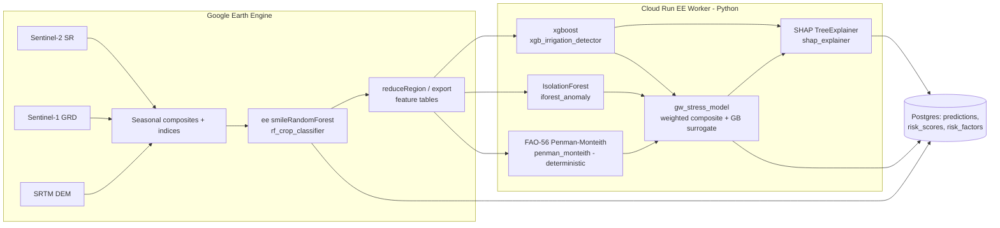

# 07 — Machine Learning

| Field | Value |
|---|---|
| Document | 07 — Machine Learning |
| Project | MIZAN — Earth Observation Environmental Intelligence for Jordan |
| Version | 0.1 (Draft) |
| Status | Phase 1 — Specification |
| Last updated | 2026-06-10 |
| Related | [04-data-sources](./04-data-sources.md), [05-earth-engine-pipelines](./05-earth-engine-pipelines.md), [06-remote-sensing-methods](./06-remote-sensing-methods.md), [08-risk-scoring](./08-risk-scoring.md), [09-confidence-engine](./09-confidence-engine.md), [11-database-schema](./11-database-schema.md), [12-api-specification](./12-api-specification.md), [16-validation-framework](./16-validation-framework.md), [20-limitations](./20-limitations.md) |

## Purpose

This document specifies the machine-learning and analytics layer of MIZAN: which models exist, what each one is for, where each runs (Google Earth Engine vs. the Cloud Run "EE Worker"), how each is trained, validated, versioned, and how outputs are written to the database. It is the authoritative reference for the AI/Analytics Method ASTROCODE deliverable.

**Deliverables mapping:** This document underpins the **AI/Analytics Method** deliverable and feeds **Functional Prototype**, **Data Explanation**, and **Results Visualization**.

---

## 0. Scientific stance and non-negotiables

MIZAN does **not** observe groundwater, wells, or aquifer pressure directly. Every model here estimates **indicators** from Earth Observation (EO) proxies — irrigated-area expansion and crop water demand; rainfall and SPI anomalies; vegetation–water divergence implying groundwater dependence; surface-water / Azraq-Oasis decline; and GRACE total-water-storage (TWS) coarse regional context.

Hard rules that constrain every model in this document:

1. **No fabricated data.** Every input value originates from Earth Engine, a stored dataset, or a prior model output, and is traceable to a `provenance_id`.
2. **Real labels only.** Training labels come from field reference points, published land-cover/crop maps, photo-interpretation of high-resolution imagery, or official statistics. Where synthetic augmentation or engineered features are used, they are explicitly flagged and **never** presented as observations.
3. **Validation Envelope on every metric.** Source, Date, Methodology, Confidence, Explanation (see [09-confidence-engine](./09-confidence-engine.md)).
4. **Transparency over accuracy.** The headline `gw_stress_index` is a transparent weighted composite explained via SHAP, not an opaque end-to-end regressor.
5. **No legal determination.** Outputs are advisory indicators, not abstraction-licence or water-rights findings (see [20-limitations](./20-limitations.md)).

---

## 1. Where each model runs

MIZAN splits compute between two environments:

- **Earth Engine (EE):** massively parallel pixel operations and the per-pixel classifier (`ee.Classifier.smileRandomForest`). Used where the workload is "apply a function to every pixel over a region/time window."
- **EE Worker (Cloud Run, Python):** scikit-learn / XGBoost / IsolationForest + SHAP (`TreeExplainer`). Used where we need calibrated probabilities, anomaly scores, gradient boosting, SHAP attribution, or deterministic physical equations on already-reduced feature tables.



| Model key | Engine | Library / primitive | Learned? |
|---|---|---|---|
| `rf_crop_classifier` | Earth Engine | `ee.Classifier.smileRandomForest` | Yes |
| `xgb_irrigation_detector` | EE Worker | `xgboost.XGBClassifier` | Yes |
| `iforest_anomaly` | EE Worker | `sklearn.ensemble.IsolationForest` | Yes (unsupervised) |
| `penman_monteith` | EE Worker | deterministic FAO-56 | **No** (baseline) |
| `gw_stress_model` | EE Worker | weighted composite + GB surrogate | Partly (surrogate for SHAP) |
| `shap_explainer` | EE Worker | `shap.TreeExplainer` | No (attribution) |

---

## 2. Model registry and run tracking

Every model is registered in Postgres `models` and every execution in `model_runs`. Artifacts (serialized estimators, feature lists, calibration objects) live in **Supabase Storage** and are referenced by URI from the registry.

```sql
-- Conceptual registry shape (authoritative DDL in 11-database-schema)
-- models: one row per (key, version)
CREATE TABLE models (
  model_id      uuid PRIMARY KEY DEFAULT gen_random_uuid(),
  key           text NOT NULL,          -- e.g. 'rf_crop_classifier'
  version       text NOT NULL,          -- semver, e.g. '1.2.0'
  engine        text NOT NULL,          -- 'earth_engine' | 'ee_worker'
  algorithm     text NOT NULL,          -- 'smileRandomForest' | 'xgboost' | ...
  hyperparams   jsonb NOT NULL,
  feature_list  jsonb NOT NULL,         -- ordered feature names + dtypes
  label_spec    jsonb,                  -- label sources + class map
  metrics       jsonb,                  -- validation metrics snapshot
  artifact_uri  text,                   -- Supabase Storage path
  data_snapshot jsonb,                  -- dataset versions / asset ids / dates
  random_seed   integer,
  trained_at    timestamptz,
  created_by    text,
  status        text DEFAULT 'staging', -- 'staging' | 'production' | 'archived'
  UNIQUE (key, version)
);

-- model_runs: one row per inference (or training) execution
CREATE TABLE model_runs (
  run_id        uuid PRIMARY KEY DEFAULT gen_random_uuid(),
  model_id      uuid REFERENCES models(model_id),
  run_type      text NOT NULL,          -- 'train' | 'inference' | 'backfill'
  region        text,
  time_window   tstzrange,
  params        jsonb,
  input_refs    jsonb,                  -- provenance_ids of inputs
  status        text,                   -- 'queued'|'running'|'succeeded'|'failed'
  metrics       jsonb,
  started_at    timestamptz,
  finished_at   timestamptz,
  provenance_id uuid
);
```

Rule: **no prediction is written without a `model_id` and a `model_runs.run_id`.** This guarantees every value in `predictions`, `risk_scores`, and `risk_factors` is traceable to an exact model version, hyperparameter set, and input snapshot.

### Shared `predictions` output schema

All per-region model outputs land in `predictions`:

```sql
CREATE TABLE predictions (
  prediction_id uuid PRIMARY KEY DEFAULT gen_random_uuid(),
  region        text NOT NULL,
  geom          geometry(MultiPolygon, 4326),
  model_id      uuid REFERENCES models(model_id),
  run_id        uuid REFERENCES model_runs(run_id),
  indicator     text,            -- e.g. 'crop_class','irrigated_area_ha'
  value         double precision,-- numeric output (nullable for class-only)
  class         text,            -- categorical output (nullable)
  probability   double precision,-- calibrated probability [0,1] (nullable)
  shap          jsonb,           -- {feature: contribution, base_value: x}
  confidence    double precision,-- [0,1] from confidence engine (doc 09)
  provenance_id uuid NOT NULL,
  observed_at   timestamptz,     -- valid time of the underlying EO data
  created_at    timestamptz DEFAULT now()
);
```

---

## 3. Model: `rf_crop_classifier` (Earth Engine)

### 3.1 Objective
Per-pixel crop / land-cover classification across the Azraq Basin to derive `cropland_area_ha`, `irrigated_area_ha` (in combination with §4), `crop_class`, and `agri_expansion_pct` over time. This is the spatial backbone for the abstraction estimate.

### 3.2 Inputs / features + feature engineering
Feature stack assembled in EE per analysis year:

- **Sentinel-2 SR** seasonal composites (cloud-masked via SCL + s2cloudless), reduced by median per season:
  - Bands: B2,B3,B4,B5,B6,B7,B8,B8A,B11,B12.
  - Indices: `ndvi`, `evi`, `savi`, `ndwi`, `mndwi`.
  - Seasons: **Wet** (Dec–Feb), **Spring** (Mar–May), **Summer-irrigation** (Jun–Aug), **Autumn** (Sep–Nov) — chosen so irrigated summer crops (which depend on groundwater when rainfall is ~0) separate from rainfed winter crops.
- **Sentinel-1 GRD** (VV, VH) seasonal means + `s1_rvi` (Radar Vegetation Index) to capture structure/moisture under cloud and to flag center-pivot/drip geometry.
- **SRTM** elevation + derived `slope` (gates wadi/floodplain classes; steep slopes are rarely irrigated).

Feature engineering: temporal stacking (per-season per-index → one flat feature vector per pixel), plus seasonal amplitude features (`ndvi_max − ndvi_min`) to encode phenology. The ordered feature list is stored in `models.feature_list`.

### 3.3 Class list
| Code | Class | Notes |
|---|---|---|
| 1 | Irrigated field crops | summer-active, high NDVI in dry season |
| 2 | Irrigated orchard / tree crops | persistent NDVI, drip signature |
| 3 | Rainfed cropland | NDVI peaks in wet season only |
| 4 | Greenhouse / protected | high reflectance, geometric S1 |
| 5 | Natural vegetation / rangeland | low, rainfall-coupled NDVI |
| 6 | Bare soil / desert | low NDVI all seasons |
| 7 | Built-up / infrastructure | — |
| 8 | Open water / wetland (Azraq Oasis remnants) | high NDWI/MNDWI |

### 3.4 Labels and label sources (real, non-fabricated)
- **Field reference points** collected by partners / prior surveys (GPS + class), where available.
- **Published land-cover & crop maps** (e.g. national agricultural land-use, ESA WorldCover, regional crop maps) used as reference and for stratification — cited with version/date.
- **Photo-interpretation** of high-resolution imagery (e.g. very-high-res basemaps) by an analyst to label points in classes lacking field data, following a documented interpretation key.
- **Official statistics** (Department of Statistics / Ministry of Water and Irrigation) for area sanity checks and prior class proportions.

Curation: every labelled point carries `source`, `date`, `interpreter`, `confidence`. Points are de-duplicated, spatially thinned to reduce autocorrelation (minimum separation ≈ 2 Sentinel-2 pixels), and stored as an EE `FeatureCollection` asset whose asset id + commit hash is recorded in `models.data_snapshot`. **No labels are invented**; classes with insufficient real labels are reported as low-confidence (doc 09) rather than padded.

### 3.5 Algorithm + hyperparameters
`ee.Classifier.smileRandomForest`:

```javascript
var rf = ee.Classifier.smileRandomForest({
  numberOfTrees: 300,
  variablesPerSplit: null,      // EE default ~ sqrt(#features)
  minLeafPopulation: 5,
  bagFraction: 0.6,
  maxNodes: null,
  seed: 42
}).train({
  features: trainingFc,
  classProperty: 'class',
  inputProperties: featureList
});
```

### 3.6 Training procedure
1. Build the seasonal feature image; sample feature values at labelled points (`sampleRegions`, 10 m scale, `geometries: true`).
2. Stratified split by class and by spatial block (grid) to avoid leakage.
3. Train RF on the training partition; export the trained classifier description and the confusion matrix as run artifacts.

### 3.7 Cross-validation design
**Spatially stratified k-fold (k = 5)**: folds are defined over spatial blocks so that no block appears in both train and test, which prevents optimistic accuracy from spatial autocorrelation. Per-class proportions are preserved across folds. Metrics are aggregated mean ± std over folds.

### 3.8 Evaluation metrics + targets
- **Overall accuracy**, **kappa**, **per-class precision/recall/F1**, full **confusion matrix**.
- Targets (Phase-1 acceptance): overall accuracy ≥ **0.80**, kappa ≥ **0.70**; for the decision-critical classes (1, 2, 3, 8) recall ≥ **0.75**. Below target ⇒ class flagged low-confidence and excluded from headline area figures until improved.

Illustrative confusion-matrix shape (rows = reference, cols = predicted):

| ref \ pred | 1 | 2 | 3 | 5 | 6 | 8 |
|---|---|---|---|---|---|---|
| 1 | 41 | 2 | 3 | 1 | 0 | 0 |
| 2 | 1 | 38 | 0 | 2 | 0 | 0 |
| 3 | 4 | 0 | 35 | 5 | 1 | 0 |
| 5 | 1 | 1 | 4 | 44 | 6 | 0 |
| 6 | 0 | 0 | 1 | 7 | 52 | 0 |
| 8 | 0 | 0 | 0 | 0 | 0 | 19 |

> *Illustrative — not a MIZAN observation.* Real matrices are produced per run and stored in `model_runs.metrics`.

### 3.9 Output schema → predictions
One row per region and crop class summarising area:

```json
{
  "region": "azraq_basin",
  "model_id": "<rf_crop_classifier@1.0.0>",
  "indicator": "crop_class",
  "value": 1840.5,
  "class": "irrigated_field_crops",
  "probability": null,
  "shap": null,
  "confidence": 0.78,
  "provenance_id": "<uuid>",
  "observed_at": "2025-08-15T00:00:00Z"
}
```
The classified raster is exported to an EE asset / Supabase Storage; `predictions` stores the reduced area per class (`cropland_area_ha`, `irrigated_area_ha`).

### 3.10 Inference cadence
Annual primary classification (post-summer composite) for `agri_expansion_pct` year-over-year, plus an optional mid-season run to detect new irrigation early.

### 3.11 Retraining / drift policy
Retrain when: new field reference is added; per-class recall on a held-out audit set drops below target; or input collections change processing baseline (e.g. S2 reprocessing). Drift is monitored via class-proportion change and feature-distribution shift (PSI) between consecutive years; large shifts trigger an audit + relabel cycle.

---

## 4. Model: `xgb_irrigation_detector` (EE Worker)

### 4.1 Objective
Discriminate **irrigated** vs **rainfed** agriculture at field/pixel-aggregate level, producing calibrated `probability` of irrigation. This separates groundwater-driven water demand from rainfall-driven growth and feeds the abstraction estimate.

### 4.2 Inputs / features + feature engineering
Feature table exported from EE (one row per candidate field/segment or per agri pixel-cluster):

- **NDVI seasonality:** dry-season mean NDVI, dry−wet NDVI difference, integral NDVI (greenness over time), number of green months, phenology peak timing.
- **S1 backscatter dynamics:** VV/VH seasonal means, temporal variance, VV−VH, `s1_rvi` dynamics (irrigation events perturb backscatter).
- **ET₀–NDVI divergence (key engineered feature):** when a field maintains high NDVI while atmospheric demand `et0_pm_mm` is high and `precip_mm` is ~0, the water must come from irrigation. Defined as:

  `et0_ndvi_divergence = mean_dry_season( NDVI_norm × (et0_pm_mm − effective_rain_mm)_norm )`

  where `effective_rain_mm` is rainfall available to the crop (USDA-SCS or fixed fraction). High divergence ⇒ likely irrigated.
- **Precipitation context:** seasonal `precip_mm`, `precip_anomaly_pct`, `spi_3` (so a wet year doesn't masquerade as irrigation).

### 4.3 Labels and label sources
Binary label `irrigated ∈ {0,1}` from the **same real sources** as §3.4: field points known to be irrigated/rainfed, published irrigated-area maps, expert photo-interpretation (visible center-pivots, drip lines, reservoirs), and official irrigation-scheme boundaries. Class balance is recorded; minority class handled with `scale_pos_weight`, **not** by inventing positives.

### 4.4 Algorithm + hyperparameters
```python
from xgboost import XGBClassifier
clf = XGBClassifier(
    n_estimators=400, max_depth=5, learning_rate=0.05,
    subsample=0.8, colsample_bytree=0.8,
    min_child_weight=2, reg_lambda=1.0, reg_alpha=0.0,
    objective="binary:logistic", eval_metric="aucpr",
    scale_pos_weight=spw, tree_method="hist",
    random_state=42, n_jobs=-1,
)
```

### 4.5 Training procedure
Split → train with early stopping on a validation fold (PR-AUC) → **probability calibration** on a held-out calibration set via isotonic regression (`CalibratedClassifierCV(method="isotonic")`) so that `predictions.probability` is a genuine probability. Persist model + calibrator + feature list to Supabase Storage.

### 4.6 Cross-validation design
**Spatial group k-fold (k = 5)**, grouping by field/parcel so the same field never spans folds. Report mean ± std. A temporal hold-out (most recent year) checks transfer to unseen seasons.

### 4.7 Evaluation metrics + targets
- **AUC-ROC**, **PR-AUC** (primary — class imbalance), **F1**, and a **calibration** check (reliability curve, Brier score).
- Targets: PR-AUC ≥ **0.85**, AUC-ROC ≥ **0.90**, Brier ≤ **0.12**. Operating threshold chosen on the PR curve (§4.9).

### 4.8 Probability calibration
Isotonic calibration fit on data disjoint from training and threshold selection. Reliability is reported per run; if Brier exceeds target the model is not promoted to `production`.

### 4.9 Threshold selection & precision/recall trade-off
The decision threshold τ on calibrated probability is chosen to balance the cost of over- vs under-counting irrigation:

- **Conservative (higher precision)** for headline `irrigated_area_ha` to avoid over-stating abstraction — choose τ maximising precision subject to recall ≥ 0.70.
- A second **sensitive** threshold (higher recall) flags *candidate new* irrigation for analyst review.

Both τ values and the chosen one are stored in `models.hyperparams`. Illustrative PR trade-off:

| τ | Precision | Recall | F1 |
|---|---|---|---|
| 0.30 | 0.74 | 0.93 | 0.82 |
| 0.50 | 0.86 | 0.84 | 0.85 |
| 0.65 | 0.93 | 0.72 | 0.81 |

> *Illustrative — not a MIZAN observation.*

### 4.10 Output schema → predictions
```json
{
  "region": "azraq_subzone_07",
  "model_id": "<xgb_irrigation_detector@1.0.0>",
  "indicator": "irrigated_area_ha",
  "value": 312.0,
  "class": "irrigated",
  "probability": 0.91,
  "shap": {"et0_ndvi_divergence": 0.41, "dry_ndvi": 0.22,
            "s1_vh_var": 0.10, "spi_3": -0.06, "base_value": 0.18},
  "confidence": 0.74,
  "provenance_id": "<uuid>",
  "observed_at": "2025-08-15T00:00:00Z"
}
```

### 4.11 Inference cadence
Seasonal (summer + winter) per analysis year; ad-hoc for change alerts.

### 4.12 Retraining / drift policy
Retrain on new labels or when calibration drifts (monitored Brier on audit set) or when PSI on `et0_ndvi_divergence` / NDVI features exceeds a threshold between seasons.

---

## 5. Model: `iforest_anomaly` (EE Worker)

### 5.1 Objective
Unsupervised detection of anomalous behaviour in rainfall and vegetation time series — e.g. an unusual NDVI–rainfall decoupling (vegetation staying green while rain collapses) that suggests increasing groundwater reliance, or an anomalous drop in surface-water extent.

### 5.2 Inputs / features
Per-region monthly/seasonal time-series features:
- `precip_mm`, `precip_anomaly_pct`, `spi_1`, `spi_3`, `spi_6`.
- `ndvi`, `ndvi_anomaly`, NDVI–precip residual (NDVI minus its rainfall-expected value).
- `surface_water_extent_km2` and its change.
- `et0_pm_mm` context.

Features are standardised; seasonality removed (subtract climatological monthly mean) so anomalies reflect deviation from the expected annual cycle.

### 5.3 Algorithm + hyperparameters
```python
from sklearn.ensemble import IsolationForest
iso = IsolationForest(
    n_estimators=200, max_samples="auto",
    contamination=0.05,   # ~5% expected anomalies; configurable, justified below
    max_features=1.0, bootstrap=False,
    random_state=42, n_jobs=-1,
)
```

### 5.4 Contamination & scoring
`contamination` is set from the prior expectation that ≈5% of months are genuinely anomalous (drought onset, exceptional irrigation); it is **configurable** and chosen by inspecting the score-distribution knee, not to hit a target count. Raw `decision_function` scores are mapped to `anomaly_score ∈ [0,1]` (1 = most anomalous) via:

`anomaly_score = clip( (s_max − s) / (s_max − s_min), 0, 1 )`

### 5.5 Interpretation & link to rainfall anomaly
A high `anomaly_score` is **not** itself groundwater stress; it is a flag. It becomes meaningful when cross-checked: high anomaly **+** strongly negative `spi_3`/`spi_6` **+** sustained NDVI ⇒ vegetation–water divergence signal feeding the risk model (doc 08, divergence sub-index). The narrative layer must phrase it as "anomalous pattern relative to baseline," with the Validation Envelope.

### 5.6 Validation (unsupervised)
No ground-truth anomaly labels are fabricated. Instead: (a) **face validity** — does the model flag documented drought years and the documented Azraq Oasis decline? (linked to doc 16); (b) **stability** — anomaly ranking robust under reseeding / sub-sampling; (c) **agreement** — flagged anomalies should coincide with independent SPI extremes.

### 5.7 Output schema → predictions
```json
{
  "region": "azraq_basin",
  "model_id": "<iforest_anomaly@1.0.0>",
  "indicator": "anomaly_score",
  "value": 0.82,
  "class": "anomalous",
  "probability": null,
  "shap": null,
  "confidence": 0.68,
  "provenance_id": "<uuid>",
  "observed_at": "2025-09-01T00:00:00Z"
}
```

### 5.8 Cadence & drift
Monthly rolling. Re-fit annually or when the baseline climatology window advances; contamination reviewed if the score distribution shifts.

---

## 6. Model: `penman_monteith` (deterministic baseline, EE Worker)

### 6.1 Objective
Deterministic reference evapotranspiration (`et0_pm_mm`) via **FAO-56 Penman–Monteith**, and crop ET (`etc_mm = Kc · et0_pm_mm`). This is **not learned** — it is a physically-based baseline that feeds both the irrigation detector (divergence feature) and the abstraction estimate.

### 6.2 Formula
```
        0.408·Δ·(Rn − G) + γ·(900/(T+273))·u2·(es − ea)
ET0 = ----------------------------------------------------
                 Δ + γ·(1 + 0.34·u2)
ETc = Kc · ET0
```
Inputs: `tmax_c`, `tmin_c`, `rh_pct`, `wind_2m` (→ u2), `srad_mj` (→ Rn), elevation (→ γ, atmospheric pressure). Δ, es, ea, Rn, G computed per FAO-56. `Kc` from FAO-56 crop-coefficient tables keyed by `crop_class` and growth stage.

### 6.3 Validation
Against published FAO-56 worked examples and, where available, station-derived ET₀; documented as a deterministic method (no training/CV). Provenance: which weather product supplied each driver.

### 6.4 Output
Writes `et0_pm_mm` and `etc_mm` indicator values with full provenance. Treated as a model in the registry (with `algorithm = 'fao56_penman_monteith'`, `hyperparams` capturing the `Kc` table version) so its runs are tracked, but no `metrics` from CV.

---

## 7. Model: `gw_stress_model` (EE Worker)

### 7.1 Objective
Produce the headline `gw_stress_index (0–100)` and `gw_stress_class ∈ {Low, Moderate, High, Severe}` as a **transparent weighted composite** of five sub-indices, explained via SHAP on a **gradient-boosted surrogate**. Full conceptual treatment is in [08-risk-scoring](./08-risk-scoring.md); this section covers the ML mechanics.

### 7.2 Inputs
The five normalised sub-indices (each 0–100) from doc 08:
abstraction pressure, recharge deficit, vegetation–water divergence, surface-water decline, regional storage (GRACE).

### 7.3 Composite (primary, transparent)
```
gw_stress_index = 100 × ( 0.30·abstraction + 0.25·recharge_deficit
                        + 0.20·divergence  + 0.15·surface_decline
                        + 0.10·grace ) / 100
```
(sub-indices already 0–100; weights default, configurable — see doc 08).

### 7.4 Gradient-boosted surrogate (for SHAP only)
To obtain principled, additive attributions we fit a small gradient-boosted regressor to **reproduce the composite** from the five sub-indices, then run `shap.TreeExplainer` on it. Because the composite is itself additive, the surrogate is near-exact; SHAP values are reported alongside (and reconciled with) the linear weight×value contributions. The surrogate is documented explicitly so no one mistakes it for an independent predictor.

```python
from sklearn.ensemble import GradientBoostingRegressor
surrogate = GradientBoostingRegressor(
    n_estimators=200, max_depth=3, learning_rate=0.05,
    subsample=0.8, random_state=42,
).fit(subindices_X, composite_y)   # composite_y = transparent formula output
```

### 7.5 Evaluation
Surrogate fidelity: R² of surrogate vs. composite ≥ **0.99** (must be near-perfect, else SHAP is not trustworthy). Risk-model *validity* (does the index track reality) is assessed against documented events in [16-validation-framework](./16-validation-framework.md), not a regression metric.

### 7.6 Output schema → risk_scores / risk_factors / predictions
Index + class + components to `risk_scores`; SHAP contributions to `risk_factors`; a mirror row may be written to `predictions` for the unified API.

```json
{
  "region": "azraq_basin",
  "model_id": "<gw_stress_model@1.0.0>",
  "value": 71.4,
  "class": "High",
  "components": {"abstraction": 84, "recharge_deficit": 70,
                  "divergence": 62, "surface_decline": 75, "grace": 48},
  "shap": {"abstraction": 14.2, "recharge_deficit": 8.1, "surface_decline": 6.0,
            "divergence": 4.4, "grace": -1.2, "base_value": 39.9},
  "confidence": 0.66
}
```
> *Illustrative — not a MIZAN observation.*

### 7.7 Cadence & drift
Recomputed whenever any input sub-index updates (typically monthly/seasonal). Weight changes are versioned as a new `models` row so historical indices remain reproducible.

---

## 8. Model: `shap_explainer`

### 8.1 Objective
Compute SHAP attributions for tree-based models (`xgb_irrigation_detector`, `gw_stress_model` surrogate, and any GB classifier) to explain individual predictions.

### 8.2 How computed
`shap.TreeExplainer(model)` → per-prediction additive contributions summing to (prediction − base_value). Computed in the EE Worker immediately after inference using the **exact** feature vector that produced the prediction.

### 8.3 Storage
- Per-prediction contributions → `predictions.shap` (jsonb: `{feature: value, base_value: x}`).
- Risk sub-index contributions → `risk_factors` (one row per factor, with SHAP value, sign, and rank).

### 8.4 Surfaced in UI / AI
- **UI:** a contribution bar/waterfall per prediction (see [13-ui-pages](./13-ui-pages.md)), e.g. "irrigation probability driven mostly by ET₀–NDVI divergence."
- **AI narrative:** the OpenAI Edge-Function proxy is given **only** the stored SHAP values + metric values and asked to explain them in plain language — it must not introduce numbers not present in the payload (grounded generation).

---

## 9. MLOps

### 9.1 Experiment tracking
Each training run logs hyperparameters, dataset snapshot ids, metrics, plots (confusion matrix, reliability curve, PR curve), and artifact URIs to `model_runs` (and optionally an external tracker). A run is promotable to `production` only if it meets the §-specific targets.

### 9.2 Model registry usage
`models.status` lifecycle: `staging → production → archived`. Exactly one `production` row per `key` is served. The API/UI always resolves the current `production` `model_id`; superseded versions are retained for reproducibility, not deleted.

### 9.3 Reproducibility
- **Seeds** fixed (`42`) and stored per model.
- **Data snapshots:** EE asset ids + dataset versions + date windows recorded in `models.data_snapshot`; label collections version-pinned.
- Re-running a `model_runs` row with the same snapshot must reproduce metrics within tolerance.

### 9.4 Data & label provenance
Every input value and every label carries `source`, `date`, `methodology`, and a `provenance_id`. Synthetic/augmented features are flagged in `feature_list` (`"synthetic": true`) and never written as observations.

### 9.5 Fairness / limitations
Spatial CV guards against autocorrelation-inflated accuracy; class imbalance is handled without fabricating positives; confidence (doc 09) is propagated so low-evidence regions are visibly low-confidence. Known constraints (mixed pixels, GRACE coarseness, no in-situ groundwater) are catalogued in [20-limitations](./20-limitations.md). Models must not be presented as direct groundwater measurement.

---

## 10. Models → deliverables mapping

| Model | AstroCode deliverable(s) |
|---|---|
| `rf_crop_classifier` | AI/Analytics Method · Results Visualization · Jordanian Use Case |
| `xgb_irrigation_detector` | AI/Analytics Method · Impact Statement |
| `iforest_anomaly` | AI/Analytics Method · Data Explanation |
| `penman_monteith` | AI/Analytics Method (deterministic baseline) · Data Explanation |
| `gw_stress_model` | AI/Analytics Method · Results Visualization · Impact Statement |
| `shap_explainer` | AI/Analytics Method · Results Visualization (explainability) |

All six together constitute the **AI/Analytics Method** deliverable; their outputs feed the **Functional Prototype** and are rendered in **Results Visualization** with the Validation Envelope from [09-confidence-engine](./09-confidence-engine.md).
