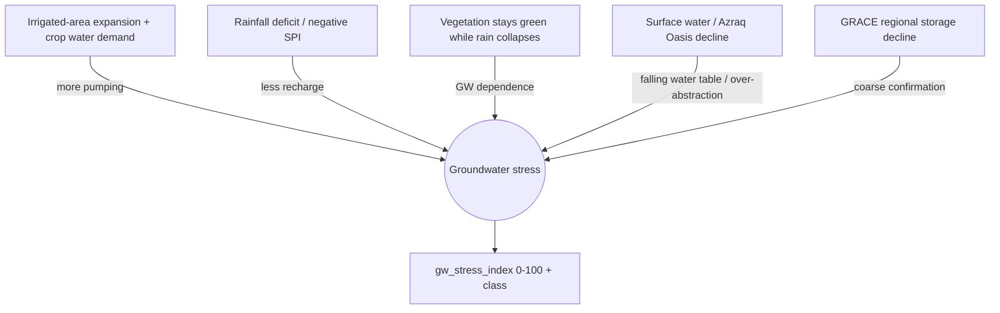

# 08 — Risk Scoring

| Field | Value |
|---|---|
| Document | 08 — Risk Scoring |
| Project | MIZAN — Earth Observation Environmental Intelligence for Jordan |
| Version | 0.1 (Draft) |
| Status | Phase 1 — Specification |
| Last updated | 2026-06-10 |
| Related | [04-data-sources](./04-data-sources.md), [06-remote-sensing-methods](./06-remote-sensing-methods.md), [07-machine-learning](./07-machine-learning.md), [09-confidence-engine](./09-confidence-engine.md), [11-database-schema](./11-database-schema.md), [12-api-specification](./12-api-specification.md), [16-validation-framework](./16-validation-framework.md), [20-limitations](./20-limitations.md) |

## Purpose

This document specifies the **groundwater stress index** (`gw_stress_index`, 0–100) and its `gw_stress_class ∈ {Low, Moderate, High, Severe}`: the conceptual model linking Earth-Observation proxies to groundwater stress, the five sub-indices, their normalization and aggregation, classification thresholds, SHAP-based explainability, confidence integration, a worked Azraq example, a validation plan, and the output schema. It is the authoritative reference for how MIZAN turns indicators into an interpretable risk signal.

**Deliverables mapping:** Primary input to **Results Visualization** and **Impact Statement**; supports **AI/Analytics Method** and **Jordanian Use Case**.

---

## 0. Scientific stance

The index is an **estimate of stress indicators from EO proxies**, not a measurement of aquifer state. There are no wells, no abstraction licences, and no pressure transducers in the loop. The design choice is therefore **transparency first**: a weighted composite whose every term is inspectable, justified by literature, and explained with SHAP — rather than an opaque regressor. Numbers in worked examples are clearly labelled illustrative. No legal determination is implied (see [20-limitations](./20-limitations.md)).

---

## 1. Conceptual model of groundwater stress

Groundwater stress in an arid closed basin like Azraq arises when **abstraction persistently exceeds recharge**, drawing down storage and degrading dependent ecosystems. We cannot see the water table from space, but we can observe its **fingerprints**:



Each arrow is operationalised as a **sub-index** (0–100, higher = worse). The five chosen sub-indices span the mass-balance logic (demand ↑, supply ↓), an ecohydrological signature (divergence), a direct local symptom (surface-water decline), and an independent regional cross-check (GRACE). Literature support is cited per sub-index below as `[ref]` placeholders to be resolved in the bibliography.

---

## 2. Sub-indices

For each sub-index we give: definition, input indicators, normalization, direction (which way is worse), and missing-data handling. All sub-indices output **0–100, higher = more stress**. Normalization uses either **min-max against an analysis range** or a **baseline z-score** (deviation from a reference/climatological period) mapped to 0–100; the choice per sub-index is stated and justified.

### 2.1 Abstraction pressure — weight 0.30

- **Definition:** estimated groundwater demand from irrigated agriculture relative to a sustainable reference. The dominant driver of Azraq depletion is agricultural pumping `[ref]`.
- **Input indicators:** `irrigated_area_ha`, `etc_mm`, `effective_rain`, `irrigation_efficiency` → `abstraction_estimate_mcm` (formula below); `agri_expansion_pct` as a trend modifier.
  ```
  abstraction_estimate = Σ_crop [ irrigated_area_crop · (ETc_crop − effective_rain) / irrigation_efficiency ]
  ```
- **Normalization:** **baseline-referenced**. Map `abstraction_estimate_mcm` to 0–100 against a reference safe yield `Q_safe` and an upper bound `Q_max`:
  `sub = 100 · clip((abstraction − Q_low)/(Q_max − Q_low), 0, 1)` where `Q_low` ≈ historical low / safe-yield estimate. Using a physically meaningful reference (not just data min-max) keeps the score comparable across years.
- **Direction:** higher abstraction → higher score (worse).
- **Missing data:** if a crop's area or `etc` is missing, that crop is excluded and the gap is reflected as **reduced confidence** (doc 09 `temporal_completeness`/`spatial_coverage`), not imputed with fabricated demand. If the whole estimate is unavailable, the sub-index is `null` and dropped from the weighted sum with renormalization (§3.4).

### 2.2 Recharge deficit — weight 0.25

- **Definition:** shortfall of rainfall-driven recharge relative to normal — the supply side of the balance `[ref]`.
- **Input indicators:** `precip_mm`, `precip_anomaly_pct`, `spi_3`/`spi_6`/`spi_12`, and `recharge_proxy_mm`:
  ```
  recharge_proxy ≈ α · max(0, P − P_threshold)
  ```
  (only rain above an infiltration threshold contributes; `α`, `P_threshold` from literature/local studies `[ref]`).
- **Normalization:** **baseline z-score**. Compute SPI (already standard-normal) and/or the z-score of `recharge_proxy_mm` vs. the climatological mean, then map deficit to 0–100:
  `sub = 100 · clip((z_ref − z)/(z_ref − z_floor), 0, 1)` with negative anomalies → high score. SPI's gamma-fit-to-normal construction makes it a natural, comparable drought measure.
- **Direction:** drier than normal (negative anomaly / negative SPI) → higher score (worse).
- **Missing data:** SPI requires a sufficient gauge/satellite-precip record; if the window is incomplete, lower `temporal_completeness` confidence and, if necessary, fall back from `spi_12` to `spi_6`/`spi_3` (documented), never invent rainfall.

### 2.3 Vegetation–water divergence — weight 0.20

- **Definition:** the degree to which vegetation remains productive while water supply (rainfall) falls — an ecohydrological signature of **groundwater dependence** `[ref]`.
- **Input indicators:** `ndvi`/`ndvi_anomaly`, `precip_anomaly_pct`/`spi_3`, `et0_pm_mm`; informed by `iforest_anomaly` `anomaly_score` (doc 07 §5) and the `xgb_irrigation_detector` divergence feature (doc 07 §4.2).
- **Normalization:** **min-max of a divergence statistic**. Define a per-region divergence `div = NDVI_anomaly_pos × (−SPI)_pos` (green-up coincident with rainfall deficit), scaled 0–100 by min-max over the analysis range.
- **Direction:** higher divergence (green despite drought) → higher score (worse, implies leaning on groundwater).
- **Missing data:** if NDVI is cloud-contaminated for the window, reduce `spatial_coverage` confidence; if either NDVI or SPI is unavailable, sub-index `null` → dropped + renormalized.

### 2.4 Surface-water decline — weight 0.15

- **Definition:** shrinkage of open water / wetland extent, most saliently the **Azraq Oasis** (Ramsar wetland whose springs dried in the 1990s due to over-abstraction) `[ref]` — a direct local symptom of a falling water table.
- **Input indicators:** `surface_water_extent_km2`, `ndwi`, `mndwi`.
- **Normalization:** **baseline-referenced decline**. Compare current extent to a reference/maximum extent `E_ref`:
  `sub = 100 · clip((E_ref − E_now)/(E_ref − E_min), 0, 1)`.
- **Direction:** smaller extent vs. reference → higher score (worse).
- **Missing data:** SAR (`mndwi` alternative via S1 water mapping) provides cloud-independent backup; if all water mapping fails for the window, sub-index `null` → dropped + renormalized.

### 2.5 Regional storage (GRACE) — weight 0.10

- **Definition:** coarse-resolution total-water-storage anomaly providing **independent regional confirmation** of decline `[ref]`. Low weight because GRACE mascons (~hundreds of km) far exceed basin scale and mix soil moisture, surface, and groundwater.
- **Input indicators:** `gws_anomaly_cm` (GRACE/GRACE-FO derived TWS anomaly, regionally contextualised).
- **Normalization:** **baseline z-score** of the TWS anomaly trend mapped to 0–100 (declining storage → higher score).
- **Direction:** more negative storage anomaly / steeper decline → higher score (worse).
- **Missing data:** GRACE has gaps (notably the 2017–2018 inter-mission gap); during gaps the sub-index is `null` → dropped + renormalized, and the absence lowers `convergence` confidence (one fewer independent indicator).

---

## 3. Aggregation

### 3.1 Weighted sum
```
gw_stress_index =
    0.30 · abstraction_pressure
  + 0.25 · recharge_deficit
  + 0.20 · vegetation_water_divergence
  + 0.15 · surface_water_decline
  + 0.10 · regional_storage_grace
```
All sub-indices are 0–100; weights sum to 1.0 ⇒ index is 0–100.

### 3.2 Weight rationale
| Sub-index | Weight | Rationale |
|---|---|---|
| Abstraction pressure | **0.30** | Direct, dominant anthropogenic driver of Azraq depletion; the lever stakeholders can act on `[ref]`. |
| Recharge deficit | **0.25** | Supply side of the mass balance; drought directly limits replenishment `[ref]`. |
| Vegetation–water divergence | **0.20** | Strong, EO-native evidence of groundwater reliance; bridges demand and impact `[ref]`. |
| Surface-water decline | **0.15** | Unambiguous local symptom (Azraq Oasis) but lagging and spatially limited `[ref]`. |
| Regional storage (GRACE) | **0.10** | Independent confirmation but too coarse for basin attribution → least weight `[ref]`. |

### 3.3 Configurability
Weights are stored in `models.hyperparams` / a config record and are **configurable** per region or scenario. Any weight change creates a **new `models` version** (doc 07 §9) so historical indices remain reproducible; the active weight vector is recorded in `risk_scores.components` metadata.

### 3.4 Missing-data renormalization
If a sub-index is `null`, drop it and renormalize the remaining weights to sum to 1:
```
w_i' = w_i / Σ_{j ∈ available} w_j
gw_stress_index = Σ_{i ∈ available} w_i' · subindex_i
```
The set of contributing sub-indices is recorded, and missingness reduces the **confidence** of the score (doc 09), not its plausibility.

### 3.5 Sensitivity analysis
Because weights are judgemental, MIZAN documents index sensitivity:
- **One-at-a-time:** perturb each weight ±0.05 (renormalising the rest) and report the resulting index range per region.
- **Local elasticity:** ∂index/∂w_i = (subindex_i − index) at the operating point, revealing which sub-index most moves the score.
- **Global (optional):** Sobol / Latin-hypercube sampling over plausible weight vectors → distribution of index and class-stability. A region whose **class** flips under small weight perturbation is flagged "borderline" in the UI.

```python
def sensitivity_oat(subindices: dict, weights: dict, delta=0.05):
    base = weighted_index(subindices, weights)
    rows = []
    for k in weights:
        w_hi = bump_and_renormalize(weights, k, +delta)
        w_lo = bump_and_renormalize(weights, k, -delta)
        rows.append({"factor": k,
                     "index_low":  weighted_index(subindices, w_lo),
                     "index_base": base,
                     "index_high": weighted_index(subindices, w_hi)})
    return rows   # illustrative helper
```

---

## 4. Classification thresholds

| Class | Range | Interpretation |
|---|---|---|
| **Low** | 0–25 | Indicators near baseline; no strong stress signal. |
| **Moderate** | 25–50 | Emerging stress; one or two sub-indices elevated. |
| **High** | 50–75 | Multiple converging stress signals; management attention warranted. |
| **Severe** | 75–100 | Strong, broad stress signature consistent with unsustainable use. |

**Justification:** equal 25-point bands keep the mapping transparent and communicable to non-specialists; the four-class scheme mirrors common drought/stress severity tiers `[ref]` and aligns with the alerting tiers (§8). Boundary cases (within ±3 of a threshold) are surfaced as "near-threshold" rather than hard-classified, reflecting estimation uncertainty.

---

## 5. Explainability — SHAP / contribution decomposition

The index is explained two complementary ways, reconciled:

1. **Linear contribution** of each sub-index: `contribution_i = w_i' · subindex_i` (sums exactly to the index).
2. **SHAP** on the gradient-boosted surrogate (doc 07 §7.4), giving additive `shap_i` around a base value; with a near-perfect surrogate (R² ≥ 0.99) these match the linear contributions.

Storage:
- **`risk_scores.components`** (jsonb): the sub-index values and the active weights/contributions.
- **`risk_factors`**: one row per factor with its SHAP value, sign, rank, and human-readable label — consumed by the UI waterfall and the grounded AI narrative (which must use only these stored numbers).

```json
// risk_scores.components (illustrative)
{
  "weights": {"abstraction":0.30,"recharge_deficit":0.25,"divergence":0.20,
              "surface_decline":0.15,"grace":0.10},
  "subindices": {"abstraction":84,"recharge_deficit":70,"divergence":62,
                 "surface_decline":75,"grace":48},
  "contributions": {"abstraction":25.2,"recharge_deficit":17.5,"divergence":12.4,
                    "surface_decline":11.3,"grace":4.8}
}
```

---

## 6. Confidence integration

The risk score carries its own confidence, derived from the confidences of its input metrics (full method in [09-confidence-engine](./09-confidence-engine.md)). Conceptually:

- Each sub-index inherits a confidence from its underlying indicator values' `confidence`.
- The risk confidence combines these via the **weighted geometric mean** (doc 09) using the same sub-index weights (renormalised for any dropped sub-index), so a high score built on weak evidence is reported as **low confidence**.
- Stored in `risk_scores.confidence` and in `confidence_scores` with the factor breakdown. The UI shows the index *and* a confidence badge; an alert may be suppressed or down-ranked if confidence is Low.

---

## 7. Worked example — Azraq Basin

> **All values below are illustrative — not a MIZAN observation.** They exist solely to show the arithmetic.

**Step 1 — sub-indices (0–100):**
| Sub-index | Value | Source proxy (illustrative) |
|---|---|---|
| Abstraction pressure | 84 | high `irrigated_area_ha`, `ETc ≫ effective_rain` |
| Recharge deficit | 70 | `spi_6 ≈ −1.4` (drier than normal) |
| Vegetation–water divergence | 62 | NDVI sustained while SPI negative |
| Surface-water decline | 75 | oasis extent ≪ reference |
| Regional storage (GRACE) | 48 | mild negative TWS trend |

**Step 2 — weighted sum:**
```
index = 0.30·84 + 0.25·70 + 0.20·62 + 0.15·75 + 0.10·48
      = 25.2 + 17.5 + 12.4 + 11.25 + 4.8
      = 71.15  → 71.2
```

**Step 3 — classify:** 71.2 ∈ [50,75) ⇒ **High**.

**Step 4 — contributions (for UI/SHAP):** abstraction 25.2 (largest), recharge 17.5, divergence 12.4, surface decline 11.3, GRACE 4.8.

**Step 5 — confidence (illustrative):** if input confidences are abstraction 0.72, recharge 0.80, divergence 0.66, surface 0.70, GRACE 0.55, the weighted geometric mean (doc 09) ≈ **0.69** → **Medium**. The narrative: *"High groundwater-stress estimate (71/100), driven chiefly by abstraction pressure and rainfall deficit; medium confidence due to partial cloud cover and coarse GRACE input."*

**Missing-data variant:** if GRACE is unavailable, drop w=0.10 and renormalize the other weights to sum to 1 (×1/0.90); recompute over the four remaining sub-indices; confidence drops slightly (one fewer convergent indicator).

---

## 8. Output schema, cadence, and alerts

### 8.1 `risk_scores`
```sql
CREATE TABLE risk_scores (
  score_id      uuid PRIMARY KEY DEFAULT gen_random_uuid(),
  region        text NOT NULL,
  geom          geometry(MultiPolygon, 4326),
  model_id      uuid REFERENCES models(model_id),
  run_id        uuid REFERENCES model_runs(run_id),
  gw_stress_index   double precision,         -- 0..100
  gw_stress_class   text,                     -- Low|Moderate|High|Severe
  components    jsonb,                         -- subindices + weights + contributions
  confidence    double precision,             -- [0,1]
  provenance_id uuid NOT NULL,
  observed_at   timestamptz,
  created_at    timestamptz DEFAULT now()
);
```

### 8.2 `risk_factors`
```sql
CREATE TABLE risk_factors (
  factor_id     uuid PRIMARY KEY DEFAULT gen_random_uuid(),
  score_id      uuid REFERENCES risk_scores(score_id),
  factor        text,            -- 'abstraction' | 'recharge_deficit' | ...
  subindex_value double precision,
  weight        double precision,
  contribution  double precision,
  shap_value    double precision,
  rank          integer,
  label         text             -- human-readable
);
```

### 8.3 Computation cadence
Recomputed whenever any input sub-index updates — in practice monthly (rainfall/SPI, surface water, anomaly) with annual/seasonal refreshes of abstraction (tied to `rf_crop_classifier`/`xgb_irrigation_detector`). Each computation is a tracked `model_runs` row.

### 8.4 Alert thresholds → `alerts`
| Trigger | Severity |
|---|---|
| Class transition upward (e.g. Moderate→High) | warning |
| `gw_stress_index ≥ 75` (Severe) | critical |
| Sub-index crosses its own alert level (e.g. abstraction ≥ 80) | info/warning |
| Confidence ≥ Medium **required** for warning+ | (gate) |

```sql
CREATE TABLE alerts (
  alert_id      uuid PRIMARY KEY DEFAULT gen_random_uuid(),
  region        text,
  score_id      uuid REFERENCES risk_scores(score_id),
  rule          text,
  severity      text,            -- info|warning|critical
  message       text,
  confidence    double precision,
  created_at    timestamptz DEFAULT now()
);
```
Alerts inherit the score's confidence; low-confidence triggers are logged but not escalated, to avoid false alarms from weak evidence.

---

## 9. Validation plan

Validation of a proxy-based index cannot use a single ground-truth number; it is evidence-triangulation (detailed in [16-validation-framework](./16-validation-framework.md)):

1. **Documented-event back-testing.** The index, run over the historical record, should rise during **documented drought years** and across the period of the **Azraq Oasis spring decline / desiccation** `[ref]`. Class transitions should be temporally consistent with these events.
2. **Internal consistency.** Sub-indices should not contradict (e.g. severe abstraction + heavy rainfall surplus is suspicious) — flagged for review.
3. **Cross-check with independent data** where available (published basin water-balance studies, official abstraction estimates) — used to sanity-check magnitude, not as fabricated labels.
4. **Stakeholder review.** Hydrogeologists / water-authority experts review index time series and weights for face validity; feedback adjusts weights (versioned).
5. **Sensitivity & stability** (§3.5) reported so reviewers see how robust each region's class is.

Acceptance for Phase 1: the index reproduces the **direction** and **relative timing** of documented stress episodes, and stakeholder review finds the weighting defensible. Quantitative skill targets are deferred until in-situ corroboration is available (see [20-limitations](./20-limitations.md)).

---

## 10. Mapping → deliverables

| Element | AstroCode deliverable(s) |
|---|---|
| `gw_stress_index` + class | Results Visualization · Impact Statement |
| Sub-index decomposition + SHAP | AI/Analytics Method · Results Visualization |
| Azraq worked example | Jordanian Use Case · Data Explanation |
| Validation plan | Impact Statement · (Functional Prototype credibility) |
| Confidence integration | Data Explanation (via [09-confidence-engine](./09-confidence-engine.md)) |
