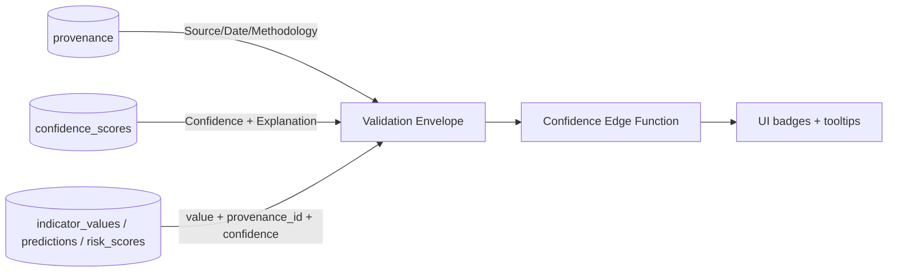

# 09 — Confidence Engine

| Field | Value |
|---|---|
| Document | 09 — Confidence Engine |
| Project | MIZAN — Earth Observation Environmental Intelligence for Jordan |
| Version | 0.1 (Draft) |
| Status | Phase 1 — Specification |
| Last updated | 2026-06-10 |
| Related | [04-data-sources](./04-data-sources.md), [05-earth-engine-pipelines](./05-earth-engine-pipelines.md), [06-remote-sensing-methods](./06-remote-sensing-methods.md), [07-machine-learning](./07-machine-learning.md), [08-risk-scoring](./08-risk-scoring.md), [11-database-schema](./11-database-schema.md), [12-api-specification](./12-api-specification.md), [13-ui-pages](./13-ui-pages.md), [16-validation-framework](./16-validation-framework.md), [20-limitations](./20-limitations.md) |

## Purpose

This document specifies the **Confidence Engine**: how MIZAN quantifies trust in every metric it reports and powers the **Validation Envelope**. It defines the five envelope fields, the six confidence factors and their scoring functions, the weighted-geometric-mean aggregation, per-indicator configuration, how confidence flows from indicators to the risk score to the UI, explanation generation, worked examples, and API exposure.

**Deliverables mapping:** Core of the **Data Explanation** deliverable; directly enables **Results Visualization** (confidence badges) and lends credibility to the **Functional Prototype** and **Impact Statement**.

---

## 0. Why a confidence engine

MIZAN reports **estimates from EO proxies**, never direct groundwater observations. A number without a stated trustworthiness is misleading. The Confidence Engine attaches, to every metric, (a) a transparent **0–1 score**, (b) a **level** (High/Medium/Low), and (c) a human-readable **explanation** — so users can see *how much to believe* each value and *why*. This is a non-negotiable: every metric ships with its Validation Envelope.

---

## 1. The Validation Envelope (five fields)

Every metric MIZAN surfaces carries five fields:

| Field | Meaning | Example |
|---|---|---|
| **Source** | Dataset(s)/model that produced the value | "Sentinel-2 SR + `rf_crop_classifier@1.0.0`" |
| **Date** | Valid time of the underlying observation(s) | "2025-08-15" |
| **Methodology** | How it was computed | "Median seasonal composite; RF crop classification; area reduction" |
| **Confidence** | 0–1 score + level | "0.78 (Medium)" |
| **Explanation** | Plain-language justification of the confidence | "Recent, low cloud, but mixed pixels at field edges." |

### 1.1 Where each field is stored / served
- **Source, Date, Methodology** derive from the `provenance` record linked by `provenance_id` on `indicator_values` / `predictions` / `risk_scores` (see [11-database-schema](./11-database-schema.md)).
- **Confidence** lives in `confidence_scores` (score, level, factor breakdown) and is denormalised onto `indicator_values.confidence`, `predictions.confidence`, `risk_scores.confidence`.
- **Explanation** is generated (template + grounded AI, §8) and stored alongside the confidence record.
- All five are assembled into a single response object by the API ([12-api-specification](./12-api-specification.md), §9 here).



---

## 2. The six confidence factors

Confidence is a weighted **geometric** mean of up to six factor scores, each in **[0,1]** (1 = best). Weights:

| Factor | Weight | Applies to |
|---|---|---|
| `freshness` | 0.20 | all metrics |
| `source_quality` | 0.20 | all metrics |
| `spatial_coverage` | 0.20 | all spatial metrics |
| `temporal_completeness` | 0.15 | time-series / aggregated metrics |
| `model_validation` | 0.15 | model-derived metrics only |
| `convergence` | 0.10 | metrics with ≥2 independent indicators |

The geometric mean is used deliberately: it is **conjunctive** — a single near-zero factor (e.g. stale data, or near-total cloud) drags the whole score down, which is the correct behaviour for trust (one fatal weakness should not be averaged away). For non-model metrics, `model_validation` is dropped and weights renormalised (§4.2).

---

## 3. Factor scoring functions (0–1)

Each function returns a score in [0,1]. All parameters (cadences, thresholds) are configurable per indicator type (§5).

### 3.1 `freshness` — decay vs expected cadence
The value should be no older than its expected update cadence `T_expected` (e.g. 5 days for S2, 1 month for SPI). Exponential decay past a grace period:

```
age   = now − observed_at
ratio = age / T_expected
freshness = exp( −max(0, ratio − 1) / τ )      # τ controls decay steepness
```
So while `age ≤ T_expected` (ratio ≤ 1) freshness = 1; beyond that it decays smoothly toward 0. `τ` default ≈ 1.0 (score ≈ 0.37 when the value is one full extra cadence stale).

```python
import math
def freshness(age_days, t_expected_days, tau=1.0):
    ratio = age_days / max(t_expected_days, 1e-9)
    return math.exp(-max(0.0, ratio - 1.0) / tau)   # [0,1]
```

### 3.2 `source_quality` — cloud % / sensor reliability / SAR availability
Quality of the acquisition behind the value:
- **Optical (S2):** `q = 1 − cloud_fraction_over_AOI` (after masking), optionally floored by a sensor-reliability term.
- **SAR (S1):** availability/relative-orbit completeness; SAR is cloud-independent so high baseline, reduced for missing passes.
- **Reanalysis/products (precip, GRACE):** a fixed per-product reliability prior from [04-data-sources](./04-data-sources.md).

```
source_quality = w_c·(1 − cloud_frac) + w_s·sensor_reliability + w_a·sar_availability
                  (only the terms relevant to the source; weights sum to 1)
```

### 3.3 `spatial_coverage` — valid-pixel fraction within AOI
Fraction of the AOI with valid (unmasked, in-swath) pixels contributing to the value:

```
spatial_coverage = valid_pixels_in_AOI / total_pixels_in_AOI      # [0,1]
```
A composite covering only 60% of Azraq (cloud/edge) scores 0.60. For non-pixel products, set to in-domain coverage of the AOI.

### 3.4 `temporal_completeness` — observations vs expected
For aggregates/time series, the share of expected observations actually present in the window:

```
temporal_completeness = n_observations / n_expected            # clipped to [0,1]
```
e.g. an SPI-6 needing 6 monthly inputs but having 5 → 0.83.

### 3.5 `model_validation` — mapped from cross-val metric
For model-derived metrics, map the model's headline validation score to [0,1]:
- `rf_crop_classifier`: overall accuracy (or per-class F1 for the specific class).
- `xgb_irrigation_detector`: PR-AUC (or calibrated reliability).
- `gw_stress_model`: surrogate fidelity is ~1; validity handled separately (doc 16) — use a conservative prior.

```
model_validation = clip( (metric − metric_floor) / (1 − metric_floor), 0, 1 )
```
with `metric_floor` the minimum acceptable (e.g. 0.5 for accuracy), so a model exactly at the floor scores 0 and a perfect model scores 1.

### 3.6 `convergence` — agreement among independent indicators
When ≥2 independent indicators estimate the same thing, agreement raises confidence; disagreement lowers it. Using the normalised spread of the standardised indicator estimates:

```
convergence = 1 − clip( std(z_i) / std_max , 0, 1 )
```
where `z_i` are the independent indicators (standardised to comparable scale) and `std_max` is the spread considered "full disagreement." Perfect agreement (std 0) → 1; wide disagreement → 0. (Equivalently, for two indicators, a function of their normalised difference.)

```python
import numpy as np
def convergence(z_values, std_max):
    if len(z_values) < 2:
        return None            # factor not applicable
    return float(1.0 - min(np.std(z_values) / std_max, 1.0))
```

---

## 4. Aggregation

### 4.1 Weighted geometric mean
```
confidence = Π_i ( factor_i ^ (w_i / Σ w_used) )
```
i.e. the weighted geometric mean over the **used** factors. Equivalently:
```
confidence = exp( Σ_i (w_i/Σw_used) · ln(max(factor_i, ε)) )
```
with a small `ε` (e.g. 1e-6) to avoid log(0). A zero in any used factor with non-trivial weight pushes confidence toward 0 — intended.

```python
import math
DEFAULT_W = {"freshness":0.20, "source_quality":0.20, "spatial_coverage":0.20,
             "temporal_completeness":0.15, "model_validation":0.15, "convergence":0.10}

def confidence_score(factors: dict, weights: dict = DEFAULT_W, eps=1e-6):
    used = {k: v for k, v in factors.items() if v is not None and k in weights}
    if not used:
        return None
    wsum = sum(weights[k] for k in used)               # renormalize over used factors
    logc = sum((weights[k]/wsum) * math.log(max(v, eps)) for k, v in used.items())
    return math.exp(logc)                              # [0,1]
```

### 4.2 Renormalization rules
- **Non-model metrics:** drop `model_validation` (and `convergence` if only one indicator) → renormalize remaining weights to sum to 1 (the `wsum` term above handles this automatically).
- **Single-source metrics:** drop `convergence`.
- The set of used factors is stored so the score is reproducible and explainable.

### 4.3 Level thresholds
| Level | Range |
|---|---|
| **High** | ≥ 0.80 |
| **Medium** | 0.50 – 0.79 |
| **Low** | < 0.50 |

---

## 5. Per-indicator-type configuration

Not every factor applies to every indicator; configuration (stored centrally, referenced by `confidence_scores`) declares applicability + parameters.

| Indicator group | Factors used | Notes |
|---|---|---|
| Optical indices (`ndvi`,`evi`,`savi`,`ndwi`,`mndwi`,`*_anomaly`) | freshness, source_quality(cloud), spatial_coverage, temporal_completeness, convergence | `T_expected`≈5 d (S2 revisit) |
| SAR (`s1_vv`,`s1_vh`,`s1_rvi`,`soil_moisture_proxy`) | freshness, source_quality(SAR avail), spatial_coverage, temporal_completeness | cloud-independent → high source baseline |
| Surface water (`surface_water_extent_km2`) | freshness, source_quality, spatial_coverage, temporal_completeness, convergence(optical+SAR) | |
| Precip / drought (`precip_mm`,`precip_anomaly_pct`,`spi_*`) | freshness, source_quality(product prior), temporal_completeness, convergence | spatial_coverage = domain coverage |
| Climate/ET (`tmax_c`…`et0_pm_mm`,`etc_mm`) | freshness, source_quality(product prior), temporal_completeness | deterministic ET → no model_validation |
| Crop/irrigation (`cropland_area_ha`,`irrigated_area_ha`,`crop_class`,`agri_expansion_pct`) | freshness, source_quality, spatial_coverage, **model_validation**, convergence | model-derived (doc 07) |
| Water balance (`recharge_proxy_mm`,`abstraction_estimate_mcm`,`water_balance_mcm`) | freshness, source_quality, temporal_completeness, model_validation, convergence | composite of model + deterministic inputs |
| Regional storage (`gws_anomaly_cm`) | freshness, source_quality(product prior), temporal_completeness | coarse; low spatial weight |
| Risk (`gw_stress_index`) | inherited via sub-index confidences (§6) | |

---

## 6. How confidence flows

```mermaid
flowchart TD
  IV[indicator_values.confidence\nper-metric factor scores] --> SUB[sub-index confidence\n(doc 08)]
  SUB --> RISK[risk_scores.confidence\nweighted geom mean over sub-indices]
  IV --> PRED[predictions.confidence]
  RISK --> BADGE[UI confidence badge + tooltip]
  PRED --> BADGE
  CS[(confidence_scores\nfactor breakdown jsonb)] --- IV
  CS --- RISK
```

1. **Indicator level:** each `indicator_values` row gets a confidence via §3–4; the factor breakdown is stored in `confidence_scores`.
2. **Risk level:** each sub-index inherits its inputs' confidence; the risk confidence is the **weighted geometric mean across sub-indices** using the same sub-index weights (renormalised for dropped sub-indices) — consistent with the conjunctive philosophy: stress built on weak evidence reads as low confidence (doc 08 §6).
3. **UI:** confidence drives a colour-coded badge (High green / Medium amber / Low red) on every value, with the Validation Envelope in a tooltip ([13-ui-pages](./13-ui-pages.md)).
4. **Alerts/AI:** low confidence gates alert escalation (doc 08 §8.4) and is stated explicitly in narratives.

### 6.1 `confidence_scores` storage
```sql
CREATE TABLE confidence_scores (
  confidence_id uuid PRIMARY KEY DEFAULT gen_random_uuid(),
  subject_type  text NOT NULL,        -- 'indicator' | 'prediction' | 'risk'
  subject_id    uuid NOT NULL,        -- FK to the scored row
  score         double precision NOT NULL,   -- [0,1]
  level         text NOT NULL,        -- High|Medium|Low
  factors       jsonb NOT NULL,       -- {factor: {value, weight, used}}
  explanation   text,
  provenance_id uuid,
  created_at    timestamptz DEFAULT now()
);
```

---

## 7. Explanation generation

A two-stage approach keeps explanations both reliable and readable:

1. **Template (deterministic, always present):** built from the factor breakdown, naming the lowest-scoring factor(s).
   - *"Confidence Medium (0.71). Strengths: recent data, low cloud. Weaknesses: only 60% of the basin had valid pixels."*
2. **Grounded-AI augmentation (optional):** the OpenAI Edge-Function proxy receives **only** the stored factor values + level and rewrites the template more fluently. It must not introduce numbers absent from the payload (grounded generation). If unavailable, the template stands alone.

```python
def explain(factors, score, level):
    weakest = sorted(((v, k) for k, v in factors.items() if v is not None))[:2]
    weak_txt = ", ".join(f"{k} ({v:.2f})" for v, k in weakest)
    return f"Confidence {level} ({score:.2f}). Main limiting factor(s): {weak_txt}."
```

---

## 8. Worked examples

> **All values below are illustrative — not a MIZAN observation.**

### 8.1 NDVI composite (model-free, spatial)
Factors (model_validation dropped, convergence dropped — single source):
- freshness 0.95 (3 days old, `T_expected`=5)
- source_quality 0.82 (18% residual cloud)
- spatial_coverage 0.60 (40% masked)
- temporal_completeness 1.00

Used weights renormalised over {0.20,0.20,0.20,0.15} → sum 0.75:
```
confidence = exp( (0.20·ln0.95 + 0.20·ln0.82 + 0.20·ln0.60 + 0.15·ln1.00)/0.75 )
           = exp( (0.20·(−0.051)+0.20·(−0.198)+0.20·(−0.511)+0)/0.75 )
           = exp( −0.152/0.75 ) = exp(−0.203) ≈ 0.82
```
Wait — recompute numerator: 0.20·(−0.051)=−0.0102; 0.20·(−0.198)=−0.0396; 0.20·(−0.511)=−0.1022; total −0.1520; ÷0.75 = −0.2027; exp = **0.816** → **High** (just above 0.80). Explanation: *"High (0.82); main limiting factor spatial_coverage (0.60) from cloud masking."*

### 8.2 Irrigated-area estimate (model-derived)
Factors:
- freshness 0.90, source_quality 0.85, spatial_coverage 0.78,
- model_validation 0.80 (PR-AUC mapped), convergence 0.70 (NDVI + SAR agree moderately).

All six weights used (temporal_completeness 0.88), sum 1.0:
```
ln terms: f −0.105·0.20, sq −0.163·0.20, sc −0.248·0.20,
          tc −0.128·0.15, mv −0.223·0.15, cv −0.357·0.10
Σ = −0.0211 −0.0325 −0.0497 −0.0192 −0.0335 −0.0357 = −0.1916
confidence = exp(−0.1916) ≈ 0.826 → High
```
Explanation: *"High (0.83); weakest factor convergence (0.70) — optical and radar agree only moderately."*

### 8.3 Risk score (inherited)
With sub-index confidences abstraction 0.72, recharge 0.80, divergence 0.66, surface 0.70, GRACE 0.55 and weights 0.30/0.25/0.20/0.15/0.10:
```
confidence = exp( 0.30·ln0.72 + 0.25·ln0.80 + 0.20·ln0.66 + 0.15·ln0.70 + 0.10·ln0.55 )
           = exp( 0.30·(−0.329)+0.25·(−0.223)+0.20·(−0.416)+0.15·(−0.357)+0.10·(−0.598) )
           = exp( −0.0987 −0.0558 −0.0831 −0.0535 −0.0598 )
           = exp(−0.3509) ≈ 0.704 → Medium
```
Matches doc 08 §7 (~0.69–0.70). Explanation: *"Medium (0.70); GRACE input (0.55) is the weakest contributor."*

---

## 9. API exposure

A dedicated **confidence Edge Function** assembles the Validation Envelope; details in [12-api-specification](./12-api-specification.md).

### 9.1 Response envelope
Every value-returning endpoint wraps results so confidence travels with the number:

```json
{
  "indicator": "ndvi",
  "region": "azraq_basin",
  "value": 0.41,
  "validation": {
    "source": "Sentinel-2 SR (COPERNICUS/S2_SR_HARMONIZED)",
    "date": "2025-08-15",
    "methodology": "Seasonal median composite, SCL+s2cloudless mask, NDVI",
    "confidence": { "score": 0.82, "level": "High",
      "factors": { "freshness":0.95, "source_quality":0.82,
                   "spatial_coverage":0.60, "temporal_completeness":1.00 } },
    "explanation": "High (0.82); main limiting factor spatial_coverage (0.60) from cloud masking."
  }
}
```
> *Illustrative — not a MIZAN observation.*

### 9.2 Endpoints (summary)
- `GET /confidence/:subject_type/:subject_id` → confidence record + explanation.
- Value endpoints embed the `validation` block above; the function resolves `provenance_id` (Source/Date/Methodology) and the `confidence_scores` row (Confidence/Explanation) in one response. Auth/format/error contract per [12-api-specification](./12-api-specification.md).

---

## 10. Mapping → deliverables

| Element | AstroCode deliverable(s) |
|---|---|
| Validation Envelope (5 fields) | Data Explanation |
| Factor scoring functions | Data Explanation · AI/Analytics Method |
| Confidence badges in UI | Results Visualization |
| Grounded-AI explanations | Data Explanation · Results Visualization |
| Confidence flow → risk/alerts | Impact Statement (trustworthy alerting) |

The Confidence Engine is what lets MIZAN claim **trustworthy** environmental intelligence: every number arrives with its provenance, a defensible 0–1 trust score, and a plain-language reason — never a bare figure, never a fabricated one (see [20-limitations](./20-limitations.md)).
