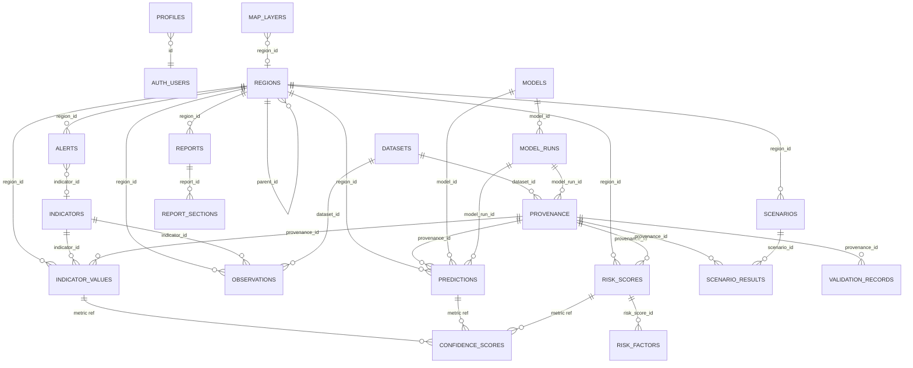
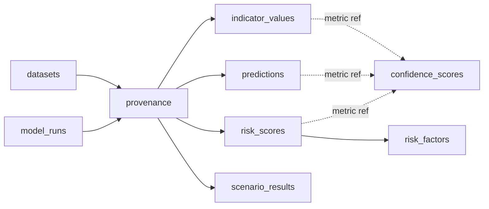

# 11 — Database Schema

| | |
|---|---|
| **Document** | 11 — Database Schema |
| **Project** | MIZAN — Earth Observation Environmental Intelligence for Jordan |
| **Version** | 0.1 (Draft) |
| **Status** | Phase 1 — Specification |
| **Last updated** | 2026-06-10 |
| **Related** | [03-system-architecture](./03-system-architecture.md) · [04-data-sources](./04-data-sources.md) · [05-earth-engine-pipelines](./05-earth-engine-pipelines.md) · [07-machine-learning](./07-machine-learning.md) · [08-risk-scoring](./08-risk-scoring.md) · [09-confidence-engine](./09-confidence-engine.md) · [10-digital-twin](./10-digital-twin.md) · [12-api-specification](./12-api-specification.md) · [15-report-generator](./15-report-generator.md) · [16-validation-framework](./16-validation-framework.md) · [17-security](./17-security.md) · [18-deployment](./18-deployment.md) |

**Purpose.** This document specifies the complete PostgreSQL 15 + PostGIS 3.4 schema that is MIZAN's single source of truth. It defines every canonical table (purpose, columns, keys, indexes, relationships), the enumerations and the catalogs, the **provenance model** that links every value to its origin, the **confidence** storage, the Row-Level Security (RLS) posture per table, seed/reference data, the Supabase migration strategy, and example queries. It is a contract: the API ([12-api-specification](./12-api-specification.md)), pipelines ([05](./05-earth-engine-pipelines.md)), risk model ([08](./08-risk-scoring.md)), and confidence engine ([09](./09-confidence-engine.md)) all bind to the names and constraints defined here.

**Core invariant.** *Every value-bearing row links to provenance.* `indicator_values`, `predictions`, `risk_scores`, and `scenario_results` each carry a **NOT NULL** `provenance_id` foreign key. There is no supported path to persist a user-visible number without provenance. This enforces the non-negotiable rule that **MIZAN never fabricates data**.

**Deliverables mapping.** Underpins **Data Explanation** (provenance/traceability), **AI/Analytics Method** (model registry + runs + SHAP), **Results Visualization** (map_layers, geometries), **Functional Prototype** (the operational store), and **Impact Statement** (auditable, decision-grade records).

---

## 1. Conventions

- **Database:** PostgreSQL 15. **Spatial:** PostGIS 3.4 (`CREATE EXTENSION postgis`). UUIDs via `pgcrypto`/`gen_random_uuid()`.
- **Schemas:** application tables in `public` (Supabase convention so PostgREST and RLS apply uniformly). `auth.users` is Supabase-managed; `public.profiles` extends it.
- **Primary keys:** `uuid` default `gen_random_uuid()` unless a natural key is clearly better (catalogs use short `text`/`citext` codes as secondary unique keys).
- **Timestamps:** `timestamptz`, stored in UTC; `created_at` defaults to `now()`; `updated_at` maintained by trigger where relevant.
- **Geometry:** `geometry(Geometry, 4326)` (or specific subtypes), SRID 4326 (WGS84). GIST indexes on all geometry columns.
- **Spatial measurement:** areas computed with `ST_Area(geography)` or `ST_Area(ST_Transform(geom, <equal-area>))`; stored area columns are denormalized for speed and recorded with the method in provenance.
- **JSONB:** used for flexible structured payloads (`parameters`, `components`, `shap`, factor breakdowns); GIN-indexed where queried.
- **Soft references to time series:** large fact tables (`indicator_values`, `observations`, `predictions`, `risk_scores`) are designed for range-partitioning by date as history grows.

---

## 2. Entity-Relationship diagram (Mermaid)



---

## 3. Enumerations & reference types

```sql
-- Roles for application users (mirrored into JWT claim).
CREATE TYPE user_role AS ENUM ('viewer', 'analyst', 'admin', 'judge');

-- Groundwater-stress class (binned from gw_stress_index 0-100).
CREATE TYPE gw_stress_class AS ENUM ('Low', 'Moderate', 'High', 'Severe');

-- Confidence band (from the weighted geometric mean score).
CREATE TYPE confidence_level AS ENUM ('High', 'Medium', 'Low');

-- Kind of region geometry.
CREATE TYPE region_kind AS ENUM ('basin', 'governorate', 'district', 'aoi', 'country');

-- The metric family a confidence score / provenance refers to.
CREATE TYPE metric_kind AS ENUM ('indicator_value', 'prediction', 'risk_score', 'scenario_result');

-- Severity of an environmental alert.
CREATE TYPE alert_severity AS ENUM ('info', 'watch', 'warning', 'critical');

-- Lifecycle status used by reports / scenarios / model_runs.
CREATE TYPE job_status AS ENUM ('pending', 'running', 'succeeded', 'failed', 'archived');
```

> **Indicator units** are not a Postgres enum (they are open-ended and documented per indicator); instead they live as a constrained `text` column in the `indicators` catalog (e.g., `'1'` dimensionless, `'mm'`, `'km2'`, `'ha'`, `'mcm'`, `'cm'`, `'dB'`, `'C'`, `'pct'`, `'index_0_100'`). Canonical unit strings are seeded in §10.

---

## 4. Catalog & spatial tables

### 4.1 `public.profiles`
**Purpose.** Extends `auth.users` with the application role and display metadata; the role drives RLS and JWT claims.

| Column | Type | Constraints |
|--------|------|-------------|
| id | uuid | PK, FK → auth.users(id) ON DELETE CASCADE |
| role | user_role | NOT NULL DEFAULT 'viewer' |
| full_name | text | |
| organization | text | |
| locale | text | DEFAULT 'en' (CHECK in {'en','ar'}) |
| created_at | timestamptz | NOT NULL DEFAULT now() |
| updated_at | timestamptz | NOT NULL DEFAULT now() |

```sql
CREATE TABLE public.profiles (
  id           uuid PRIMARY KEY REFERENCES auth.users(id) ON DELETE CASCADE,
  role         user_role NOT NULL DEFAULT 'viewer',
  full_name    text,
  organization text,
  locale       text NOT NULL DEFAULT 'en' CHECK (locale IN ('en','ar')),
  created_at   timestamptz NOT NULL DEFAULT now(),
  updated_at   timestamptz NOT NULL DEFAULT now()
);
```

### 4.2 `regions`
**Purpose.** Spatial units of analysis: basins (Azraq), governorates/districts (FAO GAUL), ad-hoc AOIs, and the country. Self-referential for hierarchy.

| Column | Type | Constraints |
|--------|------|-------------|
| id | uuid | PK |
| code | text | UNIQUE (e.g., 'azraq_basin', 'gov_amman') |
| name_en | text | NOT NULL |
| name_ar | text | |
| kind | region_kind | NOT NULL |
| parent_id | uuid | FK → regions(id) |
| admin_level | smallint | nullable (GAUL level) |
| source | text | provenance of geometry (e.g., 'FAO/GAUL/2015/level1', 'MWI', 'SRTM-derived') |
| area_km2 | double precision | denormalized ST_Area(geography)/1e6 |
| geom | geometry(MultiPolygon,4326) | NOT NULL |
| created_at | timestamptz | DEFAULT now() |

```sql
CREATE TABLE regions (
  id          uuid PRIMARY KEY DEFAULT gen_random_uuid(),
  code        text UNIQUE,
  name_en     text NOT NULL,
  name_ar     text,
  kind        region_kind NOT NULL,
  parent_id   uuid REFERENCES regions(id),
  admin_level smallint,
  source      text,
  area_km2    double precision,
  geom        geometry(MultiPolygon, 4326) NOT NULL,
  created_at  timestamptz NOT NULL DEFAULT now()
);
CREATE INDEX regions_geom_gix ON regions USING GIST (geom);
CREATE INDEX regions_kind_idx ON regions (kind);
CREATE INDEX regions_parent_idx ON regions (parent_id);
```

### 4.3 `datasets`
**Purpose.** Catalog of every EO/geospatial source (see [04-data-sources](./04-data-sources.md)); referenced by provenance and observations so attribution/cadence are recoverable for any value.

| Column | Type | Constraints |
|--------|------|-------------|
| id | uuid | PK |
| key | text | UNIQUE (e.g., 's2_sr_harmonized') |
| name | text | NOT NULL |
| provider | text | NOT NULL |
| ee_asset_id | text | (e.g., 'COPERNICUS/S2_SR_HARMONIZED') |
| spatial_res_m | double precision | native resolution (m), null for vector |
| temporal_res | text | (e.g., '5d', 'daily', 'monthly', 'static') |
| latency | text | typical catalog latency |
| license | text | NOT NULL |
| attribution | text | NOT NULL (rendered in UI/reports) |
| freshness_threshold_days | integer | feeds confidence freshness ([09](./09-confidence-engine.md)) |
| source_quality | numeric(3,2) | base quality factor [0,1] |
| notes | text | caveats/quality flags |
| created_at | timestamptz | DEFAULT now() |

```sql
CREATE TABLE datasets (
  id                       uuid PRIMARY KEY DEFAULT gen_random_uuid(),
  key                      text UNIQUE NOT NULL,
  name                     text NOT NULL,
  provider                 text NOT NULL,
  ee_asset_id              text,
  spatial_res_m            double precision,
  temporal_res             text,
  latency                  text,
  license                  text NOT NULL,
  attribution              text NOT NULL,
  freshness_threshold_days integer,
  source_quality           numeric(3,2) CHECK (source_quality BETWEEN 0 AND 1),
  notes                    text,
  created_at               timestamptz NOT NULL DEFAULT now()
);
CREATE INDEX datasets_key_idx ON datasets (key);
```

### 4.4 `indicators`
**Purpose.** Catalog of indicator codes/units/descriptions (the canonical INDICATOR CODES). Drives validation and UI labeling.

| Column | Type | Constraints |
|--------|------|-------------|
| id | uuid | PK |
| code | text | UNIQUE NOT NULL (e.g., 'ndvi', 'gw_stress_index') |
| name_en | text | NOT NULL |
| name_ar | text | |
| unit | text | NOT NULL (canonical unit string) |
| category | text | e.g., 'vegetation','water','climate','agriculture','risk' |
| value_min | double precision | optional valid range |
| value_max | double precision | optional valid range |
| description | text | methodology summary |
| created_at | timestamptz | DEFAULT now() |

```sql
CREATE TABLE indicators (
  id          uuid PRIMARY KEY DEFAULT gen_random_uuid(),
  code        text UNIQUE NOT NULL,
  name_en     text NOT NULL,
  name_ar     text,
  unit        text NOT NULL,
  category    text,
  value_min   double precision,
  value_max   double precision,
  description text,
  created_at  timestamptz NOT NULL DEFAULT now()
);
CREATE INDEX indicators_category_idx ON indicators (category);
```

---

## 5. Provenance, models & runs

### 5.1 `provenance`
**Purpose.** The traceability spine. Every computed value references exactly one provenance row capturing how it was produced.

| Column | Type | Constraints |
|--------|------|-------------|
| id | uuid | PK |
| source | text | NOT NULL (e.g., 'Earth Engine', 'CHIRPS', 'model:gw_stress_model') |
| dataset_id | uuid | FK → datasets(id) |
| ee_asset_id | text | exact EE asset used |
| period_start | date | observation window start |
| period_end | date | observation window end |
| processing_method | text | NOT NULL (e.g., 'S2 median composite + NDVI') |
| processing_version | text | NOT NULL (semantic version of the pipeline) |
| parameters | jsonb | NOT NULL DEFAULT '{}' (all tunable inputs: thresholds, kernels, Kc, etc.) |
| model_run_id | uuid | FK → model_runs(id) (when produced by a model) |
| computed_by | text | actor (service account / function / user id) |
| created_at | timestamptz | NOT NULL DEFAULT now() |

```sql
CREATE TABLE provenance (
  id                 uuid PRIMARY KEY DEFAULT gen_random_uuid(),
  source             text NOT NULL,
  dataset_id         uuid REFERENCES datasets(id),
  ee_asset_id        text,
  period_start       date,
  period_end         date,
  processing_method  text NOT NULL,
  processing_version text NOT NULL,
  parameters         jsonb NOT NULL DEFAULT '{}'::jsonb,
  model_run_id       uuid,  -- FK added after model_runs exists
  computed_by        text,
  created_at         timestamptz NOT NULL DEFAULT now()
);
CREATE INDEX provenance_dataset_idx ON provenance (dataset_id);
CREATE INDEX provenance_period_idx ON provenance (period_start, period_end);
CREATE INDEX provenance_params_gin ON provenance USING GIN (parameters);
```

### 5.2 `models`
**Purpose.** Registry of analytical models (the MODEL REGISTRY keys).

| Column | Type | Constraints |
|--------|------|-------------|
| id | uuid | PK |
| key | text | UNIQUE NOT NULL ∈ {rf_crop_classifier, xgb_irrigation_detector, iforest_anomaly, penman_monteith, shap_explainer, gw_stress_model} |
| name | text | NOT NULL |
| kind | text | e.g., 'classifier','detector','anomaly','physical','explainer','composite' |
| framework | text | e.g., 'ee.smileRandomForest','xgboost','scikit-learn','IsolationForest','formula' |
| description | text | |
| created_at | timestamptz | DEFAULT now() |

```sql
CREATE TABLE models (
  id          uuid PRIMARY KEY DEFAULT gen_random_uuid(),
  key         text UNIQUE NOT NULL,
  name        text NOT NULL,
  kind        text,
  framework   text,
  description text,
  created_at  timestamptz NOT NULL DEFAULT now()
);
```

### 5.3 `model_runs`
**Purpose.** A specific execution/version of a model, with validation metrics (feeds the confidence model_validation factor).

| Column | Type | Constraints |
|--------|------|-------------|
| id | uuid | PK |
| model_id | uuid | NOT NULL FK → models(id) |
| version | text | NOT NULL |
| status | job_status | NOT NULL DEFAULT 'pending' |
| trained_at | timestamptz | |
| metrics | jsonb | validation metrics (accuracy, F1, AUC, RMSE, OOB) |
| validation_score | numeric(4,3) | summary skill [0,1] for confidence |
| hyperparameters | jsonb | DEFAULT '{}' |
| artifact_uri | text | model artifact location (Storage/GCS) |
| created_by | text | |
| created_at | timestamptz | DEFAULT now() |

```sql
CREATE TABLE model_runs (
  id               uuid PRIMARY KEY DEFAULT gen_random_uuid(),
  model_id         uuid NOT NULL REFERENCES models(id),
  version          text NOT NULL,
  status           job_status NOT NULL DEFAULT 'pending',
  trained_at       timestamptz,
  metrics          jsonb NOT NULL DEFAULT '{}'::jsonb,
  validation_score numeric(4,3) CHECK (validation_score BETWEEN 0 AND 1),
  hyperparameters  jsonb NOT NULL DEFAULT '{}'::jsonb,
  artifact_uri     text,
  created_by       text,
  created_at       timestamptz NOT NULL DEFAULT now()
);
CREATE INDEX model_runs_model_idx ON model_runs (model_id);

-- Now wire provenance.model_run_id FK.
ALTER TABLE provenance
  ADD CONSTRAINT provenance_model_run_fk
  FOREIGN KEY (model_run_id) REFERENCES model_runs(id);
```

---

## 6. Fact / value tables (all link to provenance)

### 6.1 `indicator_values`
**Purpose.** Core time-series fact: one row per region × indicator × date. **NOT NULL** provenance.

| Column | Type | Constraints |
|--------|------|-------------|
| id | uuid | PK |
| region_id | uuid | NOT NULL FK → regions(id) |
| indicator_id | uuid | NOT NULL FK → indicators(id) |
| obs_date | date | NOT NULL (period_end / representative date) |
| value | double precision | NOT NULL |
| confidence | numeric(4,3) | denormalized score [0,1] (authoritative breakdown in confidence_scores) |
| provenance_id | uuid | NOT NULL FK → provenance(id) |
| created_at | timestamptz | DEFAULT now() |

```sql
CREATE TABLE indicator_values (
  id            uuid PRIMARY KEY DEFAULT gen_random_uuid(),
  region_id     uuid NOT NULL REFERENCES regions(id),
  indicator_id  uuid NOT NULL REFERENCES indicators(id),
  obs_date      date NOT NULL,
  value         double precision NOT NULL,
  confidence    numeric(4,3) CHECK (confidence BETWEEN 0 AND 1),
  provenance_id uuid NOT NULL REFERENCES provenance(id),
  created_at    timestamptz NOT NULL DEFAULT now(),
  UNIQUE (region_id, indicator_id, obs_date, provenance_id)
);
-- Hot read path: time series per region+indicator.
CREATE INDEX iv_region_indicator_date_idx
  ON indicator_values (region_id, indicator_id, obs_date DESC);
CREATE INDEX iv_indicator_date_idx ON indicator_values (indicator_id, obs_date DESC);
CREATE INDEX iv_provenance_idx ON indicator_values (provenance_id);
```

### 6.2 `observations`
**Purpose.** Lower-level / raw reduced observations (e.g., per-scene zonal stats) that may aggregate up into `indicator_values`; useful for temporal-completeness counting (confidence factor) and audit.

| Column | Type | Constraints |
|--------|------|-------------|
| id | uuid | PK |
| region_id | uuid | NOT NULL FK → regions(id) |
| indicator_id | uuid | FK → indicators(id) |
| dataset_id | uuid | FK → datasets(id) |
| obs_time | timestamptz | NOT NULL (scene/acquisition time) |
| value | double precision | |
| valid_pixel_fraction | numeric(4,3) | feeds spatial_coverage factor |
| raw | jsonb | extra reduced stats |
| provenance_id | uuid | NOT NULL FK → provenance(id) |
| created_at | timestamptz | DEFAULT now() |

```sql
CREATE TABLE observations (
  id                   uuid PRIMARY KEY DEFAULT gen_random_uuid(),
  region_id            uuid NOT NULL REFERENCES regions(id),
  indicator_id         uuid REFERENCES indicators(id),
  dataset_id           uuid REFERENCES datasets(id),
  obs_time             timestamptz NOT NULL,
  value                double precision,
  valid_pixel_fraction numeric(4,3) CHECK (valid_pixel_fraction BETWEEN 0 AND 1),
  raw                  jsonb NOT NULL DEFAULT '{}'::jsonb,
  provenance_id        uuid NOT NULL REFERENCES provenance(id),
  created_at           timestamptz NOT NULL DEFAULT now()
);
CREATE INDEX obs_region_time_idx ON observations (region_id, obs_time DESC);
CREATE INDEX obs_dataset_idx ON observations (dataset_id);
```

### 6.3 `predictions`
**Purpose.** Model outputs (class/value + probability + SHAP). **NOT NULL** provenance; links to the model + run.

| Column | Type | Constraints |
|--------|------|-------------|
| id | uuid | PK |
| region_id | uuid | FK → regions(id) (nullable if geom given) |
| geom | geometry(Geometry,4326) | nullable per-pixel/parcel geometry |
| model_id | uuid | NOT NULL FK → models(id) |
| model_run_id | uuid | FK → model_runs(id) |
| indicator_id | uuid | FK → indicators(id) (e.g., crop_class, irrigated_area_ha) |
| pred_date | date | NOT NULL |
| value | double precision | numeric output (nullable for pure class) |
| class | text | categorical output (e.g., crop_class label) |
| probability | numeric(4,3) | [0,1] |
| shap | jsonb | feature attributions (SHAP TreeExplainer) |
| confidence | numeric(4,3) | denormalized |
| provenance_id | uuid | NOT NULL FK → provenance(id) |
| created_at | timestamptz | DEFAULT now() |

```sql
CREATE TABLE predictions (
  id            uuid PRIMARY KEY DEFAULT gen_random_uuid(),
  region_id     uuid REFERENCES regions(id),
  geom          geometry(Geometry, 4326),
  model_id      uuid NOT NULL REFERENCES models(id),
  model_run_id  uuid REFERENCES model_runs(id),
  indicator_id  uuid REFERENCES indicators(id),
  pred_date     date NOT NULL,
  value         double precision,
  class         text,
  probability   numeric(4,3) CHECK (probability BETWEEN 0 AND 1),
  shap          jsonb NOT NULL DEFAULT '{}'::jsonb,
  confidence    numeric(4,3) CHECK (confidence BETWEEN 0 AND 1),
  provenance_id uuid NOT NULL REFERENCES provenance(id),
  created_at    timestamptz NOT NULL DEFAULT now(),
  CHECK (region_id IS NOT NULL OR geom IS NOT NULL)
);
CREATE INDEX pred_geom_gix ON predictions USING GIST (geom);
CREATE INDEX pred_region_date_idx ON predictions (region_id, pred_date DESC);
CREATE INDEX pred_model_idx ON predictions (model_id);
```

### 6.4 `risk_scores`
**Purpose.** The headline groundwater-stress result per region × period: `gw_stress_index` (0–100), class, and the weighted components. **NOT NULL** provenance.

| Column | Type | Constraints |
|--------|------|-------------|
| id | uuid | PK |
| region_id | uuid | NOT NULL FK → regions(id) |
| period_start | date | NOT NULL |
| period_end | date | NOT NULL |
| gw_stress_index | numeric(5,2) | NOT NULL CHECK 0–100 |
| gw_stress_class | gw_stress_class | NOT NULL |
| components | jsonb | NOT NULL (the five weighted components & their values) |
| confidence | numeric(4,3) | denormalized |
| provenance_id | uuid | NOT NULL FK → provenance(id) |
| created_at | timestamptz | DEFAULT now() |

```sql
CREATE TABLE risk_scores (
  id              uuid PRIMARY KEY DEFAULT gen_random_uuid(),
  region_id       uuid NOT NULL REFERENCES regions(id),
  period_start    date NOT NULL,
  period_end      date NOT NULL,
  gw_stress_index numeric(5,2) NOT NULL CHECK (gw_stress_index BETWEEN 0 AND 100),
  gw_stress_class gw_stress_class NOT NULL,
  components      jsonb NOT NULL DEFAULT '{}'::jsonb,
  confidence      numeric(4,3) CHECK (confidence BETWEEN 0 AND 1),
  provenance_id   uuid NOT NULL REFERENCES provenance(id),
  created_at      timestamptz NOT NULL DEFAULT now(),
  UNIQUE (region_id, period_start, period_end, provenance_id)
);
CREATE INDEX rs_region_period_idx ON risk_scores (region_id, period_end DESC);
CREATE INDEX rs_class_idx ON risk_scores (gw_stress_class);
CREATE INDEX rs_components_gin ON risk_scores USING GIN (components);
```

> **components jsonb shape (canonical, see [08-risk-scoring](./08-risk-scoring.md)):**
> ```json
> {
>   "abstraction_pressure":   {"value": 0.0, "weight": 0.30},
>   "recharge_deficit":       {"value": 0.0, "weight": 0.25},
>   "veg_water_divergence":   {"value": 0.0, "weight": 0.20},
>   "surface_water_decline":  {"value": 0.0, "weight": 0.15},
>   "regional_storage_grace": {"value": 0.0, "weight": 0.10}
> }
> ```

### 6.5 `risk_factors`
**Purpose.** Normalized, queryable breakdown of each risk component (one row per component per risk score) — complements the `components` jsonb for relational analytics.

```sql
CREATE TABLE risk_factors (
  id              uuid PRIMARY KEY DEFAULT gen_random_uuid(),
  risk_score_id   uuid NOT NULL REFERENCES risk_scores(id) ON DELETE CASCADE,
  factor_key      text NOT NULL,         -- e.g., 'abstraction_pressure'
  factor_value    double precision NOT NULL,  -- normalized [0,1] contribution input
  weight          numeric(4,3) NOT NULL CHECK (weight BETWEEN 0 AND 1),
  weighted_value  double precision NOT NULL,
  detail          jsonb NOT NULL DEFAULT '{}'::jsonb,
  created_at      timestamptz NOT NULL DEFAULT now(),
  UNIQUE (risk_score_id, factor_key)
);
CREATE INDEX rf_risk_score_idx ON risk_factors (risk_score_id);
```

### 6.6 `confidence_scores`
**Purpose.** Authoritative confidence per metric (the six-factor weighted geometric mean and its breakdown). Polymorphic reference to the metric it scores.

| Column | Type | Constraints |
|--------|------|-------------|
| id | uuid | PK |
| metric_kind | metric_kind | NOT NULL |
| metric_id | uuid | NOT NULL (id of the referenced value row) |
| factors | jsonb | NOT NULL (six factors + weights + raw values) |
| score | numeric(4,3) | NOT NULL CHECK 0–1 |
| level | confidence_level | NOT NULL |
| computed_at | timestamptz | NOT NULL DEFAULT now() |

```sql
CREATE TABLE confidence_scores (
  id          uuid PRIMARY KEY DEFAULT gen_random_uuid(),
  metric_kind metric_kind NOT NULL,
  metric_id   uuid NOT NULL,
  factors     jsonb NOT NULL DEFAULT '{}'::jsonb,
  score       numeric(4,3) NOT NULL CHECK (score BETWEEN 0 AND 1),
  level       confidence_level NOT NULL,
  computed_at timestamptz NOT NULL DEFAULT now(),
  UNIQUE (metric_kind, metric_id)
);
CREATE INDEX cs_metric_idx ON confidence_scores (metric_kind, metric_id);
CREATE INDEX cs_factors_gin ON confidence_scores USING GIN (factors);
```

> **factors jsonb shape (canonical, see [09-confidence-engine](./09-confidence-engine.md)):**
> ```json
> {
>   "freshness":             {"value": 0.0, "weight": 0.20},
>   "source_quality":        {"value": 0.0, "weight": 0.20},
>   "spatial_coverage":      {"value": 0.0, "weight": 0.20},
>   "temporal_completeness": {"value": 0.0, "weight": 0.15},
>   "model_validation":      {"value": 0.0, "weight": 0.15},
>   "convergence":           {"value": 0.0, "weight": 0.10}
> }
> ```
> Polymorphic integrity (metric_id must point to an existing row of `metric_kind`) is enforced by the writing Edge Function and a validation trigger, since a single FK cannot span four parent tables.

---

## 7. Scenario, reporting, validation, alerting & operational tables

### 7.1 `scenarios`
```sql
CREATE TABLE scenarios (
  id          uuid PRIMARY KEY DEFAULT gen_random_uuid(),
  region_id   uuid NOT NULL REFERENCES regions(id),
  name        text NOT NULL,
  description text,
  params      jsonb NOT NULL DEFAULT '{}'::jsonb,  -- deltas: e.g. {"irrigated_area_pct": +15, "precip_pct": -20}
  created_by  uuid REFERENCES auth.users(id),
  status      job_status NOT NULL DEFAULT 'pending',
  created_at  timestamptz NOT NULL DEFAULT now()
);
CREATE INDEX scenarios_region_idx ON scenarios (region_id);
```

### 7.2 `scenario_results`
**Purpose.** Output of a scenario run (modeled, clearly "what-if"). **NOT NULL** provenance.
```sql
CREATE TABLE scenario_results (
  id              uuid PRIMARY KEY DEFAULT gen_random_uuid(),
  scenario_id     uuid NOT NULL REFERENCES scenarios(id) ON DELETE CASCADE,
  gw_stress_index numeric(5,2) NOT NULL CHECK (gw_stress_index BETWEEN 0 AND 100),
  gw_stress_class gw_stress_class NOT NULL,
  components      jsonb NOT NULL DEFAULT '{}'::jsonb,
  delta_vs_baseline jsonb NOT NULL DEFAULT '{}'::jsonb,
  confidence      numeric(4,3) CHECK (confidence BETWEEN 0 AND 1),
  provenance_id   uuid NOT NULL REFERENCES provenance(id),
  created_at      timestamptz NOT NULL DEFAULT now()
);
CREATE INDEX sr_scenario_idx ON scenario_results (scenario_id);
```

### 7.3 `reports`
```sql
CREATE TABLE reports (
  id           uuid PRIMARY KEY DEFAULT gen_random_uuid(),
  region_id    uuid REFERENCES regions(id),
  title        text NOT NULL,
  period_start date,
  period_end   date,
  lang         text NOT NULL DEFAULT 'en' CHECK (lang IN ('en','ar')),
  status       job_status NOT NULL DEFAULT 'pending',
  storage_path text,                       -- PDF in Supabase Storage
  summary      text,
  created_by   uuid REFERENCES auth.users(id),
  created_at   timestamptz NOT NULL DEFAULT now()
);
CREATE INDEX reports_region_idx ON reports (region_id);
```

### 7.4 `report_sections`
```sql
CREATE TABLE report_sections (
  id          uuid PRIMARY KEY DEFAULT gen_random_uuid(),
  report_id   uuid NOT NULL REFERENCES reports(id) ON DELETE CASCADE,
  ordinal     integer NOT NULL,
  heading     text NOT NULL,
  body        text,                        -- grounded narrative
  figures     jsonb NOT NULL DEFAULT '[]'::jsonb,   -- figure refs (tile/COG snapshots)
  sources     jsonb NOT NULL DEFAULT '[]'::jsonb,   -- provenance_ids cited
  created_at  timestamptz NOT NULL DEFAULT now(),
  UNIQUE (report_id, ordinal)
);
CREATE INDEX report_sections_report_idx ON report_sections (report_id);
```

### 7.5 `validation_records`
**Purpose.** Ground-truth / cross-validation evidence backing metrics ([16-validation-framework](./16-validation-framework.md)); may link provenance.
```sql
CREATE TABLE validation_records (
  id            uuid PRIMARY KEY DEFAULT gen_random_uuid(),
  metric_kind   metric_kind,
  metric_id     uuid,
  method        text NOT NULL,             -- e.g., 'cross_sensor', 'field_reference', 'holdout'
  reference_source text,
  observed      double precision,
  predicted     double precision,
  error         double precision,
  passed        boolean,
  notes         text,
  provenance_id uuid REFERENCES provenance(id),
  created_at    timestamptz NOT NULL DEFAULT now()
);
CREATE INDEX vr_metric_idx ON validation_records (metric_kind, metric_id);
```

### 7.6 `alerts`
**Purpose.** Environmental alerts raised by rule evaluation against latest metrics (distinct from platform ops alerts).
```sql
CREATE TABLE alerts (
  id           uuid PRIMARY KEY DEFAULT gen_random_uuid(),
  region_id    uuid NOT NULL REFERENCES regions(id),
  indicator_id uuid REFERENCES indicators(id),
  severity     alert_severity NOT NULL DEFAULT 'info',
  title        text NOT NULL,
  message      text,
  triggered_value double precision,
  threshold    double precision,
  triggered_at timestamptz NOT NULL DEFAULT now(),
  acknowledged boolean NOT NULL DEFAULT false,
  acknowledged_by uuid REFERENCES auth.users(id),
  provenance_id uuid REFERENCES provenance(id),
  created_at   timestamptz NOT NULL DEFAULT now()
);
CREATE INDEX alerts_region_idx ON alerts (region_id, triggered_at DESC);
CREATE INDEX alerts_severity_idx ON alerts (severity);
```

### 7.7 `map_layers`
**Purpose.** Catalog of renderable layers (EE getMapId templates or pre-exported COGs) consumed by the `tiles` function and the map UI.
```sql
CREATE TABLE map_layers (
  id          uuid PRIMARY KEY DEFAULT gen_random_uuid(),
  key         text UNIQUE NOT NULL,
  title_en    text NOT NULL,
  title_ar    text,
  region_id   uuid REFERENCES regions(id),
  indicator_id uuid REFERENCES indicators(id),
  layer_type  text NOT NULL CHECK (layer_type IN ('ee_getmapid','cog','vector')),
  source_uri  text,                        -- COG URL or vector source
  vis_params  jsonb NOT NULL DEFAULT '{}'::jsonb,   -- palette, min/max, bands
  legend      jsonb NOT NULL DEFAULT '{}'::jsonb,
  bounds      geometry(Polygon,4326),
  version     integer NOT NULL DEFAULT 1,  -- bump to invalidate caches
  provenance_id uuid REFERENCES provenance(id),
  created_at  timestamptz NOT NULL DEFAULT now()
);
CREATE INDEX map_layers_bounds_gix ON map_layers USING GIST (bounds);
CREATE INDEX map_layers_region_idx ON map_layers (region_id);
```

### 7.8 `audit_log`
**Purpose.** In-database action trail (see [03](./03-system-architecture.md) §9, [17](./17-security.md)).
```sql
CREATE TABLE audit_log (
  id          uuid PRIMARY KEY DEFAULT gen_random_uuid(),
  actor       text,                        -- user id / service account / function
  action      text NOT NULL,               -- e.g., 'scheduled_compute','ai_insight','report_generate'
  target_kind text,
  target_id   uuid,
  detail      jsonb NOT NULL DEFAULT '{}'::jsonb,
  created_at  timestamptz NOT NULL DEFAULT now()
);
CREATE INDEX audit_action_idx ON audit_log (action, created_at DESC);
CREATE INDEX audit_target_idx ON audit_log (target_kind, target_id);
```

---

## 8. The provenance model (how every value links)



- **Write rule (enforced in the write path):** any insert into `indicator_values` / `predictions` / `risk_scores` / `scenario_results` must first insert (or reference) a `provenance` row; the FK is `NOT NULL`, so the database rejects unattributed values.
- **Attribution recovery:** `provenance.dataset_id → datasets.attribution/license` yields the citation for any value; `provenance.parameters` + `processing_version` + `ee_asset_id` + period make it reproducible.
- **Confidence linkage:** `confidence_scores(metric_kind, metric_id)` points back to the value; the denormalized `confidence` column on each value table mirrors `confidence_scores.score` for fast reads. The **Validation Envelope** (Source, Date, Methodology, Confidence, Explanation) is assembled from provenance + confidence_scores at read time.
- **Model linkage:** model-derived values set `provenance.model_run_id`, tying the number to a specific, validated model version.

---

## 9. RLS policy overview (per table)

RLS is **enabled on every table**. Full policy SQL and the role matrix are in [17-security](./17-security.md); the overview:

| Table | viewer | analyst | admin | judge | Notes |
|-------|--------|---------|-------|-------|-------|
| profiles | self read | self read | all | self read | Only admin updates roles. |
| regions | read | read | all | read | Public catalog. |
| datasets | read | read | all | read | Public catalog (attribution). |
| indicators | read | read | all | read | Public catalog. |
| provenance | read | read | all | read | Traceability must be inspectable (esp. judge). |
| indicator_values | read | read | all | read | Writes only via service-role (Edge/Worker). |
| observations | read | read | all | read | Same write rule. |
| predictions | read | read | all | read | Same. |
| risk_scores | read | read | all | read | Same. |
| risk_factors | read | read | all | read | Same. |
| confidence_scores | read | read | all | read | Read-only to clients. |
| scenarios | read | own+read | all | read | analyst creates own scenarios. |
| scenario_results | read | read | all | read | Written by scenario-run. |
| reports | own/read | own/read | all | read | created_by-scoped + shared. |
| report_sections | via report | via report | all | via report | Inherits report visibility. |
| validation_records | read | read | all | read | Transparency for judges. |
| alerts | read | read+ack | all | read | analyst can acknowledge. |
| map_layers | read | read | all | read | Catalog for map. |
| audit_log | none | none | read | none | Admin-only visibility. |

General rules: **mutations to value/derived tables are performed by the service role** (Edge Functions / EE Worker), never directly by client roles, guaranteeing the provenance write rule. Public/anon read is limited to the catalog + metrics needed for Judge Mode transparency.

```sql
-- Pattern (illustrative; full set in 17-security):
ALTER TABLE indicator_values ENABLE ROW LEVEL SECURITY;
CREATE POLICY iv_read ON indicator_values
  FOR SELECT USING (true);                -- public/authenticated read of metrics
-- No client INSERT/UPDATE/DELETE policy => only service_role (bypasses RLS) can write.

ALTER TABLE scenarios ENABLE ROW LEVEL SECURITY;
CREATE POLICY scenarios_owner_rw ON scenarios
  FOR ALL USING (created_by = auth.uid())
  WITH CHECK (created_by = auth.uid());
CREATE POLICY scenarios_read ON scenarios FOR SELECT USING (true);
```

---

## 10. Seed / reference data

### 10.1 `datasets` catalog (seed rows)
```sql
INSERT INTO datasets (key, name, provider, ee_asset_id, spatial_res_m, temporal_res, latency, license, attribution, freshness_threshold_days, source_quality, notes) VALUES
 ('s2_sr_harmonized','Sentinel-2 SR Harmonized','ESA Copernicus','COPERNICUS/S2_SR_HARMONIZED',10,'5d','hours-days','Copernicus open','Contains modified Copernicus Sentinel data',10,0.90,'Cloud mask via S2_CLOUD_PROBABILITY + SCL; apply harmonization offset'),
 ('s2_cloud_prob','Sentinel-2 Cloud Probability','ESA / s2cloudless','COPERNICUS/S2_CLOUD_PROBABILITY',10,'5d','hours-days','Copernicus open','Contains modified Copernicus Sentinel data',10,0.85,'Companion cloud mask'),
 ('s1_grd','Sentinel-1 GRD','ESA Copernicus','COPERNICUS/S1_GRD',10,'6-12d','~1d','Copernicus open','Contains modified Copernicus Sentinel data',14,0.85,'Speckle filter required; VV,VH'),
 ('chirps_daily','CHIRPS Daily','UCSB CHG','UCSB-CHG/CHIRPS/DAILY',5500,'daily','~3w','Open/public domain','UCSB Climate Hazards Group CHIRPS',45,0.80,'Coarse; preliminary vs final'),
 ('chirps_pentad','CHIRPS Pentad','UCSB CHG','UCSB-CHG/CHIRPS/PENTAD',5500,'pentad','days','Open/public domain','UCSB Climate Hazards Group CHIRPS',15,0.75,'Faster latency'),
 ('srtm','SRTM 30m','NASA/USGS','USGS/SRTMGL1_003',30,'static','n/a','Public domain','NASA/USGS SRTM',NULL,0.90,'Static terrain (2000)'),
 ('gaul_l1','FAO GAUL L1','FAO','FAO/GAUL/2015/level1',NULL,'static','n/a','FAO GAUL terms','FAO GAUL 2015 (analytical boundaries)',NULL,0.80,'Non-legal boundaries; 2015 vintage'),
 ('gaul_l2','FAO GAUL L2','FAO','FAO/GAUL/2015/level2',NULL,'static','n/a','FAO GAUL terms','FAO GAUL 2015 (analytical boundaries)',NULL,0.80,'Non-legal boundaries; 2015 vintage'),
 ('landsat8_l2','Landsat 8 L2','USGS/NASA','LANDSAT/LC08/C02/T1_L2',30,'16d','~1d','Public domain','USGS/NASA Landsat',16,0.80,'Cross-sensor harmonization'),
 ('landsat9_l2','Landsat 9 L2','USGS/NASA','LANDSAT/LC09/C02/T1_L2',30,'16d','~1d','Public domain','USGS/NASA Landsat',16,0.80,'Continuity with L8'),
 ('smap_l4','SMAP L4 Soil Moisture','NASA','NASA/SMAP/SPL4SMGP/007',9000,'3-hourly','days','NASA open','NASA SMAP SPL4SMGP v007',7,0.70,'Modeled, coarse'),
 ('era5_land_hourly','ERA5-Land Hourly','ECMWF C3S','ECMWF/ERA5_LAND/HOURLY',9000,'hourly','~5d','Copernicus C3S','Copernicus Climate Change Service information',10,0.75,'Reanalysis; drivers for ET0'),
 ('era5_land_daily','ERA5-Land Daily Agg','ECMWF C3S','ECMWF/ERA5_LAND/DAILY_AGGR',9000,'daily','~5d','Copernicus C3S','Copernicus Climate Change Service information',10,0.75,'Daily aggregates'),
 ('viirs_dnb','VIIRS Nightlights','NOAA','NOAA/VIIRS/DNB/MONTHLY_V1/VCMSLCFG',500,'monthly','weeks','NOAA open','NOAA/Colorado School of Mines VIIRS DNB',45,0.60,'Indirect activity proxy'),
 ('grace_mascon','GRACE Mascon CRI','NASA JPL','NASA/GRACE/MASS_GRIDS_V03/MASCON_CRI',55000,'monthly','months','NASA open','NASA JPL GRACE/GRACE-FO Mascon V03 (CRI)',90,0.55,'COARSE regional context only');
```

### 10.2 `indicators` catalog (seed rows)
```sql
INSERT INTO indicators (code, name_en, unit, category) VALUES
 ('ndvi','NDVI','1','vegetation'),
 ('evi','EVI','1','vegetation'),
 ('savi','SAVI','1','vegetation'),
 ('ndvi_anomaly','NDVI anomaly','1','vegetation'),
 ('ndwi','NDWI','1','water'),
 ('mndwi','MNDWI','1','water'),
 ('surface_water_extent_km2','Surface water extent','km2','water'),
 ('s1_vv','Sentinel-1 VV','dB','water'),
 ('s1_vh','Sentinel-1 VH','dB','water'),
 ('s1_rvi','Radar Vegetation Index','1','vegetation'),
 ('soil_moisture_proxy','Soil moisture proxy','1','water'),
 ('precip_mm','Precipitation','mm','climate'),
 ('precip_anomaly_pct','Precipitation anomaly','pct','climate'),
 ('spi_1','SPI-1','1','climate'),
 ('spi_3','SPI-3','1','climate'),
 ('spi_6','SPI-6','1','climate'),
 ('spi_12','SPI-12','1','climate'),
 ('tmax_c','Max temperature','C','climate'),
 ('tmin_c','Min temperature','C','climate'),
 ('rh_pct','Relative humidity','pct','climate'),
 ('wind_2m','Wind speed 2m','m/s','climate'),
 ('srad_mj','Solar radiation','MJ/m2/day','climate'),
 ('et0_pm_mm','Reference ET (Penman-Monteith)','mm','climate'),
 ('etc_mm','Crop water demand','mm','agriculture'),
 ('cropland_area_ha','Cropland area','ha','agriculture'),
 ('irrigated_area_ha','Irrigated area','ha','agriculture'),
 ('crop_class','Crop class','1','agriculture'),
 ('agri_expansion_pct','Agricultural expansion','pct','agriculture'),
 ('recharge_proxy_mm','Recharge proxy','mm','water'),
 ('abstraction_estimate_mcm','Abstraction estimate','mcm','water'),
 ('water_balance_mcm','Water balance','mcm','water'),
 ('gws_anomaly_cm','GRACE storage anomaly','cm','water'),
 ('gw_stress_index','Groundwater stress index','index_0_100','risk'),
 ('gw_stress_class','Groundwater stress class','1','risk');
```

### 10.3 `models` registry (seed rows)
```sql
INSERT INTO models (key, name, kind, framework) VALUES
 ('rf_crop_classifier','Random Forest crop classifier','classifier','ee.smileRandomForest'),
 ('xgb_irrigation_detector','XGBoost irrigation detector','detector','xgboost'),
 ('iforest_anomaly','Isolation Forest anomaly detector','anomaly','IsolationForest'),
 ('penman_monteith','Penman-Monteith ET0','physical','formula'),
 ('shap_explainer','SHAP TreeExplainer','explainer','shap'),
 ('gw_stress_model','Groundwater stress composite model','composite','formula+ml');
```

### 10.4 Reference regions (seed)
```sql
-- Azraq Basin (demo AOI). geom omitted here; ingested from MWI/derived watershed with provenance.
INSERT INTO regions (code, name_en, name_ar, kind, source, geom)
VALUES ('azraq_basin','Azraq Basin','حوض الأزرق','basin','MWI/SRTM-derived',
        ST_GeomFromText('MULTIPOLYGON EMPTY',4326));  -- placeholder; real geom set on ingest
```

---

## 11. Supabase migration strategy

- **Tooling:** Supabase CLI migrations (SQL files under `supabase/migrations/`), applied via `supabase db push` (or MCP `apply_migration`). Each migration is forward-only and idempotent where feasible (`IF NOT EXISTS`, guarded enum creation).
- **Naming:** `NNNN_<verb>_<subject>.sql` with a timestamp/sequence prefix, e.g. `0001_init_extensions.sql`, `0002_enums.sql`, `0003_catalogs.sql`, `0004_provenance_models.sql`, `0005_fact_tables.sql`, `0006_scenarios_reports.sql`, `0007_alerts_maplayers_audit.sql`, `0008_rls_policies.sql`, `0009_seed_catalogs.sql`, `0010_views.sql`.
- **Ordering constraints:** extensions → enums → catalogs (`datasets`,`indicators`,`regions`,`profiles`) → `provenance`/`models`/`model_runs` (with the deferred `provenance.model_run_id` FK) → fact tables → scenario/report/alert/maplayer/audit → RLS → seeds → views.
- **Versioning:** schema changes are versioned in git; breaking changes bump a documented schema version; the pipeline `processing_version` is independent of schema version.
- **Environments:** branch databases via Supabase branching for PRs; migrations promoted dev → staging → prod ([18-deployment](./18-deployment.md)).
- **Rollback:** each migration ships with a tested down-path or a compensating forward migration; destructive changes require an explicit data-migration step.
- **Generated types:** TypeScript types are regenerated after each migration for the SPA/Edge (`generate_typescript_types`), keeping [12-api-specification](./12-api-specification.md) in sync.

---

## 12. Performance & indexing notes

- **Time-series hot path:** `indicator_values (region_id, indicator_id, obs_date DESC)` composite index serves the dominant "region time series" query.
- **Latest-per-region:** materialized views (below) precompute "latest value per region/indicator" and "latest risk per region" for the National Command Center and map.
- **Spatial:** GIST on `regions.geom`, `predictions.geom`, `map_layers.bounds` for AOI intersection and tile bounding.
- **JSONB:** GIN on `provenance.parameters`, `risk_scores.components`, `confidence_scores.factors` for component/factor filtering.
- **Partitioning (future):** range-partition `indicator_values` and `observations` by `obs_date`/`obs_time` (e.g., yearly) once volume warrants; the composite indexes are partition-friendly.

```sql
-- Materialized view: latest indicator value per region+indicator.
CREATE MATERIALIZED VIEW mv_latest_indicator AS
SELECT DISTINCT ON (region_id, indicator_id)
       region_id, indicator_id, obs_date, value, confidence, provenance_id
FROM indicator_values
ORDER BY region_id, indicator_id, obs_date DESC;
CREATE UNIQUE INDEX mv_latest_indicator_uq ON mv_latest_indicator (region_id, indicator_id);

-- Materialized view: latest risk score per region.
CREATE MATERIALIZED VIEW mv_latest_risk AS
SELECT DISTINCT ON (region_id)
       region_id, period_end, gw_stress_index, gw_stress_class, components, confidence, provenance_id
FROM risk_scores
ORDER BY region_id, period_end DESC;
CREATE UNIQUE INDEX mv_latest_risk_uq ON mv_latest_risk (region_id);
```

---

## 13. Example queries

**(a) Region time series for an indicator (NDVI for Azraq, last year):**
```sql
SELECT iv.obs_date, iv.value, iv.confidence
FROM indicator_values iv
JOIN regions r    ON r.id = iv.region_id  AND r.code = 'azraq_basin'
JOIN indicators i ON i.id = iv.indicator_id AND i.code = 'ndvi'
WHERE iv.obs_date >= (CURRENT_DATE - INTERVAL '12 months')
ORDER BY iv.obs_date;
```

**(b) Latest groundwater-stress per region (via materialized view):**
```sql
SELECT r.code, r.name_en, m.gw_stress_index, m.gw_stress_class,
       m.period_end, m.confidence
FROM mv_latest_risk m
JOIN regions r ON r.id = m.region_id
ORDER BY m.gw_stress_index DESC;
```

**(c) A metric joined to full provenance + confidence (the Validation Envelope):**
```sql
SELECT
  i.code                         AS indicator,
  iv.obs_date,
  iv.value,
  -- Source / Methodology / Date from provenance
  p.source, p.ee_asset_id, p.processing_method, p.processing_version,
  p.period_start, p.period_end, p.parameters,
  d.attribution,
  -- Confidence from confidence_scores
  cs.score                       AS confidence_score,
  cs.level                       AS confidence_level,
  cs.factors                     AS confidence_factors
FROM indicator_values iv
JOIN indicators i        ON i.id = iv.indicator_id
JOIN provenance p        ON p.id = iv.provenance_id
LEFT JOIN datasets d     ON d.id = p.dataset_id
LEFT JOIN confidence_scores cs
       ON cs.metric_kind = 'indicator_value' AND cs.metric_id = iv.id
WHERE iv.id = $1;
```

**(d) Risk components breakdown for a region/period:**
```sql
SELECT rf.factor_key, rf.factor_value, rf.weight, rf.weighted_value
FROM risk_scores rs
JOIN risk_factors rf ON rf.risk_score_id = rs.id
WHERE rs.region_id = (SELECT id FROM regions WHERE code = 'azraq_basin')
ORDER BY rs.period_end DESC, rf.weight DESC
LIMIT 5;
```

**(e) PostgREST embedded read (equivalent to (c), used by the SPA):**
```
GET /rest/v1/indicator_values?id=eq.<uuid>&select=obs_date,value,confidence,
    indicators(code,unit),
    provenance(source,ee_asset_id,processing_method,processing_version,period_start,period_end,parameters,datasets(attribution)),
    confidence_scores(score,level,factors)
```
This returns the value plus its provenance and confidence in one call — the embed shape the API spec ([12-api-specification](./12-api-specification.md)) standardizes into the response envelope.

---

## 14. Summary of guarantees

1. Every value-bearing row (`indicator_values`, `predictions`, `risk_scores`, `scenario_results`) has a **NOT NULL** `provenance_id` — no unattributed numbers.
2. Provenance records `ee_asset_id` + `processing_version` + `parameters` + period → **reproducibility**.
3. Confidence is stored authoritatively in `confidence_scores` (six-factor geometric mean) and denormalized onto value rows for fast reads.
4. Catalogs (`datasets`, `indicators`, `models`) make every value self-describing (units, attribution, model lineage).
5. **RLS on every table**; mutations to derived tables only via the service role, preserving the provenance write rule.
6. Spatial integrity via PostGIS (SRID 4326, GIST indexes), with denormalized areas computed and recorded with method.
7. Migration order and naming guarantee a reproducible build from these docs alone.
