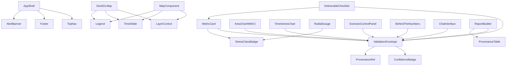

# 13 — UI Pages

| Field        | Value                                                                                                                                                                          |
|--------------|--------------------------------------------------------------------------------------------------------------------------------------------------------------------------------|
| Document     | 13-ui-pages.md                                                                                                                                                                 |
| Project      | MIZAN — Earth Observation Environmental Intelligence for Jordan                                                                                                                |
| Version      | 0.1 (Draft)                                                                                                                                                                    |
| Status       | Phase 1 — Specification                                                                                                                                                        |
| Last updated | 2026-06-10                                                                                                                                                                     |
| Related      | [03-system-architecture](03-system-architecture.md) · [10-digital-twin](10-digital-twin.md) · [11-database-schema](11-database-schema.md) · [12-api-specification](12-api-specification.md) · [14-judge-mode](14-judge-mode.md) · [15-report-generator](15-report-generator.md) · [16-validation-framework](16-validation-framework.md) · [17-security](17-security.md) · [19-astrocode-compliance](19-astrocode-compliance.md) |

---

## Purpose

This document is the complete frontend specification for MIZAN. It covers the global design system (tokens, typography, color, dark/light themes), application shell, navigation, i18n (EN/AR with full RTL), accessibility (WCAG 2.1 AA), responsive breakpoints, and all global reusable components — with particular emphasis on the `ValidationEnvelope` badge/popover (mandatory on every displayed metric), the `MapComponent` (MapLibre GL JS + MapTiler), chart components (Recharts), and the `ConfidenceBadge`. It then specifies each of the 10 application pages with wireframe layouts, data contracts, interaction flows, and states. It closes with a component inventory and reuse table, routing and state management plan, and frontend performance notes.

**Deliverables mapping:** Functional Prototype · Data Explanation · Results Visualization · Jordanian Use Case · Impact Statement

---

## Part A — Global Design System

### A.1 Technology Stack

| Concern | Technology |
|---------|-----------|
| Framework | React 18 + TypeScript + Vite |
| Styling | Tailwind CSS 3.x + shadcn/ui |
| Data fetching | TanStack Query v5 |
| Routing | React Router v6 |
| Map | MapLibre GL JS 4.x + MapTiler Cloud |
| 3D | deck.gl 9.x over MapLibre |
| Charts | Recharts 2.x |
| i18n | react-i18next + i18next |
| Accessibility | Radix UI primitives (via shadcn), axe-core CI |
| Icons | Lucide React |
| Build | Vite 5 + TypeScript strict mode |

### A.2 Tailwind & shadcn Design Tokens

#### Color Palette

```typescript
// tailwind.config.ts — extend colors
colors: {
  brand: {
    cobalt:   { DEFAULT: '#1D4ED8', 50: '#EFF6FF', 900: '#1E3A8A' },
    amber:    { DEFAULT: '#D97706', 50: '#FFFBEB', 900: '#78350F' },
    crimson:  { DEFAULT: '#DC2626', 50: '#FEF2F2', 900: '#7F1D1D' },
  },
  stress: {
    low:      '#16A34A',   // green-600
    moderate: '#CA8A04',   // yellow-600
    high:     '#EA580C',   // orange-600
    severe:   '#DC2626',   // red-600
  },
  confidence: {
    high:     '#0D9488',   // teal-600
    medium:   '#D97706',   // amber-600
    low:      '#9CA3AF',   // gray-400
  },
  surface: {
    light:    '#F8FAFC',
    dark:     '#0F172A',
  },
}
```

#### Typography

```typescript
fontFamily: {
  sans:  ['Inter', 'ui-sans-serif', 'system-ui'],
  arabic: ['Cairo', 'Noto Sans Arabic', 'ui-sans-serif'],
  mono:  ['JetBrains Mono', 'ui-monospace'],
},
fontSize: {
  '2xs': ['0.625rem', { lineHeight: '1rem' }],
  // ...Tailwind defaults retained
},
```

Arabic text uses `font-arabic` applied via the `dir="rtl"` selector:

```css
[dir="rtl"] body { font-family: theme('fontFamily.arabic'); }
```

#### Dark / Light Mode

Tailwind `darkMode: 'class'`. The `<html>` element receives `class="dark"` when the user selects dark mode (stored in `localStorage.mizanTheme`). shadcn components inherit via CSS variables:

```css
:root         { --background: 248 250 252; --foreground: 15 23 42; }
.dark         { --background: 15 23 42;   --foreground: 248 250 252; }
```

#### Responsive Breakpoints

```
sm   640px  — tablet portrait (single-column, map full-width)
md   768px  — tablet landscape (sidebar appears)
lg  1024px  — desktop (standard layout)
xl  1280px  — wide desktop (expanded panels)
2xl 1536px  — ultra-wide (dual-panel map comparison)
```

---

### A.3 Application Shell

```
┌────────────────────────────────────────────────────────────────────────────┐
│  TOP NAV BAR (h-14, sticky, bg-surface/95 backdrop-blur)                  │
│  [MIZAN logo + wordmark]  [page links]  [EN|AR toggle]  [theme ☀/☾]  [👤] │
├────────────────────────────────────────────────────────────────────────────┤
│  PAGE CONTENT (flex-1, overflow-y-auto)                                    │
│                                                                            │
│  <Outlet />  (React Router)                                                │
│                                                                            │
├────────────────────────────────────────────────────────────────────────────┤
│  FOOTER (h-10, text-xs, text-muted)                                        │
│  MIZAN v0.1 · Data: Google Earth Engine · © 2026 · Jordan                 │
└────────────────────────────────────────────────────────────────────────────┘
```

#### Top Nav Links (in order)

| Label (EN) | Label (AR) | Route | Icon |
|---|---|---|---|
| Dashboard | لوحة التحكم | `/` | LayoutDashboard |
| Map | الخريطة | `/map` | Map |
| Azraq | عزرق | `/azraq` | Droplets |
| Satellite | الأقمار الصناعية | `/satellite` | Satellite |
| AI Insights | رؤى الذكاء الاصطناعي | `/ai` | Brain |
| Digital Twin | التوأم الرقمي | `/twin` | Layers |
| Validation | التحقق | `/validation` | ShieldCheck |
| Impact | الأثر | `/impact` | BarChart3 |
| Reports | التقارير | `/reports` | FileText |
| Judge Mode | وضع الحكم | `/judge` | Gavel |

Nav links are hidden in mobile; replaced by a hamburger drawer. The `/judge` link is only rendered for `role = 'judge'` or `role = 'admin'`.

---

### A.4 i18n — EN / AR with Full RTL

The i18n framework is `react-i18next`. All user-visible strings are in translation files:

```
src/
  i18n/
    en/
      common.json
      pages.json
      indicators.json
      validation.json
    ar/
      common.json
      pages.json
      indicators.json
      validation.json
```

RTL activation:

```typescript
// App.tsx
const { i18n } = useTranslation();
useEffect(() => {
  document.documentElement.dir  = i18n.language === 'ar' ? 'rtl' : 'ltr';
  document.documentElement.lang = i18n.language;
}, [i18n.language]);
```

Tailwind RTL utilities (`rtl:mr-auto`, `rtl:text-right`, etc.) are enabled via the `tailwindcss-rtl` plugin. All flex layouts use `start/end` logical properties rather than `left/right`.

---

### A.5 Accessibility (WCAG 2.1 AA)

| Requirement | Implementation |
|---|---|
| Color contrast ≥ 4.5:1 | All text/bg pairs validated against design tokens |
| Keyboard navigation | All interactive elements reachable via Tab; focus ring `ring-2 ring-brand-cobalt` |
| ARIA labels | All icon-only buttons have `aria-label`; maps have `role="img"` + `aria-label` |
| Screen reader | shadcn primitives built on Radix UI provide full ARIA semantics |
| Skip link | `<a class="sr-only focus:not-sr-only" href="#main-content">Skip to main content</a>` |
| Reduced motion | `@media (prefers-reduced-motion)` disables all CSS and JS animations |
| Form labels | Every form input has an associated `<label>` |
| Error messages | `aria-live="polite"` regions for async error notifications |

---

### A.6 Global Loading, Empty, Error, and Skeleton States

#### Skeleton

```typescript
// <MetricCardSkeleton /> — used when TanStack Query isLoading
<div className="animate-pulse rounded-lg bg-muted h-24 w-full" />
```

All metric cards, chart panels, and map panels have skeleton variants. The shimmer animation respects `prefers-reduced-motion`.

#### Loading (Page-level)

```typescript
// Suspense boundary per route
<Suspense fallback={<PageSkeleton pageName="azraq" />}>
  <AzraqPage />
</Suspense>
```

#### Empty State

```typescript
// <EmptyState icon={<Droplets />} title="No data available"
//   description="Indicator data for the selected period has not yet been computed." />
```

#### Error State

```typescript
// <ErrorState title="Failed to load indicators"
//   message={error.message}
//   retry={() => refetch()} />
```

TanStack Query `retry: 2` with exponential back-off. On `status === 'error'` after retries, the `ErrorState` component renders with a Retry button.

---

## Part B — Global Reusable Components

### B.1 ValidationEnvelope (the ubiquitous transparency component)

The `ValidationEnvelope` is MIZAN's central scientific-transparency affordance. It MUST appear on **every displayed metric, index value, and map layer** without exception.

#### Anatomy

```
[value] [badge]
         ↓ click
┌─────────────────────────────────────────────────────┐
│  ValidationEnvelope                        [×]      │
├─────────────────────────────────────────────────────┤
│  Metric:      gw_stress_index                       │
│  Value:       74.3                                  │
│  Unit:        index (0–100)                         │
├─────────────────────────────────────────────────────┤
│  Source       Google Earth Engine + MIZAN engine    │
│  Date         2023-09-30                            │
│  Methodology  Sub-index weighted risk score         │
│               [View full methodology →]             │
│  Confidence   ● High (0.82)                         │
│  Explanation  Derived from 5 EO proxy sub-indices.  │
│               Not a direct groundwater measurement. │
├─────────────────────────────────────────────────────┤
│  [View Provenance Record]  [View in Validation]     │
└─────────────────────────────────────────────────────┘
```

#### Component Interface

```typescript
interface ValidationEnvelopeProps {
  metricCode:    string;          // e.g. 'gw_stress_index'
  value:         number | string;
  unit?:         string;
  date:          string;          // ISO 8601
  source:        string;
  methodology:   string;
  confidence:    ConfidenceLevel; // 'High' | 'Medium' | 'Low'
  confidenceScore?: number;       // 0.0–1.0
  explanation:   string;
  provenanceId?: string;          // UUID to link full provenance record
  variant?:      'badge' | 'inline' | 'icon';
  // variant='badge' → small colored badge button next to value
  // variant='inline' → full inline card (used in reports)
  // variant='icon' → icon-only trigger (used in map cells)
}
```

#### Badge Variants

```
badge:  [● High]  (teal dot, teal text — clickable, opens popover)
        [● Med]   (amber dot)
        [● Low]   (gray dot)
        [⚠ None]  (crimson, shown when no confidence data)

icon:   [ℹ]  (info icon, opens popover on click)
```

The badge button has `aria-label="Validation information for {metricCode}"` and `aria-expanded` tied to popover state.

#### Popover Behavior

- Implemented with Radix UI `<Popover>`.
- Max-width 360px; scrollable if content overflows.
- Opened by click (not hover) for accessibility.
- Focus trap inside popover; Escape closes.
- `provenanceId` renders a "View Provenance Record" button that navigates to `/validation?record={provenanceId}`.

#### Where ValidationEnvelope Appears (non-exhaustive)

| Location | Variant | Metrics wrapped |
|---|---|---|
| Metric cards (all pages) | badge | All indicator values |
| Chart tooltips | icon | Hovered data point |
| Map legend items | badge | Each layer's current value |
| Digital Twin output panel | badge | All scenario outputs |
| AI Insights responses | inline | Every cited metric |
| Report sections | inline | Every figure |
| Judge Mode panels | inline + highlight | All deliverable evidence |

---

### B.2 ConfidenceBadge

A lightweight variant of the ValidationEnvelope badge focused purely on the confidence level, used in tight spaces (table cells, chart axes):

```typescript
interface ConfidenceBadgeProps {
  level:  ConfidenceLevel;
  score?: number;
  size?:  'sm' | 'md';
}
// Renders: colored pill "High 0.82" / "Med 0.67" / "Low 0.41"
```

---

### B.3 MapComponent

The primary map component used on `/map`, `/azraq`, `/satellite`, `/validation`:

```typescript
interface MapComponentProps {
  style?:        string;         // MapTiler style URL; default: satellite
  initialView?:  MapView;
  layers?:       LayerConfig[];
  timeSlider?:   TimeSliderConfig;
  legend?:       LegendConfig;
  onCellClick?:  (cell: MapCell) => void;
  className?:    string;
}

interface MapView {
  center:   [number, number];  // [lng, lat]
  zoom:     number;
  pitch?:   number;
  bearing?: number;
}
```

Built-in sub-components:

- **LayerControl** — collapsible panel (top-right), checkbox per layer, opacity slider per layer.
- **Legend** — bottom-left, color ramp + labels for active indicator layer.
- **TimeSlider** — bottom-center, date range slider with play/pause/step controls.
- **ScaleBar** — bottom-right, auto-units.
- **Attribution** — MapTiler + GEE attribution, bottom-left (required by license).

MapTiler styles available:
- `satellite` — Satellite imagery (default for analysis)
- `topo` — Topographic
- `streets` — Street/labels overlay

Default Jordan view: `center: [38.0, 31.5], zoom: 7`.
Default Azraq view: `center: [36.8, 31.9], zoom: 9`.

---

### B.4 Chart Components (Recharts wrappers)

All charts are Recharts components wrapped with:
1. A ValidationEnvelope badge on the chart title.
2. A ConfidenceBadge in the subtitle.
3. A `ChartTooltip` that always shows source + date on hover.

```typescript
// <AreaChartWithCI />  — area chart with p10/p90 confidence interval shading
interface AreaChartWithCIProps {
  data:         Array<{ x: string | number; median: number; p10: number; p90: number }>;
  xKey:         string;
  yLabel:       string;
  color:        string;
  confidence:   ConfidenceLevel;
  validation:   ValidationEnvelopeProps;
}

// <TimeSeriesChart />  — multi-line time series with optional threshold lines
// <BarChartGrouped />  — grouped bars for comparing scenarios / sub-indices
// <RadialGauge />      — 0–100 radial gauge for gw_stress_index
// <SubIndexRadar />    — radar chart for 5 risk sub-indices
```

---

### B.5 StressClassBadge

```typescript
// Colored pill for gw_stress_class
interface StressClassBadgeProps {
  stressClass: 'Low' | 'Moderate' | 'High' | 'Severe';
  showIndex?:  boolean;  // show numeric value alongside
}
// Low → green; Moderate → yellow; High → orange; Severe → red
```

---

### B.6 AlertBanner

Used to surface time-sensitive conditions from the `alerts` table:

```typescript
interface AlertBannerProps {
  alerts: Alert[];
  dismissible: boolean;
}
// Stacks alert pills at top of page; click to expand detail; links to affected metric
```

---

## Part C — Page Specifications

### C.1 `/` — National Command Center

**Purpose:** Executive dashboard giving an at-a-glance view of groundwater stress, key indicators, and active alerts across all of Jordan's monitored basins.

**Primary users:** Admin, Analyst, Viewer

**Deliverables:** Functional Prototype, Results Visualization, Impact Statement

#### Wireframe

```
┌───────────────────────────────────────────────────────────────┐
│  NAV BAR                                                      │
├───────────────────────────────────────────────────────────────┤
│  ALERT BANNER (if active alerts) [alert pills, dismissible]   │
├──────────────────────┬────────────────────────────────────────┤
│  SUMMARY STRIP (h-20, full width, 4 KPI cards):               │
│  [GW Stress Index] [Irrigated Area] [Precip Anomaly] [Risk Cl]│
│  Each KPI card has: value + unit + trend arrow + [●Conf badge]│
├──────────────────────┬────────────────────────────────────────┤
│  JORDAN BASINS MAP   │  STRESS CLASS SUMMARY TABLE            │
│  (60% width)         │  (40% width)                           │
│                      │  Basin | Class | Index | Date | [●]    │
│  Choropleth by       │  Azraq | Severe| 74.3  |2023-09|[●H]   │
│  gw_stress_class     │  Zarqa | High  | 62.1  |2023-09|[●H]   │
│  Hover → tooltip     │  ...                                   │
│  Click → /azraq or   │                                        │
│  basin-specific page │  [View all basins →]                   │
├──────────────────────┴────────────────────────────────────────┤
│  NATIONAL TREND CHARTS (3 col)                                │
│  [Precip anomaly time series] [NDVI trend] [GW stress 12-mo]  │
│  Each: Recharts TimeSeriesChart + ValidationEnvelope badge    │
├───────────────────────────────────────────────────────────────┤
│  RECENT ALERTS TABLE                                          │
│  Severity | Region | Indicator | Value | Threshold | Date     │
├───────────────────────────────────────────────────────────────┤
│  LAST UPDATED: {timestamp}  [Refresh]                         │
└───────────────────────────────────────────────────────────────┘
```

#### Data Consumed

```
GET /rest/v1/indicator_values?select=...&date=gte.{30_days_ago}
GET /rest/v1/risk_scores?select=...&order=date.desc&limit=50
GET /rest/v1/alerts?status=eq.active&order=created_at.desc&limit=10
GET /rest/v1/regions?select=id,name,name_ar,geojson_url
```

#### Interactions

- Click basin on choropleth → navigate to that basin's deep-dive page (Azraq → `/azraq`).
- Click KPI card → navigate to `/validation?indicator={code}`.
- Click alert row → expand detail panel; link to affected indicator page.
- "Refresh" button → invalidate TanStack Query cache for all dashboard keys.

#### States

| State | Behavior |
|-------|---------|
| Loading | 4 skeleton KPI cards; skeleton map; skeleton table |
| Loaded | Full content with ValidationEnvelope on all KPI values |
| No data | EmptyState on map ("No recent indicator data") |
| Active alerts | AlertBanner at top; alert table populated |

#### ValidationEnvelope Placement

Each KPI card value carries a `badge` variant. Each chart carries a `badge` variant on the chart title. Map legend items carry `icon` variant.

---

### C.2 `/map` — Jordan Monitoring Map

**Purpose:** Full-screen, multi-layer interactive map for spatial exploration of all indicator layers across Jordan.

**Primary users:** Analyst, Viewer

**Deliverables:** Functional Prototype, Results Visualization

#### Wireframe

```
┌───────────────────────────────────────────────────────────────┐
│  NAV BAR                                                      │
├────────────────┬──────────────────────────────────────────────┤
│  LAYER PANEL   │  FULL-SCREEN MAP (MapLibre GL JS + MapTiler) │
│  (collapsible, │                                              │
│  280px)        │  [Basemap selector: Satellite/Topo/Streets]  │
│                │                                              │
│  INDICATOR     │  [Active layer choropleth]                   │
│  LAYERS:       │                                              │
│  ○ GW Stress   │  [LEGEND: stress/indicator color ramp]       │
│  ○ NDVI        │                                              │
│  ○ Precip      │  [SCALE BAR]  [COMPASS]                     │
│  ○ Soil Moist  │                                              │
│  ○ Surface Wtr │  [TIME SLIDER: date range]                   │
│  ○ ET₀         │                                              │
│  ○ Irrigated   │                                              │
│    Area        ├──────────────────────────────────────────────┤
│                │  HOVER PANEL (bottom overlay, appears on     │
│  DATE FILTER:  │  hover over a region/cell):                  │
│  [date picker] │  Region: Azraq  |  GW Stress: 74.3 [● High] │
│                │  Date: 2023-09  |  [View details →]          │
│  OPACITY:      │                                              │
│  [slider]      │                                              │
│                │                                              │
│  SEARCH:       │                                              │
│  [place search]│                                              │
└────────────────┴──────────────────────────────────────────────┘
```

#### Data Consumed

```
GET /rest/v1/map_layers?select=layer_code,tile_url,style_config,date
GET /rest/v1/indicator_values?indicator_code=eq.{active}&date=eq.{selected}
GET /functions/v1/tiles/{layer_code}/{z}/{x}/{y}  (MVT tiles)
```

#### Interactions

- Layer toggle → update active MapLibre layer; update legend.
- Time slider drag → update date filter; re-query indicator tiles.
- Click region → open side panel with region summary + ValidationEnvelope for all shown indicators.
- Place search (MapTiler Geocoding API) → fly to location.
- Export current view → screenshot (html2canvas); includes legend and attribution.

#### ValidationEnvelope Placement

Legend item for active layer carries `badge` variant showing layer's latest confidence. Click-on-region popover carries `inline` variant for each indicator in the region summary.

---

### C.3 `/azraq` — Azraq Basin Intelligence

**Purpose:** The primary deep-dive basin page — the demo showcase. Comprehensive view of all indicators and risk for the Azraq Basin with timeline, charts, oasis status, and agricultural expansion analysis.

**Primary users:** All roles; the primary demo page.

**Deliverables:** Functional Prototype, Data Explanation, Results Visualization, Jordanian Use Case, Impact Statement

#### Wireframe

```
┌───────────────────────────────────────────────────────────────────┐
│  NAV BAR                                                          │
├───────────────────────────────────────────────────────────────────┤
│  PAGE HEADER: "Azraq Basin" / "حوض عزرق"                         │
│  [Last updated: 2023-09-30]  [GW Stress: SEVERE 74.3 ●H]        │
│  [Sub-title: ~12,700 km² | NE Jordan | RAMSAR Wetland site]      │
├───────────────────────────────────────────────────────────────────┤
│  RISK OVERVIEW ROW (5 cards, stress sub-indices):                 │
│  [Abstraction 85] [Recharge 72] [Veg-Water 68] [Surf.Water 79]  │
│  [Storage 71]  — each: RadialGauge + StressClassBadge + [● conf] │
├──────────────────────────────┬────────────────────────────────────┤
│  AZRAQ MAP (50%)             │  INDICATORS PANEL (50%)           │
│  MapComponent, Azraq view    │  [Tab: Vegetation|Water|Climate|Ag]│
│  Layers: irrigated, oasis,   │                                   │
│  stress heatmap              │  Tab: VEGETATION                  │
│                              │  [NDVI time series 2015–2024]     │
│  [Oasis extent trend          │  [NDVI Anomaly bar chart]        │
│   visual on map]             │  [EVI + SAVI mini cards]          │
│                              │  [ValidationEnvelope on each]     │
│  [Time slider]               │                                   │
│                              │  Tab: WATER                       │
│                              │  [NDWI map snippet]               │
│                              │  [surface_water_extent_km² chart] │
│                              │  [soil_moisture_proxy chart]      │
│                              │                                   │
│                              │  Tab: CLIMATE                     │
│                              │  [precip_mm + SPI charts]         │
│                              │  [tmax, ET₀ mini cards]           │
│                              │                                   │
│                              │  Tab: AGRICULTURE                 │
│                              │  [irrigated_area_ha trend]        │
│                              │  [agri_expansion_pct highlight]   │
│                              │  [crop_class donut chart]         │
├──────────────────────────────┴────────────────────────────────────┤
│  WATER BALANCE SECTION                                            │
│  [recharge_proxy_mcm] [abstraction_estimate_mcm] [water_balance] │
│  [Area chart: balance trend 2015–2024 with uncertainty bands]    │
│  [ValidationEnvelope on each number + chart]                     │
│  [Disclaimer: "These are EO-proxy estimates, not direct          │
│   measurements of groundwater levels."]                          │
├───────────────────────────────────────────────────────────────────┤
│  GW STRESS HISTORY (full-width time series, 2015–2024)           │
│  [stress index line + class color band]                          │
│  [SubIndexRadar snapshot for latest period]                      │
├───────────────────────────────────────────────────────────────────┤
│  OASIS STATUS SECTION                                             │
│  [surface_water_extent_km² trend]                                │
│  [Note: "Azraq Oasis is a RAMSAR wetland — surface extent        │
│   derived from Sentinel-1/2 composite, not ground survey."]      │
├───────────────────────────────────────────────────────────────────┤
│  QUICK ACTIONS                                                    │
│  [Open Digital Twin →] [Generate Report →] [View in Judge Mode →]│
└───────────────────────────────────────────────────────────────────┘
```

#### Data Consumed

```
GET /rest/v1/indicator_values?region_id=eq.{azraq}&select=...
GET /rest/v1/risk_scores?region_id=eq.{azraq}&order=date.desc
GET /rest/v1/confidence_scores?...
GET /rest/v1/provenance?region_id=eq.{azraq}&indicator_code=in.(...)
GET /rest/v1/alerts?region_id=eq.{azraq}&status=eq.active
```

#### Interactions

- Indicator tab switch → smooth transition; chart data updates via TanStack Query (each tab's data pre-fetched).
- Time slider on map → indicator charts highlight corresponding date with vertical crosshair.
- Click any indicator value → ValidationEnvelope popover.
- "Open Digital Twin" → `/twin?region=azraq` (pre-loads Azraq scenario).
- "Generate Report" → `/reports?template=basin-brief&region=azraq`.

---

### C.4 `/satellite` — Satellite Analysis Center

**Purpose:** Explore the raw and processed satellite-derived indicator layers, understand satellite data sources (Sentinel-1/2, MODIS, CHIRPS, ERA5), and compare multi-temporal imagery composites.

**Primary users:** Analyst

**Deliverables:** Data Explanation, AI/Analytics Method, Results Visualization

#### Wireframe

```
┌───────────────────────────────────────────────────────────────┐
│  NAV BAR                                                      │
├─────────────────────────────────────────────────────────────┤
│  PAGE HEADER: "Satellite Analysis Center"                   │
├──────────────────┬────────────────────────────────────────────┤
│  LEFT PANEL      │  SPLIT MAP VIEW (side-by-side or swipe)   │
│  (280px)         │                                           │
│                  │  LEFT COMPOSITE    |  RIGHT COMPOSITE      │
│  SATELLITE:      │  [Sentinel-2 RGB   |  [NDVI heatmap]       │
│  ○ Sentinel-2    │   2023-09]         |  [same date]          │
│  ○ Sentinel-1    │                                           │
│  ○ MODIS         │  [SWIPE SLIDER to compare]                │
│  ○ CHIRPS        │                                           │
│  ○ ERA5          │  [Date picker A]   |  [Date picker B]      │
│                  ├───────────────────────────────────────────┤
│  INDICATOR:      │  INDICATOR DETAILS PANEL                  │
│  [dropdown]      │  Code: ndvi  |  Satellite: Sentinel-2     │
│                  │  Band combo: (NIR−Red)/(NIR+Red)          │
│  DATE A:         │  Resolution: 10m  |  Revisit: 5 days      │
│  [date picker]   │  GEE Collection: COPERNICUS/S2_SR_HARMONIZED│
│  DATE B:         │  [ValidationEnvelope inline]              │
│  [date picker]   │  [Time series chart for this indicator]   │
│                  │  [Download composite (if analyst role)]   │
│  REGION:         │                                           │
│  [dropdown]      │                                           │
└──────────────────┴────────────────────────────────────────────┘
```

#### Data Consumed

```
GET /rest/v1/map_layers?indicator_code=eq.{code}&date=gte.{A}&date=lte.{B}
GET /rest/v1/indicator_values?indicator_code=eq.{code}&region_id=eq.{region}
GET /functions/v1/ee-compute  (on-demand GEE composite request — analyst only)
```

#### Indicator Code Reference Table (rendered in UI)

| Code | Satellite | Formula / Band | GEE Collection |
|---|---|---|---|
| `ndvi` | Sentinel-2 | (B8−B4)/(B8+B4) | S2_SR_HARMONIZED |
| `evi` | Sentinel-2 | 2.5·(B8−B4)/(B8+6·B4−7.5·B2+1) | S2_SR_HARMONIZED |
| `ndwi` | Sentinel-2 | (B3−B8)/(B3+B8) | S2_SR_HARMONIZED |
| `s1_vv` | Sentinel-1 | VV backscatter (dB) | S1_GRD |
| `s1_rvi` | Sentinel-1 | 4·VH/(VV+VH) | S1_GRD |
| `soil_moisture_proxy` | Sentinel-1 | VV change vs dry baseline | S1_GRD |
| `precip_mm` | CHIRPS | Precipitation (mm) | UCSB-CHG/CHIRPS/DAILY |
| `et0_pm_mm` | ERA5 | Penman-Monteith ET₀ | ECMWF/ERA5_LAND/DAILY |

---

### C.5 `/ai` — AI Intelligence Center

**Purpose:** Grounded natural-language Q&A about MIZAN data. Users ask questions; the AI returns answers that cite specific stored metric IDs and provenance records. No hallucination; if data is unavailable the AI says so.

**Primary users:** Analyst, Admin, Viewer (read-only queries)

**Deliverables:** Data Explanation, AI/Analytics Method

#### Wireframe

```
┌───────────────────────────────────────────────────────────────┐
│  NAV BAR                                                      │
├───────────────────────────────────────────────────────────────┤
│  PAGE HEADER: "AI Intelligence Center"                        │
│  [Grounding statement: "All responses cite stored metrics     │
│   and provenance records. No information is invented."]       │
├──────────────────────────┬────────────────────────────────────┤
│  CONTEXT PANEL (280px)   │  CHAT INTERFACE                   │
│                          │                                   │
│  Region: [Azraq ▾]       │  ┌─────────────────────────────┐  │
│  Date range: [picker]    │  │ AI: Hello! I can answer      │  │
│  Indicators: [multi-sel] │  │ questions about groundwater  │  │
│                          │  │ stress and EO indicators for  │  │
│  SUGGESTED PROMPTS:      │  │ Jordan — grounded in stored  │  │
│  • "What is the current  │  │ data only.                   │  │
│    GW stress in Azraq?"  │  └─────────────────────────────┘  │
│  • "How has irrigated    │                                   │
│    area changed?"        │  [User message]                   │
│  • "What does SPI-12     │  ┌─────────────────────────────┐  │
│    indicate for 2023?"   │  │ You: What is the current GW  │  │
│  • "Explain the water    │  │ stress index for Azraq?     │  │
│    balance calculation"  │  └─────────────────────────────┘  │
│                          │                                   │
│  CONVERSATION HISTORY    │  ┌─────────────────────────────┐  │
│  [list of past chats]    │  │ AI: The groundwater stress  │  │
│                          │  │ index for Azraq Basin as of │  │
│                          │  │ 2023-09-30 is **74.3**      │  │
│                          │  │ [● High conf · inline env.] │  │
│                          │  │                             │  │
│                          │  │ Source: indicator_values    │  │
│                          │  │ record {uuid} · GEE derived │  │
│                          │  │ · methodology: risk-scoring │  │
│                          │  └─────────────────────────────┘  │
│                          │                                   │
│                          │  [Type your question…] [Send →]   │
└──────────────────────────┴────────────────────────────────────┘
```

#### Data Consumed

```
POST /functions/v1/ai-insights
Body: { region_id, date_range, question, context_indicators[] }

Response: {
  answer: string,          // narrative text
  cited_metrics: MetricCitation[],  // each: {indicator_code, value, date, record_id}
  confidence: ConfidenceLevel,
  disclaimer: string
}
```

#### ValidationEnvelope in AI Responses

Every metric value cited in an AI response is rendered as an inline `ValidationEnvelope` card. The AI response text uses a special Markdown-like syntax that the frontend parses:

```
The gw_stress_index is {{metric:gw_stress_index:74.3:2023-09-30:{record_id}}}
```

The frontend renders `{{metric:...}}` tokens as `<ValidationEnvelope variant="inline" />` components embedded in the response text.

#### Scientific Integrity Guard

The `ai-insights` Edge Function operates under a system prompt that strictly prohibits:
- Inventing data not present in the context window.
- Making claims about actual groundwater levels (vs. EO proxies).
- Providing legal or regulatory recommendations.

If the user asks a question that cannot be answered from stored data, the AI responds: "I don't have sufficient stored data to answer this question. The available indicators for {region} and {date_range} are: {list}."

---

### C.6 `/twin` — Digital Twin

**Purpose:** Interactive 3D scenario workspace.

**Deliverables:** Functional Prototype, Results Visualization, Impact Statement

See [10-digital-twin.md](10-digital-twin.md) for full specification. Summary of UI:

- Left panel: scenario control (parameters, horizon, reference year).
- Center: full-screen deck.gl 3D map (terrain, irrigated polygons, stress heatmap, oasis extent).
- Bottom: output chart panel (water balance, stress index trajectory, crop water demand).
- Collapsible "Behind the Numbers" equations panel.
- A/B comparison mode.
- Persistent non-dismissable disclaimer banner.

---

### C.7 `/validation` — Validation Center

**Purpose:** Full auditable record of all provenance, methodology, and confidence data. Every metric's lineage is traceable here. Judges and analysts verify that numbers are real and sourced.

**Primary users:** Analyst, Judge, Admin

**Deliverables:** Data Explanation, AI/Analytics Method

#### Wireframe

```
┌───────────────────────────────────────────────────────────────┐
│  NAV BAR                                                      │
├───────────────────────────────────────────────────────────────┤
│  PAGE HEADER: "Validation Center"                             │
│  "Every number in MIZAN is traceable to its original         │
│   Earth Engine computation or stored dataset."                │
├────────────────────┬──────────────────────────────────────────┤
│  FILTER PANEL      │  PROVENANCE RECORDS TABLE                │
│                    │                                         │
│  Indicator: [all ▾]│  Indicator | Value | Date | Source      │
│  Region: [all ▾]   │  | Confidence | Methodology | [Details] │
│  Date: [picker]    │                                         │
│  Confidence: [all ▾]│  [Paginated, 20 rows/page]            │
│  Source: [all ▾]   │                                         │
│  [Search by ID]    │                                         │
├────────────────────┴──────────────────────────────────────────┤
│  SELECTED RECORD DETAIL (expandable, appears on row click)    │
│                                                               │
│  ┌─────────────────────────────────────────────────────────┐  │
│  │  PROVENANCE RECORD: {uuid}                              │  │
│  │  Indicator: gw_stress_index  |  Value: 74.3             │  │
│  │  Region: Azraq               |  Date: 2023-09-30        │  │
│  │  Source: MIZAN risk engine v0.1 + GEE sub-indices       │  │
│  │  GEE Asset: projects/mizan/assets/azraq_risk_2023Q3     │  │
│  │  Methodology: Weighted sub-index risk score             │  │
│  │  Sub-indices:  abstraction=85  recharge=72  veg=68      │  │
│  │                surf_water=79   storage=71               │  │
│  │  Confidence Score: 0.82 (High)                          │  │
│  │  Computed at: 2023-10-15T08:32:11Z                      │  │
│  │  Explanation: "Derived from five EO proxy sub-indices   │  │
│  │   using weighted combination. Not a direct groundwater  │  │
│  │   measurement or model calibrated to piezometers."      │  │
│  │  [Download provenance JSON]  [Cite this record]         │  │
│  └─────────────────────────────────────────────────────────┘  │
├───────────────────────────────────────────────────────────────┤
│  CONFIDENCE SCORE DISTRIBUTION (histogram, all records)       │
│  [Histogram of confidence_score 0–1.0 across all indicators]  │
│  [Breakdown: High X% | Medium Y% | Low Z%]                    │
├───────────────────────────────────────────────────────────────┤
│  METHODOLOGY LIBRARY                                          │
│  [Accordion per indicator category, showing methodology       │
│   description, source paper/report references, GEE code ref]  │
└───────────────────────────────────────────────────────────────┘
```

#### Data Consumed

```
GET /rest/v1/provenance?select=*&order=date.desc
GET /rest/v1/confidence_scores?select=*
GET /functions/v1/confidence?indicator_code=...&region_id=...
```

#### ValidationEnvelope Placement

On this page, the `ValidationEnvelope` is itself the subject of the content — the full inline variant is used for every record detail view, with no further nesting.

---

### C.8 `/impact` — Impact Center

**Purpose:** Communicate the human, ecological, and policy significance of MIZAN's findings. Tells the story of what the numbers mean for Jordan.

**Primary users:** All roles; especially useful for policy audiences and judges.

**Deliverables:** Impact Statement, Jordanian Use Case, Results Visualization

#### Wireframe

```
┌───────────────────────────────────────────────────────────────┐
│  NAV BAR                                                      │
├───────────────────────────────────────────────────────────────┤
│  HERO SECTION: "What MIZAN finds — and why it matters"        │
│  [Full-width satellite image of Azraq Basin with overlay]     │
│  [Pull quote: "Azraq GW Stress: SEVERE — estimated             │
│   abstraction exceeds recharge by ~60 MCM/yr [● Med]"]        │
├───────────────────────────────────────────────────────────────┤
│  IMPACT METRICS STRIP (3 cards):                              │
│  [Est. area under stress] [Population served] [Oasis %change] │
├───────────────────────────────────────────────────────────────┤
│  USE CASE CARDS (scrollable horizontal):                      │
│  [Farmer Decision Support]  [Water Policy]  [RAMSAR Monitoring]│
│  [Irrigation Planning]      [Drought Early Warning]           │
│  Each card: 2-sentence use case + data indicator + impact     │
├───────────────────────────────────────────────────────────────┤
│  STORY SECTION: "The Azraq Oasis"                             │
│  [Text + oasis extent time-lapse map: 2015→2023]              │
│  [surface_water_extent_km² trend chart]                       │
│  [ValidationEnvelope on all cited values]                     │
├───────────────────────────────────────────────────────────────┤
│  NATIONAL CONTEXT (Jordan water scarcity facts)               │
│  [Bar chart: Jordan per-capita water vs. global threshold]    │
│  [All values from stored literature context, labeled]         │
├───────────────────────────────────────────────────────────────┤
│  IMPACT STATEMENT (full text, exportable as section of report)│
│  [Static text with all MIZAN caveats and non-claims]          │
└───────────────────────────────────────────────────────────────┘
```

---

### C.9 `/judge` — Judge Mode

**Purpose:** Guided evaluation experience for AstroCode judges.

**Deliverables:** All six deliverables

See [14-judge-mode.md](14-judge-mode.md) for full specification. Summary: ordered tour through all AstroCode deliverables with live evidence, deliverables checklist overlay, "Explain this number" affordances, scientific-integrity statements, and a reproducible demo state.

---

### C.10 `/reports` — Report Generator

**Purpose:** Generate traceable, branded PDF/HTML reports from stored MIZAN data.

**Deliverables:** Data Explanation, Results Visualization, Impact Statement, Jordanian Use Case

See [15-report-generator.md](15-report-generator.md) for full specification. Summary: select report type, configure sections, trigger `report-generate` Edge Function, download PDF. All content sourced from stored metrics; every number carries provenance.

---

## Part D — Component Inventory & Reuse Table

### D.1 Component Inventory

| Component | Location | Used On |
|---|---|---|
| `ValidationEnvelope` | `components/validation/` | ALL pages — every metric |
| `ConfidenceBadge` | `components/validation/` | All pages; table cells |
| `StressClassBadge` | `components/risk/` | `/`, `/azraq`, `/map`, `/judge` |
| `AlertBanner` | `components/alerts/` | `/`, `/azraq`, `/map` |
| `MapComponent` | `components/map/` | `/map`, `/azraq`, `/satellite`, `/validation` |
| `DeckGLMap` | `components/map/` | `/twin` |
| `LayerControl` | `components/map/` | `/map`, `/satellite`, `/twin` |
| `TimeSlider` | `components/map/` | `/map`, `/azraq`, `/satellite`, `/twin` |
| `Legend` | `components/map/` | `/map`, `/azraq`, `/twin` |
| `AreaChartWithCI` | `components/charts/` | `/twin`, `/azraq` |
| `TimeSeriesChart` | `components/charts/` | `/`, `/azraq`, `/satellite`, `/twin` |
| `BarChartGrouped` | `components/charts/` | `/azraq`, `/impact` |
| `RadialGauge` | `components/charts/` | `/azraq`, `/judge` |
| `SubIndexRadar` | `components/charts/` | `/azraq`, `/twin`, `/judge` |
| `MetricCard` | `components/common/` | `/`, `/azraq`, `/judge` |
| `MetricCardSkeleton` | `components/common/` | All pages |
| `EmptyState` | `components/common/` | All pages |
| `ErrorState` | `components/common/` | All pages |
| `PageSkeleton` | `components/common/` | All pages (Suspense fallback) |
| `ScenarioControlPanel` | `components/twin/` | `/twin` |
| `BehindTheNumbers` | `components/twin/` | `/twin` |
| `ChatInterface` | `components/ai/` | `/ai` |
| `ProvenanceTable` | `components/validation/` | `/validation`, `/reports` |
| `DeliverableChecklist` | `components/judge/` | `/judge` |
| `ReportBuilder` | `components/reports/` | `/reports` |
| `AppShell` | `layout/` | All pages |
| `TopNav` | `layout/` | All pages |
| `Footer` | `layout/` | All pages |

### D.2 Reuse Dependency Graph (Mermaid)



---

## Part E — Routing & State Map

### E.1 Router Configuration

```typescript
// src/router.tsx
const router = createBrowserRouter([
  {
    path: '/',
    element: <AppShell />,
    errorElement: <GlobalErrorPage />,
    children: [
      { index: true,      element: <NationalCommandCenter /> },
      { path: 'map',      element: <JordanMonitoringMap /> },
      { path: 'azraq',    element: <AzraqBasinPage /> },
      { path: 'satellite',element: <SatelliteAnalysisCenter /> },
      { path: 'ai',       element: <AIIntelligenceCenter /> },
      { path: 'twin',     element: <DigitalTwin /> },
      { path: 'validation',element: <ValidationCenter /> },
      { path: 'impact',   element: <ImpactCenter /> },
      {
        path: 'judge',
        element: <ProtectedRoute roles={['judge','admin']}><JudgeMode /></ProtectedRoute>
      },
      { path: 'reports',  element: <ReportGenerator /> },
    ],
  },
]);
```

### E.2 Global State (Zustand)

```typescript
interface MizanStore {
  // User & auth
  profile: Profile | null;
  language: 'en' | 'ar';
  theme: 'light' | 'dark';

  // Active map state (shared across pages with map)
  activeRegionId: string | null;
  activeDate: string | null;
  activeIndicatorCode: string | null;

  // Scenario state (Digital Twin)
  activeScenarioA: ScenarioParams | null;
  activeScenarioB: ScenarioParams | null;

  // Judge Mode
  judgeMode: boolean;
  currentDeliverableStep: number;

  // Actions
  setLanguage: (lang: 'en' | 'ar') => void;
  setTheme: (theme: 'light' | 'dark') => void;
  setActiveRegion: (id: string) => void;
  setActiveDate: (date: string) => void;
  setJudgeMode: (active: boolean) => void;
}
```

### E.3 TanStack Query Keys

```typescript
const queryKeys = {
  regions:           ['regions'] as const,
  indicators:        (region: string, date: string) => ['indicators', region, date] as const,
  riskScores:        (region: string)               => ['risk', region] as const,
  provenance:        (id: string)                   => ['provenance', id] as const,
  confidence:        (region: string, code: string) => ['confidence', region, code] as const,
  alerts:            (region: string)               => ['alerts', region] as const,
  mapLayers:         (code: string, date: string)   => ['layers', code, date] as const,
  scenarioResults:   (id: string)                   => ['scenario', id] as const,
  aiInsights:        (hash: string)                 => ['ai', hash] as const,
};
```

Cache times:
- Indicators / risk scores: `staleTime: 15 * 60 * 1000` (15 min), `gcTime: 60 * 60 * 1000` (1 hr)
- Provenance / confidence: `staleTime: Infinity` (immutable once written)
- Alerts: `staleTime: 60 * 1000` (1 min), refetch on window focus
- Scenario results: `staleTime: Infinity` (cached by scenario_id)
- Map tiles: browser cache via HTTP headers; no TanStack Query

---

## Part F — Frontend Performance Notes

### F.1 Code Splitting & Lazy Loading

```typescript
// All page components are lazy-loaded
const NationalCommandCenter = lazy(() => import('./pages/NationalCommandCenter'));
const DigitalTwin           = lazy(() => import('./pages/DigitalTwin'));
// etc.

// deck.gl is ~2MB; only imported on /twin
const DeckGLMap = lazy(() => import('./components/map/DeckGLMap'));
```

Route-level code splitting means the initial bundle excludes all page code except the landing page.

### F.2 Map Tile Caching

- MapTiler serves tiles with `Cache-Control: public, max-age=86400`.
- MVT indicator tiles served from Supabase Storage with `Cache-Control: public, max-age=3600` (1 hr).
- The `TimeSlider` prefetches ±1 adjacent date tiles on hover to reduce perceived latency.

### F.3 TanStack Query Prefetching

On the `/azraq` page, all four indicator tabs' data are prefetched on page mount:

```typescript
useEffect(() => {
  queryClient.prefetchQuery({ queryKey: queryKeys.indicators(azraqId, latestDate) });
  queryClient.prefetchQuery({ queryKey: queryKeys.riskScores(azraqId) });
}, []);
```

### F.4 Image & Asset Optimization

- Satellite imagery composites served as WebP via Supabase Storage CDN.
- Vite asset pipeline applies `imagemin-webp` to all static images.
- SVG icons (Lucide) are tree-shaken at build time.
- Fonts (Inter, Cairo) are subset and served via `<link rel="preload">`.

### F.5 Bundle Size Budget

| Chunk | Target Size (gzip) |
|-------|--------------------|
| Vendor (React, Recharts, router) | < 120 KB |
| MapLibre GL JS | < 250 KB |
| deck.gl (twin page only) | < 400 KB |
| Per-page chunks | < 40 KB each |
| Total initial load | < 200 KB |

### F.6 Web Vitals Targets

| Metric | Target |
|--------|--------|
| LCP (Largest Contentful Paint) | < 2.5 s |
| FID / INP | < 100 ms |
| CLS | < 0.1 |
| TTI | < 3.5 s |

The map canvas is the main LCP candidate; it is pre-loaded with a static basemap screenshot placeholder while MapLibre initialises.
