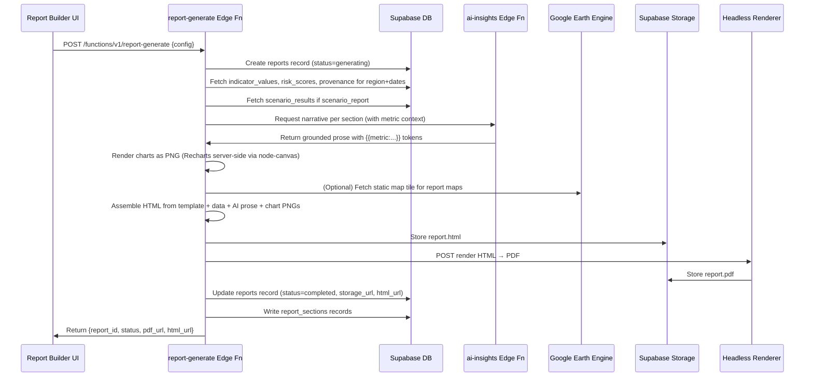

# 15 — Report Generator

| Field        | Value                                                                                                                                                                              |
|--------------|------------------------------------------------------------------------------------------------------------------------------------------------------------------------------------|
| Document     | 15-report-generator.md                                                                                                                                                             |
| Project      | MIZAN — Earth Observation Environmental Intelligence for Jordan                                                                                                                    |
| Version      | 0.1 (Draft)                                                                                                                                                                        |
| Status       | Phase 1 — Specification                                                                                                                                                            |
| Last updated | 2026-06-10                                                                                                                                                                         |
| Related      | [03-system-architecture](03-system-architecture.md) · [11-database-schema](11-database-schema.md) · [12-api-specification](12-api-specification.md) · [13-ui-pages](13-ui-pages.md) · [16-validation-framework](16-validation-framework.md) · [17-security](17-security.md) · [19-astrocode-compliance](19-astrocode-compliance.md) |

---

## Purpose

This document specifies the MIZAN Report Generator — the system by which users generate traceable, branded, bilingual PDF and HTML reports from stored MIZAN data at route `/reports`. Reports are the primary output artefact for policy communication, field briefings, and competition deliverable evidence. Every report section, figure, and numeric value must originate from stored metrics and provenance records, be citeable, and carry a Validation Envelope entry.

**Deliverables mapping:** Data Explanation · Results Visualization · Impact Statement · Jordanian Use Case

---

## 1. Concept & Goals

### 1.1 What the Report Generator Produces

MIZAN reports are structured, traceable documents that translate Earth Observation indicator data into plain-language briefings for water-management, policy, and scientific audiences. A report:

- Is generated on-demand from stored `indicator_values`, `risk_scores`, `scenario_results`, and `provenance` records.
- Has every numeric value and figure linked to a provenance record (by UUID).
- Contains a grounded AI-drafted narrative: the `ai-insights` Edge Function drafts prose that explicitly cites metric record IDs and never invents information. If data is unavailable for a section, the AI writes "Insufficient data for this period — see provenance record {id}."
- Is rendered from an HTML template to PDF by a headless renderer (Puppeteer or equivalent) running in the `report-generate` Edge Function.
- Is stored in Supabase Storage on completion; a record is written to the `reports` table.
- Includes three mandatory appendices in all report types: Provenance Appendix, Methodology Appendix, and Limitations Section.

### 1.2 What Reports Are NOT

> **Non-fabrication guarantee (displayed in the report generator UI and in all report footers):**
>
> "All numeric values in this report originate from Earth Engine-derived datasets or stored model outputs. No value has been invented, estimated without disclosure, or sourced from unverifiable data. Each figure carries a provenance record reference (Appendix A). The AI-drafted narrative cites metric record IDs and introduces no information beyond what is recorded in the MIZAN database."

Reports make no claims about:
- Actual groundwater levels or aquifer pressures (EO proxies only).
- Future states as observations (scenario projections are labeled "indicative simulation").
- Legal or regulatory determinations.

---

## 2. Report Types & Templates

### 2.1 Report Type Registry

| Type Code | Display Name (EN) | Display Name (AR) | Primary Audience | Typical Length |
|---|---|---|---|---|
| `basin_brief` | Basin Groundwater Stress Brief | موجز إجهاد المياه الجوفية للحوض | Policy staff, Water authority | 6–10 pages |
| `national_summary` | Jordan National Water Status Summary | ملخص حالة المياه الوطنية في الأردن | Ministry of Water, Senior govt | 12–20 pages |
| `scenario_report` | Scenario Analysis Report | تقرير تحليل السيناريوهات | Planners, Analysts | 8–14 pages |
| `validation_report` | Data Validation & Confidence Report | تقرير التحقق من البيانات والثقة | Technical reviewers, Judges | 8–12 pages |

### 2.2 Template Structure Per Type

#### `basin_brief` Template

```
1. Cover Page
2. Executive Summary (AI-drafted, 1 page)
3. Basin Overview (map + key statistics)
4. Groundwater Stress Assessment
   4.1 Current GW Stress Index
   4.2 Sub-index Breakdown
   4.3 Historical Trend (3–5 years)
5. Key Indicator Summary
   5.1 Vegetation Indicators
   5.2 Water Indicators
   5.3 Climate Indicators
   5.4 Agricultural Indicators
6. Water Balance Estimate
7. Notable Changes & Alerts
8. Recommended Monitoring Actions (AI-suggested, from stored data only)
   [Mandatory: "Recommendations are based on EO proxy indicators only and
    should be validated with ground-truth data before policy implementation."]
9. APPENDIX A — Provenance Records
10. APPENDIX B — Methodology Notes
11. APPENDIX C — Limitations
```

#### `national_summary` Template

```
1. Cover Page
2. Executive Summary
3. Jordan National Water Context (static narrative, literature-referenced)
4. Basin-by-Basin Stress Matrix
5. National Indicator Heat Map
6. Precipitation & Drought Analysis (SPI network)
7. Agricultural Water Use Overview
8. Scenario Outlook (1 selected scenario per basin)
9. Policy Implications (AI-drafted, grounded)
10. APPENDIX A — Provenance Records
11. APPENDIX B — Methodology Notes
12. APPENDIX C — Limitations
```

#### `scenario_report` Template

```
1. Cover Page
2. Scenario Summary (parameters + disclaimer)
3. Input Parameters & Justification
4. Equations Used (verbatim from §4, 10-digital-twin.md)
5. Results: Crop Water Demand
6. Results: Water Balance Trajectory
7. Results: GW Stress Index Projection
8. Uncertainty Analysis (p10/p50/p90 charts)
9. Scenario A vs B Comparison (if applicable)
10. Key Findings & Interpretation
    [Mandatory: "All projections are indicative simulations. See Appendix C."]
11. APPENDIX A — Provenance Records (base indicators)
12. APPENDIX B — Scenario Equations & Parameters
13. APPENDIX C — Limitations & Disclaimers
```

#### `validation_report` Template

```
1. Cover Page
2. Purpose & Scope
3. Indicator Coverage Summary (table: all indicators, date range, completeness %)
4. Confidence Score Distribution (histogram)
5. Data Source Audit (per satellite/collection)
6. Methodology Documentation (per indicator category)
7. Known Data Gaps & Limitations
8. APPENDIX A — Full Provenance Record Listing
9. APPENDIX B — Confidence Scoring Methodology
10. APPENDIX C — External Reference List
```

---

## 3. Section Model — `report_sections` Table

Each section of a report is stored as an individual record in `report_sections`, enabling modular re-generation, localization, and auditing.

### 3.1 Database Schema

```sql
-- See 11-database-schema.md for full DDL

CREATE TABLE reports (
  id              UUID PRIMARY KEY DEFAULT gen_random_uuid(),
  report_type     TEXT NOT NULL,    -- 'basin_brief' | 'national_summary' | etc.
  title           TEXT NOT NULL,
  title_ar        TEXT,
  region_id       UUID REFERENCES regions(id),
  scenario_id     UUID REFERENCES scenarios(id),   -- nullable; for scenario reports
  reference_date  DATE NOT NULL,
  date_range_start DATE,
  date_range_end   DATE,
  language        TEXT NOT NULL DEFAULT 'en',      -- 'en' | 'ar' | 'both'
  status          TEXT NOT NULL DEFAULT 'pending', -- 'pending'|'generating'|'completed'|'failed'
  created_by      UUID REFERENCES profiles(id),
  storage_url     TEXT,            -- Supabase Storage URL of final PDF
  html_url        TEXT,            -- Supabase Storage URL of final HTML
  metadata        JSONB,           -- branding, page size, etc.
  created_at      TIMESTAMPTZ DEFAULT now(),
  completed_at    TIMESTAMPTZ
);

CREATE TABLE report_sections (
  id              UUID PRIMARY KEY DEFAULT gen_random_uuid(),
  report_id       UUID REFERENCES reports(id) ON DELETE CASCADE,
  section_code    TEXT NOT NULL,   -- e.g. '4.1_gw_stress_current'
  section_title   TEXT NOT NULL,
  section_title_ar TEXT,
  section_order   INT  NOT NULL,
  content_html    TEXT,            -- rendered HTML content
  content_ar_html TEXT,            -- Arabic rendered HTML content
  -- Metrics cited in this section
  cited_metric_ids UUID[],         -- indicator_values.id references
  cited_provenance_ids UUID[],     -- provenance.id references
  -- AI narrative
  ai_narrative    TEXT,            -- AI-drafted prose, with {{metric:...}} tokens
  ai_narrative_ar TEXT,
  -- Charts/maps embedded
  chart_urls      TEXT[],          -- Supabase Storage URLs of rendered chart PNGs
  map_url         TEXT,            -- Supabase Storage URL of rendered map PNG
  -- Status
  status          TEXT DEFAULT 'pending',
  generated_at    TIMESTAMPTZ,
  UNIQUE(report_id, section_code)
);
```

### 3.2 Section Content Rules

1. **All narrative text** is generated by the `report-generate` Edge Function via the `ai-insights` proxy. The AI is given the section template, the relevant metric values with their units, dates, and provenance IDs, and a strict system prompt.
2. **All numeric values** in the rendered HTML use a special `<data>` element that the template engine converts to a ValidationEnvelope citation:
   ```html
   <data class="mizan-metric"
         data-code="gw_stress_index"
         data-value="74.3"
         data-provenance-id="uuid-prov"
         data-confidence="High">74.3</data>
   ```
   In the HTML report, this renders as an inline badge. In the PDF, it renders as the value followed by a superscript citation number linking to Appendix A.
3. **Every figure** (chart or map image) has a caption that includes: metric code, date, region, source, and confidence.

---

## 4. Generation Pipeline

### 4.1 Pipeline Overview (Mermaid)



### 4.2 Edge Function: `report-generate`

See [12-api-specification](12-api-specification.md) §report-generate for full OpenAPI definition.

#### Request

```http
POST /functions/v1/report-generate
Authorization: Bearer <supabase_user_jwt>
Content-Type: application/json
```

```json
{
  "report_type":      "basin_brief",
  "region_id":        "uuid-azraq",
  "reference_date":   "2023-09-30",
  "date_range_start": "2022-10-01",
  "date_range_end":   "2023-09-30",
  "language":         "both",
  "scenario_id":      null,
  "title":            "Azraq Basin Groundwater Stress Brief — Q3 2023",
  "sections":         ["all"],
  "branding": {
    "logo_url":       "https://cdn.mizan.jo/logo.png",
    "color_primary":  "#1D4ED8",
    "footer_text":    "MIZAN Platform — Earth Observation for Jordan"
  },
  "page_size":        "A4"
}
```

#### Response (immediate — async generation)

```json
{
  "report_id":     "uuid-report",
  "status":        "generating",
  "estimated_seconds": 45,
  "poll_url":      "/rest/v1/reports?id=eq.{uuid-report}&select=status,storage_url"
}
```

The UI polls `poll_url` every 3 seconds. When `status = 'completed'`, the UI presents the download link.

#### Polling & WebSocket Alternative

For better UX, the UI subscribes to Supabase Realtime on the `reports` table:

```typescript
supabase
  .channel(`report-${reportId}`)
  .on('postgres_changes', {
    event:  'UPDATE',
    schema: 'public',
    table:  'reports',
    filter: `id=eq.${reportId}`
  }, (payload) => {
    if (payload.new.status === 'completed') {
      setReportUrl(payload.new.storage_url);
    }
  })
  .subscribe();
```

#### Error Codes

| Code | Meaning |
|------|---------|
| 400 | Invalid request parameters |
| 402 | Insufficient data for requested report (region/date) |
| 422 | Template error (unknown section code) |
| 429 | Rate limit (1 report/min per user) |
| 503 | Headless renderer unavailable |

---

## 5. AI Narrative Generation

### 5.1 System Prompt Template

The AI (OpenAI proxy via `ai-insights` Edge Function) receives a strictly structured system prompt for each section:

```
You are a scientific writer for MIZAN, an Earth Observation environmental
intelligence platform for Jordan. You are writing the section
"{section_title}" of a {report_type} report.

STRICT RULES:
1. Only use the metric values provided below. Do not invent, estimate, or
   extrapolate beyond what is given.
2. Every numeric claim must reference a metric record ID in the format
   {{metric:{code}:{value}:{date}:{record_id}}}.
3. If a required metric is missing from the provided context, write:
   "Data for {metric_code} was not available for this period
   (see Provenance Appendix for coverage details)."
4. Do not make legal, regulatory, or attribution claims.
5. EO-derived values are estimates/proxies. Use hedged language:
   "is estimated at", "proxy suggests", "indicator indicates", not
   "is", "shows", "proves".
6. Write in {language}. If language=both, provide EN first, AR second,
   separated by "---AR---".

METRIC CONTEXT (pre-populated by report-generate function):
{metric_context_json}
```

### 5.2 Token Budget

The AI narrative for each section is limited to 400 tokens (EN) + 400 tokens (AR). The report-generate function chunks long sections into sub-sections if needed.

### 5.3 Post-Processing

After AI generation, the report-generate function:
1. Validates all `{{metric:...}}` tokens against the `metric_context_json` (every cited value must exactly match a provided metric record). Any unmatched token triggers a generation error.
2. Replaces `{{metric:...}}` tokens with `<data class="mizan-metric" ...>` HTML elements.
3. Strips any content that the AI added beyond the supplied context (a secondary regex scan for numeric values not in the context list).

---

## 6. Mandatory Appendices

All report types include three mandatory appendices that cannot be removed:

### 6.1 Appendix A — Provenance Records

A table listing every metric cited in the report body:

| # | Metric Code | Value | Unit | Date | Region | Source | GEE Asset/Collection | Methodology | Confidence | Record ID |
|---|---|---|---|---|---|---|---|---|---|---|
| 1 | gw_stress_index | 74.3 | index | 2023-09-30 | Azraq | MIZAN risk engine | projects/mizan/azraq_risk_2023Q3 | Weighted sub-index | High 0.82 | uuid-prov-1 |
| 2 | ndvi | 0.21 | index | 2023-09-30 | Azraq | GEE S2_SR | COPERNICUS/S2_SR_HARMONIZED | (B8−B4)/(B8+B4) | High 0.88 | uuid-prov-2 |
| ... | | | | | | | | | | |

This table is auto-generated from `cited_provenance_ids` across all `report_sections` records for this report.

### 6.2 Appendix B — Methodology Notes

A structured description of each methodology used in the report:

```
B.1 NDVI Calculation
    Formula: (B8 − B4) / (B8 + B4)
    Satellite: Sentinel-2 MSI, Level-2A (Bottom of Atmosphere)
    GEE Collection: COPERNICUS/S2_SR_HARMONIZED
    Cloud masking: QA60 band + s2cloudless
    Spatial resolution: 10 m
    Temporal compositing: Median of all cloud-free observations in period
    Reference: Tucker (1979); ESA Sentinel-2 Technical Guide

B.2 Groundwater Stress Index
    Formula: 0.30×abstraction_sub + 0.25×recharge_sub + 0.20×veg_water_sub
             + 0.15×surface_water_sub + 0.10×storage_sub
    Sub-index derivation: see 08-risk-scoring.md §3
    Weight justification: literature review (BGR, MWI reports) + expert elicitation

B.3 FAO-56 Reference Evapotranspiration (ET₀)
    Method: Penman-Monteith (FAO Irrigation and Drainage Paper No. 56)
    Source data: ERA5-Land daily climate variables
    ...
```

### 6.3 Appendix C — Limitations

This section is **auto-generated, non-editable**, and included verbatim in all reports:

```
LIMITATIONS OF MIZAN REPORTS

1. Proxy estimation, not direct observation
   All groundwater-related indicators in this report are proxies derived
   from satellite data. They are not direct measurements of groundwater
   levels, aquifer pressure, pumping rates, or well water table depths.

2. Simplified water-balance model
   The water balance estimates (recharge_proxy, abstraction_estimate,
   water_balance_mcm) use simplified equations with literature-derived
   coefficients (α, P_threshold, Kc, irrigation_efficiency). These
   coefficients are not calibrated to local piezometer data and carry
   substantial uncertainty. The p10–p90 uncertainty bands shown in charts
   reflect Monte Carlo parameter uncertainty only, not structural model
   uncertainty.

3. Spatial resolution limitations
   Sentinel-2 provides 10 m spatial resolution; ERA5-Land provides ~9 km
   resolution. Sub-field heterogeneity and micro-climate variations are
   not captured. Results represent spatial averages over the analysis unit.

4. Cloud cover and data gaps
   Optical satellite composites (Sentinel-2 for NDVI/EVI/NDWI) may have
   reduced quality or temporal gaps during cloudy periods. Low confidence
   scores indicate periods where data gaps affected indicator quality.

5. Crop coefficient (Kc) assumptions
   Kc values are taken from FAO-56 tables for the identified crop types.
   Actual Kc values in the Azraq Basin may differ due to local cultivars,
   growing conditions, and management practices.

6. AI-generated narrative
   The narrative text in this report was drafted by an AI language model
   operating under strict grounding constraints (all values sourced from
   stored metrics; no invention permitted). All AI-generated text has
   been validated to ensure cited metric values match database records.
   Nonetheless, narrative interpretation should be reviewed by a qualified
   hydrologist before use in formal policy documents.

7. Scenario projections (scenario reports only)
   Scenario outputs are indicative simulations, not predictions of the
   actual water table trajectory. They explore sensitivity to parameter
   changes using simplified equations and should not be the sole basis
   for engineering, legal, or regulatory decisions.

8. No legal determination
   Nothing in this report constitutes a legal determination, regulatory
   finding, or attribution of responsibility for water-resource conditions.
```

---

## 7. Report UI — `/reports`

### 7.1 Page Purpose & Users

| Attribute | Value |
|-----------|-------|
| Route | `/reports` |
| Purpose | Configure, generate, manage, and download MIZAN reports |
| Primary users | Analyst (`analyst`), Admin (`admin`) |
| Secondary users | Viewer (can download completed reports, cannot generate) |

### 7.2 Wireframe

```
┌───────────────────────────────────────────────────────────────────┐
│  NAV BAR                                                          │
├───────────────────────────────────────────────────────────────────┤
│  PAGE HEADER: "Report Generator"                                  │
│  "All reports are generated from stored EO data with full        │
│   provenance. Every number carries a citation."                  │
├──────────────────────────┬────────────────────────────────────────┤
│  REPORT BUILDER (left,   │  REPORT PREVIEW / HISTORY (right)     │
│  380px)                  │                                       │
│                          │  TABS: [New Report] [My Reports]      │
│  Step 1: Report Type     │                                       │
│  ┌────────────────────┐  │  Tab: MY REPORTS                      │
│  │ ○ Basin Brief      │  │  ┌───────────────────────────────────┐│
│  │ ○ National Summary │  │  │ Report | Type | Date | Status    ││
│  │ ○ Scenario Report  │  │  │ Azraq Brief Q3 2023 | ✓ Complete ││
│  │ ○ Validation Report│  │  │ [▼ PDF] [▼ HTML] [↺ Regenerate]  ││
│  └────────────────────┘  │  │                                   ││
│                          │  │ National Summary 2023 | ⟳ Generating│
│  Step 2: Region          │  │ [Progress: assembling sections…]  ││
│  [Azraq Basin ▾]         │  └───────────────────────────────────┘│
│                          │                                       │
│  Step 3: Date Range      │  Tab: NEW REPORT PREVIEW              │
│  Start: [date picker]    │  ┌───────────────────────────────────┐│
│  End:   [date picker]    │  │ SECTION CHECKLIST                 ││
│                          │  │ ✓ Cover Page                      ││
│  Step 4: Scenario        │  │ ✓ Executive Summary               ││
│  [None ▾] (if type=scen) │  │ ✓ Basin Overview                  ││
│                          │  │ ✓ GW Stress Assessment            ││
│  Step 5: Language        │  │ ✓ Key Indicators                  ││
│  [Both (EN + AR) ▾]      │  │ ✓ Water Balance                   ││
│                          │  │ ✓ APPENDIX A (mandatory)          ││
│  Step 6: Report Title    │  │ ✓ APPENDIX B (mandatory)          ││
│  [text input, editable]  │  │ ✓ APPENDIX C (mandatory)          ││
│                          │  │                                   ││
│  Step 7: Branding        │  │ [Sections are auto-populated      ││
│  Logo URL: [input]       │  │  from report type template]       ││
│  Primary color: [picker] │  │                                   ││
│                          │  │ DATA AVAILABILITY CHECK:          ││
│  [Estimate: ~6 pages]    │  │ ✓ gw_stress_index  2023-09-30     ││
│                          │  │ ✓ ndvi             2023-09-30     ││
│  [▶ Generate Report]     │  │ ⚠ s1_rvi           Gap: Oct-Dec   ││
│                          │  │   (Medium confidence for this     ││
│  [💾 Save as Template]   │  │    period)                        ││
└──────────────────────────┴────────────────────────────────────────┘
```

### 7.3 Data Availability Check

Before the user clicks "Generate Report", the UI performs a pre-flight data availability check:

```typescript
// POST /functions/v1/report-generate with { dry_run: true }
// Returns: { sections: SectionAvailability[] }
interface SectionAvailability {
  section_code:        string;
  metrics_required:    string[];
  metrics_available:   string[];
  metrics_missing:     string[];
  estimated_confidence: ConfidenceLevel;
}
```

The UI renders this as the "Data Availability Check" panel (see wireframe). Sections with missing data are flagged with a warning; the user can still generate but the report will note the data gaps.

### 7.4 Interaction Flows

#### Flow 1 — Generate New Report

1. User selects report type, region, date range.
2. UI triggers `dry_run` pre-flight check (§7.3); displays availability panel.
3. User reviews availability, adjusts date range if needed.
4. User enters title, selects language, optionally customises branding.
5. User clicks "Generate Report".
6. UI sends `POST /functions/v1/report-generate` (§4.2).
7. UI receives `{ status: 'generating', report_id, poll_url }`.
8. Progress toast appears: "Generating report… this takes ~45 seconds."
9. UI subscribes to Supabase Realtime on `reports.id = {report_id}`.
10. On `status = 'completed'`: toast updates to "Report ready!"; download buttons appear.
11. On `status = 'failed'`: error toast with reason; retry button.

#### Flow 2 — Download

Download buttons appear for `status = 'completed'` reports:
- "Download PDF" → direct link to `storage_url` (Supabase Storage signed URL, 1-hour expiry).
- "Download HTML" → direct link to `html_url`.
- "Share link" → copies a shareable URL (requires `is_public = true`; admin-only toggle).

#### Flow 3 — Regenerate

"Regenerate" re-submits the same config to `report-generate`. A new `reports` record is created; the old one is retained. Useful when underlying indicator data has been updated.

---

## 8. Report Rendering — HTML Template

### 8.1 HTML Template Structure

Reports are rendered from a Handlebars template. Key template conventions:

```handlebars
<!-- Cover Page -->
<div class="report-cover">
  
  <h1 class="report-title">{{report.title}}</h1>
  <h2 class="report-title-ar" dir="rtl">{{report.title_ar}}</h2>
  <div class="report-meta">
    <span>{{report.region}}</span> · <span>{{report.reference_date}}</span>
  </div>
  <div class="non-fabrication-notice">
    {{i18n 'report.nonFabricationNotice'}}
  </div>
</div>

<!-- Section Template -->
<section class="report-section" id="{{section.code}}">
  <h2>{{section_order}}. {{section.title}}</h2>
  {{#if report.language == 'both'}}
    <p class="en">{{section.ai_narrative_en_rendered}}</p>
    <p class="ar" dir="rtl">{{section.ai_narrative_ar_rendered}}</p>
  {{else}}
    <p>{{section.ai_narrative_rendered}}</p>
  {{/if}}

  {{#each section.charts}}
    <figure class="report-figure">
      
      <figcaption>
        {{this.caption}}
        <sup><a href="#prov-{{this.provenance_id}}">{{this.citation_number}}</a></sup>
        <span class="confidence-badge confidence-{{this.confidence}}">
          {{this.confidence}}
        </span>
      </figcaption>
    </figure>
  {{/each}}
</section>
```

### 8.2 Chart Rendering (Server-Side)

Charts embedded in reports are rendered as PNG images by the `report-generate` function using a server-side Recharts renderer (Node.js + `react-dom/server` + `canvas`):

```typescript
// Pseudocode — chart rendering in Edge Function
async function renderChartToPng(chartConfig: ChartConfig): Promise<Buffer> {
  const svg = ReactDOMServer.renderToString(
    <TimeSeriesChart data={chartConfig.data} /* ...props */ />
  );
  const canvas = createCanvas(800, 400);
  const ctx = canvas.getContext('2d');
  await Canvg.fromString(ctx, svg).render();
  return canvas.toBuffer('image/png');
}
```

Charts rendered for reports always include:
- A title with the indicator code and date range.
- Axis labels with units.
- A legend.
- The confidence badge as text in the chart corner.
- The non-fabrication footer: "Source: MIZAN EO Platform · Provenance: see Appendix A."

### 8.3 Map Rendering (Static Map API)

Maps embedded in reports use the MapTiler Static Maps API:

```
https://api.maptiler.com/maps/satellite/static/
  {lng},{lat},{zoom}/{width}x{height}@2x.png
  ?key={MAPTILER_KEY}
  &markers=geojson:{basin_boundary_geojson}
```

For reports, an annotated map PNG is generated showing the region boundary, key indicator choropleth, and a scale bar. This is rendered by a dedicated `render-report-map` sub-function.

### 8.4 PDF Rendering

HTML-to-PDF conversion uses a headless browser (Puppeteer) running as a separate microservice or Deno-compatible library in the Edge Function:

```typescript
const pdf = await puppeteer.launch({ ... });
const page = await pdf.newPage();
await page.setContent(htmlString, { waitUntil: 'networkidle0' });
const pdfBuffer = await page.pdf({
  format:      'A4',
  printBackground: true,
  margin: { top: '20mm', right: '15mm', bottom: '20mm', left: '15mm' },
  displayHeaderFooter: true,
  headerTemplate: `<div class="header">MIZAN — ${report.title}</div>`,
  footerTemplate: `<div class="footer">
    Page <span class="pageNumber"></span> of <span class="totalPages"></span>
    · All values sourced from EO data · See Appendix A for provenance
  </div>`
});
```

---

## 9. Localization (EN/AR)

### 9.1 Template Strings

All report template strings are in the MIZAN i18n files (`src/i18n/en/report.json`, `src/i18n/ar/report.json`). The `report-generate` Edge Function loads the appropriate locale at generation time.

### 9.2 Bilingual Layout

When `language = 'both'`, the report uses a side-by-side two-column layout for the body sections:

```
┌─────────────────────────┬─────────────────────────┐
│ English (LTR)           │ Arabic (RTL) — العربية  │
│ [EN section text]       │ [AR section text]        │
└─────────────────────────┴─────────────────────────┘
```

Charts and maps appear full-width below the bilingual text block. Numbers and figure captions are in both languages.

### 9.3 Arabic Numerals

In Arabic sections, the `report-generate` function converts numerals to Eastern Arabic numerals (٠١٢٣٤٥٦٧٨٩) via a utility function:

```typescript
function toArabicNumerals(n: number | string): string {
  return String(n).replace(/[0-9]/g, d => '٠١٢٣٤٥٦٧٨٩'[+d]);
}
```

---

## 10. Branding & Visual Style

### 10.1 Default Brand

| Element | Value |
|---------|-------|
| Logo | MIZAN logotype (SVG) |
| Primary color | `#1D4ED8` (brand cobalt) |
| Secondary color | `#D97706` (brand amber) |
| Alert color | `#DC2626` (brand crimson) |
| Font (EN) | Inter (loaded via Google Fonts in HTML; embedded in PDF) |
| Font (AR) | Cairo (loaded via Google Fonts; embedded in PDF) |
| Page size | A4 (default); US Letter available |
| Cover image | Satellite composite of the reported region (from Supabase Storage) |

### 10.2 Custom Branding

When a Jordanian government or institutional user generates a report, they may supply:
- `logo_url` — replaces the MIZAN logo on the cover (must be HTTPS, max 2 MB, PNG/SVG).
- `color_primary` — hex color for headings and accent elements.
- `footer_text` — custom footer text (max 80 chars; MIZAN attribution retained).

Custom branding parameters are validated server-side (URL must be reachable, color must be valid hex).

---

## 11. Storage & Lifecycle

### 11.1 Supabase Storage Layout

```
supabase-storage/
  reports/
    {user_id}/
      {report_id}/
        report.html
        report.pdf
        sections/
          {section_code}.html
          charts/
            {section_code}_{chart_index}.png
        maps/
          overview_map.png
```

Storage bucket: `mizan-reports` (private by default; signed URLs for download).

### 11.2 Retention Policy

| Report status | Retention |
|---|---|
| Completed | 90 days (then soft-deleted; metadata retained in DB) |
| Failed | 7 days (auto-deleted) |
| User-deleted | Immediate hard delete |

Users can manually delete their reports at any time via the "My Reports" tab.

### 11.3 Row-Level Security

```sql
-- reports table RLS
-- Users can only see their own reports (or reports for their organisation)
CREATE POLICY "Users can view own reports"
ON reports FOR SELECT
USING (created_by = auth.uid()
   OR (metadata->>'org_id') = (
     SELECT metadata->>'org_id' FROM profiles WHERE id = auth.uid()
   ));

CREATE POLICY "Users can generate reports"
ON reports FOR INSERT
WITH CHECK (
  (SELECT role FROM profiles WHERE id = auth.uid())
  IN ('analyst', 'admin')
);
```

---

## 12. Security Notes

See [17-security](17-security.md) for full security specification. Key report-specific points:

- Report generation requires authenticated session (JWT validated in Edge Function middleware).
- `viewer` role can download completed public reports but cannot generate.
- Rate limit: 1 report generation per user per minute (enforced in Edge Function).
- All PDFs are stored in private Supabase Storage; signed URLs expire after 1 hour.
- The AI narrative generation is logged (prompt + response stored in `audit_log`) for review.
- Custom logo URLs are fetched server-side in the Edge Function (not by user browsers), preventing SSRF from being triggered by report consumers.

---

## 13. Deliverables Mapping

| AstroCode Deliverable | How the Report Generator Demonstrates It |
|---|---|
| Functional Prototype | Working report generation pipeline from UI through Edge Function to downloadable PDF |
| Data Explanation | Appendix A (provenance records) + Appendix B (methodology) ensure every number is explained; methodology appendix documents all EO methods |
| AI/Analytics Method | AI narrative generation with strict grounding constraints; Section-level AI drafting with metric citations |
| Results Visualization | Charts embedded in reports (NDVI trends, water balance, stress index, scenario trajectories) |
| Jordanian Use Case | Basin Brief template specifically designed for Azraq Basin; national summary for MoWI audience |
| Impact Statement | Basin Brief section 8 + national summary section 9; impact framing in executive summaries |

---

## 14. Related Documents

| Doc | Relationship |
|-----|-------------|
| [11-database-schema](11-database-schema.md) | `reports`, `report_sections` table DDL; all source tables |
| [12-api-specification](12-api-specification.md) | `report-generate` Edge Function full OpenAPI spec |
| [13-ui-pages](13-ui-pages.md) | `/reports` page UI; ValidationEnvelope component |
| [16-validation-framework](16-validation-framework.md) | Provenance records that populate Appendix A |
| [17-security](17-security.md) | RLS, rate limiting, signed URL policies |
| [10-digital-twin](10-digital-twin.md) | Scenario results that feed `scenario_report` type |
| [19-astrocode-compliance](19-astrocode-compliance.md) | Deliverables mapping |
