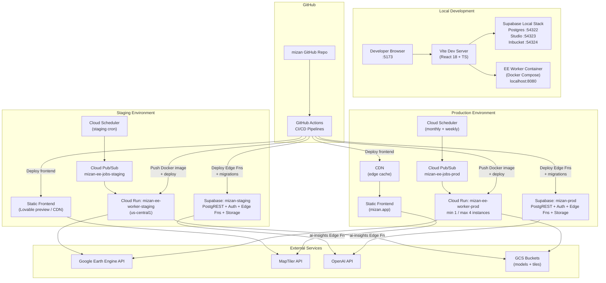

# 18 — Deployment

| Field        | Value                                                                    |
|--------------|--------------------------------------------------------------------------|
| Document     | 18-deployment.md                                                         |
| Project      | MIZAN — Earth Observation Environmental Intelligence for Jordan           |
| Version      | 0.1 (Draft)                                                              |
| Status       | Phase 1 — Specification                                                  |
| Last updated | 2026-06-10                                                               |
| Related      | [03-system-architecture](03-system-architecture.md) · [05-earth-engine-pipelines](05-earth-engine-pipelines.md) · [11-database-schema](11-database-schema.md) · [12-api-specification](12-api-specification.md) · [17-security](17-security.md) |

---

## Purpose

This document specifies the complete deployment architecture for MIZAN across three environments
(local, staging, production), the CI/CD pipeline, Docker configuration, environment variable
management, and a production-readiness preview for Phase 3. Any engineer should be able to
reproduce a running MIZAN stack from this document alone.

**Deliverables mapping:** Functional Prototype · AI/Analytics Method · Jordanian Use Case

---

## 1. Environments

MIZAN operates in three environments with strict promotion gates between them.

| Attribute | Local | Staging | Production |
|-----------|-------|---------|-----------|
| Purpose | Developer inner loop; local debugging | Integration testing; demo; stakeholder preview | Live product |
| Supabase | Supabase CLI local stack (Docker) | Dedicated Supabase project (`mizan-staging`) | Dedicated Supabase project (`mizan-prod`) |
| EE Worker | Docker Compose local container | Cloud Run (staging service) | Cloud Run (prod service) |
| Frontend | Vite dev server (`localhost:5173`) | Lovable preview / static hosting (staging URL) | Lovable / static hosting (production URL) |
| GEE project | `mizan-ee-dev` (dev SA) | `mizan-ee-staging` | `mizan-ee-prod` |
| Database | Supabase local (`localhost:54322`) | Supabase `mizan-staging` project | Supabase `mizan-prod` project |
| Secrets | `.env.local` (never committed) | GitHub Actions → Cloud Run / Supabase Vault | GitHub Actions → Cloud Run / Supabase Vault |
| Data | Synthetic + small real sample | Full Azraq Basin data, last 12 months | Full historical data (≥ 5 years) |
| Promotion gate | Manual (developer) | CI green; code review; migration check | Staging sign-off; stakeholder validation |

---

## 2. Topology Diagram



---

## 3. Frontend Deployment

### 3.1 Build

The frontend is a Vite + React 18 + TypeScript + Tailwind application.

```bash
# Build command
npm run build
# Output: dist/
# Vite config: vite.config.ts
```

**Vite build config (illustrative):**

```typescript
// vite.config.ts
import { defineConfig } from "vite";
import react from "@vitejs/plugin-react";
import path from "path";

export default defineConfig({
  plugins: [react()],
  resolve: {
    alias: { "@": path.resolve(__dirname, "./src") },
  },
  build: {
    sourcemap: false,           // Disabled in production; enabled in staging
    rollupOptions: {
      output: {
        manualChunks: {
          maplibre: ["maplibre-gl"],
          vendor:   ["react", "react-dom", "@tanstack/react-query"],
        },
      },
    },
  },
  define: {
    // Only VITE_* env vars are embedded at build time — no secrets
    __APP_VERSION__: JSON.stringify(process.env.npm_package_version),
  },
});
```

### 3.2 Lovable / Static Hosting

MIZAN's frontend is designed to be Lovable-compatible (deployable from the Lovable platform as a
static site). It is also deployable to any static hosting provider (Cloudflare Pages, Vercel, or
a custom nginx/Apache container).

**Lovable deployment notes:**
- Connect the GitHub repository in the Lovable dashboard.
- Set all `VITE_*` environment variables in the Lovable project settings.
- The build command is `npm run build`; the publish directory is `dist`.
- Custom domain (`mizan.app`) is configured in the Lovable/hosting DNS settings.

**Required `_headers` file for CDN security headers (Cloudflare Pages / Netlify):**

```
/*
  Strict-Transport-Security: max-age=63072000; includeSubDomains; preload
  X-Content-Type-Options: nosniff
  X-Frame-Options: DENY
  Referrer-Policy: strict-origin-when-cross-origin
  Permissions-Policy: geolocation=(), camera=(), microphone=()
  Content-Security-Policy: default-src 'self'; script-src 'self'; style-src 'self' 'unsafe-inline'; img-src 'self' data: blob: https://*.maptiler.com; connect-src 'self' https://*.supabase.co wss://*.supabase.co https://api.maptiler.com; worker-src blob:; frame-ancestors 'none'
```

**SPA routing — `_redirects`:**

```
/*    /index.html    200
```

---

## 4. Supabase Project Setup

### 4.1 Project Initialisation

```bash
# Install Supabase CLI
npm install -g supabase

# Initialise project (run once in repo root)
supabase init

# Link to remote projects
supabase link --project-ref <STAGING_REF>  --password <STAGING_DB_PASS>
supabase link --project-ref <PROD_REF>     --password <PROD_DB_PASS>
```

### 4.2 Database (PostgreSQL 15 + PostGIS 3.4)

PostGIS is enabled via a migration:

```sql
-- supabase/migrations/0001_enable_postgis.sql
CREATE EXTENSION IF NOT EXISTS postgis  WITH SCHEMA extensions;
CREATE EXTENSION IF NOT EXISTS postgis_topology WITH SCHEMA extensions;
CREATE EXTENSION IF NOT EXISTS "uuid-ossp" WITH SCHEMA extensions;
CREATE EXTENSION IF NOT EXISTS pgcrypto  WITH SCHEMA extensions;
```

All subsequent migrations follow the naming convention:
`supabase/migrations/YYYYMMDDHHMMSS_<description>.sql`

### 4.3 Auth Configuration

In the Supabase dashboard (or via `config.toml`):

```toml
# supabase/config.toml (illustrative relevant sections)
[auth]
site_url = "https://mizan.app"
additional_redirect_urls = ["https://staging.mizan.app", "http://localhost:5173"]
jwt_expiry = 3600             # 1 hour access token
enable_signup = true
enable_anonymous_sign_ins = false

[auth.email]
enable_signup = true
double_confirm_changes = true
enable_confirmations = true
```

A database trigger syncs `auth.users` → `public.profiles` on new user creation:

```sql
-- supabase/migrations/0002_profiles_sync_trigger.sql
CREATE OR REPLACE FUNCTION public.handle_new_user()
RETURNS TRIGGER AS $$
BEGIN
  INSERT INTO public.profiles (id, role, display_name)
  VALUES (NEW.id, 'viewer', COALESCE(NEW.raw_user_meta_data->>'display_name', ''));
  RETURN NEW;
END;
$$ LANGUAGE plpgsql SECURITY DEFINER;

CREATE TRIGGER on_auth_user_created
  AFTER INSERT ON auth.users
  FOR EACH ROW EXECUTE FUNCTION public.handle_new_user();
```

### 4.4 Storage Buckets

```sql
-- supabase/migrations/0003_storage_buckets.sql
-- Created via Supabase Storage API or SQL helper

INSERT INTO storage.buckets (id, name, public, file_size_limit, allowed_mime_types)
VALUES
  ('report-exports',  'report-exports',  false, 52428800,  -- 50 MB
   ARRAY['application/pdf', 'text/markdown', 'application/json']),
  ('tile-cache',      'tile-cache',       true,  10485760,  -- 10 MB
   ARRAY['image/png', 'image/webp', 'application/x-protobuf']),
  ('model-artifacts', 'model-artifacts',  false, 524288000, -- 500 MB
   ARRAY['application/octet-stream', 'application/zip']);
```

Storage RLS policies:

```sql
-- report-exports: owner can read; service role can write
CREATE POLICY "report_exports_select_owner"
  ON storage.objects FOR SELECT TO authenticated
  USING (bucket_id = 'report-exports' AND auth.uid()::text = (storage.foldername(name))[1]);

CREATE POLICY "report_exports_insert_service"
  ON storage.objects FOR INSERT TO service_role
  WITH CHECK (bucket_id = 'report-exports');

-- tile-cache: public read
CREATE POLICY "tile_cache_select_public"
  ON storage.objects FOR SELECT TO anon
  USING (bucket_id = 'tile-cache');
```

### 4.5 Edge Functions Deployment

```bash
# Deploy all Edge Functions
supabase functions deploy --project-ref <PROJECT_REF>

# Deploy a single function
supabase functions deploy ee-compute --project-ref <PROJECT_REF>

# Set secrets (never in source control)
supabase secrets set \
  OPENAI_API_KEY=<value> \
  SUPABASE_SERVICE_ROLE_KEY=<value> \
  EE_WORKER_URL=<value> \
  --project-ref <PROJECT_REF>
```

Edge functions are located in:

```
supabase/functions/
├── _shared/
│   ├── cors.ts
│   ├── auth.ts
│   ├── rateLimit.ts
│   └── validation.ts
├── ai-insights/index.ts
├── alerts/index.ts
├── confidence/index.ts
├── ee-compute/index.ts
├── report-generate/index.ts
├── risk-score/index.ts
├── scenario-run/index.ts
└── tiles/index.ts
```

### 4.6 Database Migrations

Migrations are applied in sequence via the CI/CD pipeline:

```bash
# Apply pending migrations to staging
supabase db push --project-ref <STAGING_REF>

# Apply pending migrations to production (after staging validation)
supabase db push --project-ref <PROD_REF>
```

The migration workflow is:
1. Developer creates `supabase/migrations/<timestamp>_<description>.sql`.
2. CI runs `supabase db diff --local` to verify no untracked schema changes exist.
3. On merge to `main`, migrations are applied to staging automatically.
4. After staging sign-off, a manual approval step applies migrations to production.

---

## 5. EE Worker on Cloud Run

### 5.1 Dockerfile

```dockerfile
# EE Worker Dockerfile
# Located at: ee-worker/Dockerfile

FROM python:3.11.9-slim@sha256:<pinned-digest>

# Security: run as non-root user
RUN groupadd --gid 1001 appgroup && \
    useradd --uid 1001 --gid appgroup --no-create-home appuser

WORKDIR /app

# Install system dependencies required by GDAL/rasterio
RUN apt-get update && apt-get install -y --no-install-recommends \
    libgdal-dev \
    libgeos-dev \
    curl \
    && rm -rf /var/lib/apt/lists/*

# Install Python dependencies from pinned requirements
COPY requirements.txt .
RUN pip install --no-cache-dir -r requirements.txt

# Copy application source (no credential files)
COPY src/ ./src/
COPY scripts/ ./scripts/
COPY tests/ ./tests/

# GEE service account JSON is mounted at runtime via Secret Manager
# NEVER baked into image
ENV GEE_SA_JSON_PATH=/secrets/gee-sa.json

USER appuser

EXPOSE 8080

# Health check endpoint
HEALTHCHECK --interval=30s --timeout=10s --start-period=60s --retries=3 \
  CMD curl -f http://localhost:8080/healthz || exit 1

CMD ["python", "-m", "uvicorn", "src.main:app", "--host", "0.0.0.0", "--port", "8080"]
```

**`requirements.txt` (illustrative — pinned versions):**

```
earthengine-api==0.1.388
google-auth==2.29.0
google-cloud-storage==2.16.0
google-cloud-pubsub==2.21.1
google-cloud-secret-manager==2.20.0
scikit-learn==1.4.2
xgboost==2.0.3
shap==0.45.0
pandas==2.2.2
numpy==1.26.4
psycopg2-binary==2.9.9
sqlalchemy==2.0.29
fastapi==0.111.0
uvicorn==0.29.0
httpx==0.27.0
pydantic==2.7.1
rasterio==1.3.10
pyproj==3.6.1
```

### 5.2 GEE Service Account Authentication

```python
# src/auth.py — GEE authentication
import os
import json
import ee
from google.oauth2.service_account import Credentials

def authenticate_gee():
    """
    Authenticate to Google Earth Engine using service account credentials.
    Credentials are loaded from Secret Manager (mounted as env var at Cloud Run runtime).
    Never from a file baked into the Docker image.
    """
    sa_json = os.environ.get("GEE_SA_JSON")
    if not sa_json:
        raise EnvironmentError(
            "GEE_SA_JSON environment variable not set. "
            "Ensure the Cloud Run service is configured with the Secret Manager secret."
        )
    sa_info = json.loads(sa_json)
    credentials = Credentials.from_service_account_info(
        sa_info,
        scopes=["https://www.googleapis.com/auth/earthengine"]
    )
    ee.Initialize(
        credentials=credentials,
        project=os.environ["GEE_PROJECT_ID"],
        opt_url="https://earthengine.googleapis.com"
    )
```

### 5.3 Cloud Run Deployment Configuration

```yaml
# Illustrative: Cloud Run service configuration (gcloud CLI equivalent)
# cloud-run/service-staging.yaml
apiVersion: serving.knative.dev/v1
kind: Service
metadata:
  name: mizan-ee-worker-staging
  namespace: mizan-gcp-project
spec:
  template:
    metadata:
      annotations:
        autoscaling.knative.dev/minScale: "0"    # Scale to zero in staging
        autoscaling.knative.dev/maxScale: "2"
        run.googleapis.com/execution-environment: gen2
    spec:
      serviceAccountName: mizan-ee-worker-sa@mizan-gcp-project.iam.gserviceaccount.com
      timeoutSeconds: 3600         # Long-running EE jobs
      containers:
      - image: us-central1-docker.pkg.dev/mizan-gcp-project/mizan-workers/ee-worker:staging
        resources:
          limits:
            cpu:    "2"
            memory: "4Gi"
        env:
        - name: ENVIRONMENT
          value: staging
        - name: GEE_PROJECT_ID
          value: mizan-ee-staging
        - name: SUPABASE_URL
          valueFrom:
            secretKeyRef:
              name: mizan-supabase-url-staging
              key: latest
        - name: SUPABASE_SERVICE_ROLE_KEY
          valueFrom:
            secretKeyRef:
              name: mizan-service-role-key-staging
              key: latest
        - name: GEE_SA_JSON
          valueFrom:
            secretKeyRef:
              name: mizan-gee-sa-key-staging
              key: latest
        - name: DATABASE_URL
          valueFrom:
            secretKeyRef:
              name: mizan-database-url-staging
              key: latest
```

### 5.4 Cloud Scheduler and Pub/Sub Triggers

**Monthly full pipeline run** (1st of each month, 02:00 UTC):

```yaml
# Illustrative: Cloud Scheduler job
name: mizan-monthly-indicators-prod
schedule: "0 2 1 * *"
timeZone: "UTC"
pubsubTarget:
  topicName: projects/mizan-gcp-project/topics/mizan-ee-jobs-prod
  data: |
    {
      "job_type": "full_pipeline",
      "indicators": ["all"],
      "aoi": "azraq_basin",
      "period": "last_month"
    }
```

**Weekly freshness check** (every Monday 03:00 UTC):

```yaml
name: mizan-weekly-freshness-prod
schedule: "0 3 * * 1"
timeZone: "UTC"
pubsubTarget:
  topicName: projects/mizan-gcp-project/topics/mizan-ee-jobs-prod
  data: |
    {
      "job_type": "freshness_check",
      "indicators": ["NDVI", "NDWI", "CHIRPS_PRECIP", "GRACE_TWS"]
    }
```

The EE Worker subscribes to the Pub/Sub topic via a push subscription that calls the Cloud Run
`/jobs/trigger` endpoint:

```python
# src/main.py — Pub/Sub push handler
from fastapi import FastAPI, Request, HTTPException
import json, base64

app = FastAPI()

@app.post("/jobs/trigger")
async def trigger_job(request: Request):
    """Receives Pub/Sub push messages and dispatches pipeline jobs."""
    body = await request.json()
    try:
        pubsub_message = body["message"]
        data = json.loads(base64.b64decode(pubsub_message["data"]).decode("utf-8"))
    except (KeyError, ValueError) as e:
        raise HTTPException(status_code=400, detail=f"Invalid Pub/Sub message: {e}")

    job_type = data.get("job_type")
    if job_type == "full_pipeline":
        # Dispatch async task
        import asyncio
        asyncio.create_task(run_full_pipeline(data))
    elif job_type == "freshness_check":
        asyncio.create_task(run_freshness_check(data))
    else:
        raise HTTPException(status_code=400, detail=f"Unknown job_type: {job_type}")

    return {"status": "accepted"}

@app.get("/healthz")
def health_check():
    return {"status": "ok", "version": "1.0.0"}
```

---

## 6. Tile and Storage Buckets

### 6.1 GCS Bucket Structure

```
gs://mizan-models/
├── rf_crop_classifier/
│   ├── v1.0.0/rf_crop_classifier.joblib
│   └── v1.1.0/rf_crop_classifier.joblib
├── xgb_irrigation_detector/
│   └── v1.0.0/xgb_irrigation_detector.json
└── iforest_anomaly/
    └── v1.0.0/iforest_anomaly.joblib

gs://mizan-tiles/
├── ndvi/azraq/{z}/{x}/{y}.png
├── ndwi/azraq/{z}/{x}/{y}.png
└── stress_index/azraq/{z}/{x}/{y}.png

gs://mizan-data-snapshots/
└── {year}/{month}/snapshot_{run_id}.json.gz
```

Bucket IAM:
- `mizan-ee-worker-sa` has `storage.objectCreator` on `mizan-models` and `mizan-tiles`.
- `mizan-ee-worker-sa` has `storage.objectViewer` on `mizan-models` (for model loading).
- `allUsers` has `storage.objectViewer` on `mizan-tiles` only (public tile serving).
- `mizan-models` has object versioning enabled with a 90-day non-current retention policy.

### 6.2 MapTiler Configuration

MapTiler provides the base map style and raster tile CDN. Configuration:

- A **restricted API key** (`VITE_MAPTILER_KEY`) is created in the MapTiler console with:
  - HTTP referrer restriction: `https://mizan.app/*`, `https://staging.mizan.app/*`
  - API key is embedded in the frontend build (as `VITE_MAPTILER_KEY`); quota abuse is mitigated
    by referrer restriction.
- Custom MIZAN data layers (NDVI, stress index) are served from `mizan-tiles` GCS bucket, not
  from MapTiler, to avoid vendor dependency for scientific data layers.

```typescript
// Illustrative: MapLibre GL JS map initialisation
import maplibregl from "maplibre-gl";

const map = new maplibregl.Map({
  container: "map",
  style: `https://api.maptiler.com/maps/topo-v2/style.json?key=${import.meta.env.VITE_MAPTILER_KEY}`,
  center: [36.8, 31.9],    // Jordan centre
  zoom: 6,
});

// Add MIZAN NDVI layer from GCS (public tiles)
map.on("load", () => {
  map.addSource("ndvi-tiles", {
    type: "raster",
    tiles: [`${import.meta.env.VITE_TILE_BASE_URL}/ndvi/azraq/{z}/{x}/{y}.png`],
    tileSize: 256,
    attribution: "MIZAN · Copernicus/S2 · Google Earth Engine",
  });
  map.addLayer({
    id: "ndvi-layer",
    type: "raster",
    source: "ndvi-tiles",
    paint: { "raster-opacity": 0.7 },
  });
});
```

---

## 7. Docker Setup

### 7.1 Local Development with Docker Compose

The local stack runs Supabase's official Docker Compose setup alongside the EE Worker. A
`docker-compose.override.yml` adds the EE Worker container.

```yaml
# docker-compose.override.yml
# Extends Supabase local docker-compose.yml
version: "3.9"
services:
  ee-worker:
    build:
      context: ./ee-worker
      dockerfile: Dockerfile
    image: mizan-ee-worker:local
    container_name: mizan-ee-worker-local
    ports:
      - "8080:8080"
    environment:
      ENVIRONMENT: local
      GEE_PROJECT_ID: ${GEE_PROJECT_ID}
      GEE_SA_JSON: ${GEE_SA_JSON}           # From .env.local (never committed)
      SUPABASE_URL: http://kong:8000         # Internal Docker network
      SUPABASE_SERVICE_ROLE_KEY: ${SUPABASE_SERVICE_ROLE_KEY}
      DATABASE_URL: postgresql://postgres:${POSTGRES_PASSWORD}@db:5432/postgres
    depends_on:
      - db
      - kong
    networks:
      - supabase_network_mizan
    volumes:
      - ./ee-worker/src:/app/src:ro          # Hot-reload in dev

networks:
  supabase_network_mizan:
    external: true
    name: supabase_network_miazsa
```

**Starting the local stack:**

```bash
# 1. Start Supabase local stack
supabase start

# 2. Build and start EE Worker
docker-compose -f docker-compose.override.yml up --build

# 3. Apply migrations
supabase db push --local

# 4. Start frontend dev server
npm run dev
```

### 7.2 Local Supabase Stack Services

When `supabase start` runs, the following services are available locally:

| Service | URL | Purpose |
|---------|-----|---------|
| PostgREST API | `http://localhost:54321` | REST API |
| Supabase Studio | `http://localhost:54323` | DB admin UI |
| Inbucket (email) | `http://localhost:54324` | Auth email testing |
| PostgreSQL | `localhost:54322` | Direct DB connection |
| Edge Functions | `http://localhost:54321/functions/v1/` | Local function invocation |
| Storage API | `http://localhost:54321/storage/v1/` | Local storage |

---

## 8. CI/CD Pipeline (GitHub Actions)

### 8.1 Pipeline Overview

```
┌─────────────┐    ┌──────────────┐    ┌─────────────────┐    ┌──────────────┐
│ PR opened / │    │  CI Pipeline │    │ Merge to main   │    │ Manual       │
│ push to     │───▶│  (lint +     │───▶│ → Deploy to     │───▶│ approval →   │
│ feature/*   │    │  test + build│    │   staging        │    │ Deploy prod  │
└─────────────┘    └──────────────┘    └─────────────────┘    └──────────────┘
```

### 8.2 CI Pipeline — `.github/workflows/ci.yml`

```yaml
# .github/workflows/ci.yml
name: CI

on:
  push:
    branches: ["main", "develop", "feature/**"]
  pull_request:
    branches: ["main", "develop"]

permissions:
  contents: read

jobs:
  lint-and-typecheck:
    name: Lint & Type Check
    runs-on: ubuntu-latest
    steps:
      - uses: actions/checkout@v4

      - uses: actions/setup-node@v4
        with:
          node-version: "20"
          cache: "npm"

      - name: Install dependencies
        run: npm ci

      - name: ESLint
        run: npm run lint

      - name: TypeScript check
        run: npm run typecheck

      - name: Prettier check
        run: npm run format:check

  test-frontend:
    name: Frontend Tests
    runs-on: ubuntu-latest
    needs: lint-and-typecheck
    steps:
      - uses: actions/checkout@v4
      - uses: actions/setup-node@v4
        with:
          node-version: "20"
          cache: "npm"
      - run: npm ci
      - name: Unit tests (Vitest)
        run: npm run test:unit -- --coverage
      - name: Upload coverage
        uses: actions/upload-artifact@v4
        with:
          name: frontend-coverage
          path: coverage/

  test-edge-functions:
    name: Edge Function Tests
    runs-on: ubuntu-latest
    steps:
      - uses: actions/checkout@v4

      - uses: denoland/setup-deno@v1
        with:
          deno-version: "1.44.x"

      - name: Deno type check
        run: deno check supabase/functions/**/*.ts

      - name: Deno lint
        run: deno lint supabase/functions/

      - name: Edge Function unit tests
        run: deno test supabase/functions/__tests__/ --allow-net --allow-env

  test-ee-worker:
    name: EE Worker Tests
    runs-on: ubuntu-latest
    steps:
      - uses: actions/checkout@v4

      - uses: actions/setup-python@v5
        with:
          python-version: "3.11"
          cache: "pip"

      - name: Install dependencies
        run: pip install -r ee-worker/requirements.txt

      - name: pip-audit (security check)
        run: pip-audit -r ee-worker/requirements.txt

      - name: Unit tests (pytest)
        run: |
          cd ee-worker
          pytest tests/unit/ -v --tb=short -q

      - name: PM-ET0 FAO-56 benchmark test
        run: |
          cd ee-worker
          pytest tests/unit/test_pm_et0.py -v

      - name: Confidence formula test
        run: |
          cd ee-worker
          pytest tests/unit/test_confidence.py -v

  build-frontend:
    name: Build Frontend
    runs-on: ubuntu-latest
    needs: [test-frontend, test-edge-functions]
    steps:
      - uses: actions/checkout@v4
      - uses: actions/setup-node@v4
        with:
          node-version: "20"
          cache: "npm"
      - run: npm ci
      - name: Build
        env:
          VITE_SUPABASE_URL:    ${{ vars.VITE_SUPABASE_URL_STAGING }}
          VITE_SUPABASE_ANON_KEY: ${{ vars.VITE_SUPABASE_ANON_KEY_STAGING }}
          VITE_MAPTILER_KEY:    ${{ secrets.VITE_MAPTILER_KEY_STAGING }}
          VITE_TILE_BASE_URL:   ${{ vars.VITE_TILE_BASE_URL_STAGING }}
          VITE_APP_ENV:         staging
        run: npm run build
      - name: Upload build artifact
        uses: actions/upload-artifact@v4
        with:
          name: frontend-dist
          path: dist/

  build-ee-worker:
    name: Build EE Worker Docker Image
    runs-on: ubuntu-latest
    needs: test-ee-worker
    permissions:
      contents: read
      id-token: write    # For OIDC auth to GCP Artifact Registry
    steps:
      - uses: actions/checkout@v4

      - uses: google-github-actions/auth@v2
        with:
          workload_identity_provider: ${{ secrets.GCP_WORKLOAD_IDENTITY_PROVIDER }}
          service_account:            ${{ secrets.GCP_DEPLOY_SA_EMAIL }}

      - name: Configure Docker for Artifact Registry
        run: gcloud auth configure-docker us-central1-docker.pkg.dev

      - name: Build Docker image
        run: |
          docker build \
            -t us-central1-docker.pkg.dev/mizan-gcp-project/mizan-workers/ee-worker:${{ github.sha }} \
            -t us-central1-docker.pkg.dev/mizan-gcp-project/mizan-workers/ee-worker:latest-staging \
            ee-worker/

      - name: Push Docker image
        run: docker push --all-tags us-central1-docker.pkg.dev/mizan-gcp-project/mizan-workers/ee-worker
```

### 8.3 Deploy to Staging — `.github/workflows/deploy-staging.yml`

```yaml
# .github/workflows/deploy-staging.yml
name: Deploy to Staging

on:
  push:
    branches: ["main"]

permissions:
  contents: read
  id-token: write

jobs:
  deploy-db-migrations:
    name: Apply DB Migrations (Staging)
    runs-on: ubuntu-latest
    environment: staging
    steps:
      - uses: actions/checkout@v4
      - uses: supabase/setup-cli@v1
        with:
          version: latest
      - name: Link Supabase project
        run: supabase link --project-ref ${{ vars.SUPABASE_PROJECT_REF_STAGING }} --password ${{ secrets.SUPABASE_DB_PASSWORD_STAGING }}
      - name: Apply migrations
        run: supabase db push

  deploy-edge-functions:
    name: Deploy Edge Functions (Staging)
    runs-on: ubuntu-latest
    needs: deploy-db-migrations
    environment: staging
    steps:
      - uses: actions/checkout@v4
      - uses: supabase/setup-cli@v1
        with:
          version: latest
      - name: Deploy functions
        run: |
          supabase functions deploy \
            --project-ref ${{ vars.SUPABASE_PROJECT_REF_STAGING }}
      - name: Set secrets
        run: |
          supabase secrets set \
            OPENAI_API_KEY=${{ secrets.OPENAI_API_KEY }} \
            EE_WORKER_URL=${{ vars.EE_WORKER_URL_STAGING }} \
            --project-ref ${{ vars.SUPABASE_PROJECT_REF_STAGING }}

  deploy-ee-worker:
    name: Deploy EE Worker to Cloud Run (Staging)
    runs-on: ubuntu-latest
    needs: deploy-db-migrations
    environment: staging
    steps:
      - uses: google-github-actions/auth@v2
        with:
          workload_identity_provider: ${{ secrets.GCP_WORKLOAD_IDENTITY_PROVIDER }}
          service_account:            ${{ secrets.GCP_DEPLOY_SA_EMAIL }}
      - uses: google-github-actions/deploy-cloudrun@v2
        with:
          service:  mizan-ee-worker-staging
          region:   us-central1
          image:    us-central1-docker.pkg.dev/mizan-gcp-project/mizan-workers/ee-worker:${{ github.sha }}
          flags: |
            --set-secrets GEE_SA_JSON=mizan-gee-sa-key-staging:latest
            --set-secrets SUPABASE_SERVICE_ROLE_KEY=mizan-service-role-key-staging:latest
            --set-secrets DATABASE_URL=mizan-database-url-staging:latest
            --set-env-vars ENVIRONMENT=staging,GEE_PROJECT_ID=mizan-ee-staging

  deploy-frontend:
    name: Deploy Frontend (Staging)
    runs-on: ubuntu-latest
    needs: deploy-edge-functions
    environment: staging
    steps:
      - uses: actions/checkout@v4
      - uses: actions/setup-node@v4
        with:
          node-version: "20"
          cache: "npm"
      - run: npm ci
      - name: Build for staging
        env:
          VITE_SUPABASE_URL:       ${{ vars.VITE_SUPABASE_URL_STAGING }}
          VITE_SUPABASE_ANON_KEY:  ${{ vars.VITE_SUPABASE_ANON_KEY_STAGING }}
          VITE_MAPTILER_KEY:       ${{ secrets.VITE_MAPTILER_KEY_STAGING }}
          VITE_TILE_BASE_URL:      ${{ vars.VITE_TILE_BASE_URL_STAGING }}
          VITE_APP_ENV:            staging
        run: npm run build
      # Deploy to Lovable / Cloudflare Pages / Vercel (configure per platform)
      - name: Deploy to hosting
        run: echo "Deploy dist/ to staging hosting provider"

  e2e-tests:
    name: E2E Tests (Staging)
    runs-on: ubuntu-latest
    needs: [deploy-frontend, deploy-ee-worker]
    environment: staging
    steps:
      - uses: actions/checkout@v4
      - uses: actions/setup-node@v4
        with:
          node-version: "20"
          cache: "npm"
      - run: npm ci
      - name: Install Playwright
        run: npx playwright install --with-deps chromium
      - name: Run E2E tests
        env:
          PLAYWRIGHT_BASE_URL: ${{ vars.STAGING_URL }}
          TEST_USER_EMAIL:     ${{ secrets.E2E_TEST_USER_EMAIL }}
          TEST_USER_PASSWORD:  ${{ secrets.E2E_TEST_USER_PASSWORD }}
        run: npx playwright test e2e/
      - name: Upload Playwright report
        if: always()
        uses: actions/upload-artifact@v4
        with:
          name: playwright-report
          path: playwright-report/
```

### 8.4 Deploy to Production — `.github/workflows/deploy-production.yml`

```yaml
# .github/workflows/deploy-production.yml
name: Deploy to Production

on:
  workflow_dispatch:
    inputs:
      confirmed_sha:
        description: "SHA that was validated on staging"
        required: true

permissions:
  contents: read
  id-token: write

jobs:
  verify-staging-validated:
    name: Verify Staging E2E Passed
    runs-on: ubuntu-latest
    steps:
      - name: Check staging E2E workflow status
        run: |
          echo "Confirming SHA ${{ inputs.confirmed_sha }} was validated on staging"
          # In Phase 3: query GitHub API to verify the staging E2E run passed for this SHA

  deploy-db-migrations-prod:
    name: Apply DB Migrations (Production)
    runs-on: ubuntu-latest
    needs: verify-staging-validated
    environment: production       # Requires manual approval in GitHub environment settings
    steps:
      - uses: actions/checkout@v4
        with:
          ref: ${{ inputs.confirmed_sha }}
      - uses: supabase/setup-cli@v1
        with:
          version: latest
      - run: supabase link --project-ref ${{ vars.SUPABASE_PROJECT_REF_PROD }} --password ${{ secrets.SUPABASE_DB_PASSWORD_PROD }}
      - run: supabase db push

  deploy-edge-functions-prod:
    name: Deploy Edge Functions (Production)
    runs-on: ubuntu-latest
    needs: deploy-db-migrations-prod
    environment: production
    steps:
      - uses: actions/checkout@v4
        with:
          ref: ${{ inputs.confirmed_sha }}
      - uses: supabase/setup-cli@v1
      - run: supabase functions deploy --project-ref ${{ vars.SUPABASE_PROJECT_REF_PROD }}
      - run: supabase secrets set OPENAI_API_KEY=${{ secrets.OPENAI_API_KEY_PROD }} --project-ref ${{ vars.SUPABASE_PROJECT_REF_PROD }}

  deploy-ee-worker-prod:
    name: Deploy EE Worker (Production)
    runs-on: ubuntu-latest
    needs: deploy-db-migrations-prod
    environment: production
    steps:
      - uses: google-github-actions/auth@v2
        with:
          workload_identity_provider: ${{ secrets.GCP_WORKLOAD_IDENTITY_PROVIDER }}
          service_account:            ${{ secrets.GCP_DEPLOY_SA_EMAIL }}
      - uses: google-github-actions/deploy-cloudrun@v2
        with:
          service: mizan-ee-worker-prod
          region:  us-central1
          image:   us-central1-docker.pkg.dev/mizan-gcp-project/mizan-workers/ee-worker:${{ inputs.confirmed_sha }}
          flags: |
            --set-secrets GEE_SA_JSON=mizan-gee-sa-key-prod:latest
            --set-secrets SUPABASE_SERVICE_ROLE_KEY=mizan-service-role-key-prod:latest
            --set-secrets DATABASE_URL=mizan-database-url-prod:latest
            --set-env-vars ENVIRONMENT=production,GEE_PROJECT_ID=mizan-ee-prod
            --min-instances=1
            --max-instances=4

  deploy-frontend-prod:
    name: Deploy Frontend (Production)
    runs-on: ubuntu-latest
    needs: deploy-edge-functions-prod
    environment: production
    steps:
      - uses: actions/checkout@v4
        with:
          ref: ${{ inputs.confirmed_sha }}
      - uses: actions/setup-node@v4
        with:
          node-version: "20"
          cache: "npm"
      - run: npm ci
      - name: Build for production
        env:
          VITE_SUPABASE_URL:      ${{ vars.VITE_SUPABASE_URL_PROD }}
          VITE_SUPABASE_ANON_KEY: ${{ vars.VITE_SUPABASE_ANON_KEY_PROD }}
          VITE_MAPTILER_KEY:      ${{ secrets.VITE_MAPTILER_KEY_PROD }}
          VITE_TILE_BASE_URL:     ${{ vars.VITE_TILE_BASE_URL_PROD }}
          VITE_APP_ENV:           production
        run: npm run build
      - name: Deploy to production hosting
        run: echo "Deploy dist/ to production CDN/hosting"
```

### 8.5 Preview Deployments

Pull requests targeting `main` or `develop` automatically generate preview deployments:

- **Frontend** — Lovable PR previews (or Vercel/Cloudflare Pages preview URLs) are posted as
  GitHub PR comments.
- **Edge Functions** — Previews use the staging Supabase project with PR-specific function
  versions; Supabase Branching (Phase 3) will provide isolated DB branches per PR.
- **EE Worker** — PR builds push a Docker image tagged `pr-<number>` but do not deploy a Cloud
  Run instance in Phase 1 (too expensive). Integration tests run against mock GEE.

### 8.6 Release Strategy

- **Trunk-based development** — `main` is always deployable; feature branches are short-lived.
- **Semantic versioning** — Releases are tagged `vMAJOR.MINOR.PATCH`. Phase 1 = `v0.x.x`.
- **Release notes** — Generated automatically from conventional commit messages
  (`feat:`, `fix:`, `chore:`, `docs:`, `security:`).
- **Rollback** — Rolling back a Cloud Run service is instant via `gcloud run services update-traffic`.
  Rolling back a DB migration requires a down-migration script (every up-migration has a
  corresponding down-migration in `supabase/migrations/`).

---

## 9. Environment Variables — Complete `.env.example`

All variable names are listed below. No values are provided. Copy to `.env.local` for local
development and populate from the relevant secret store.

```dotenv
# ============================================================
# .env.example — MIZAN environment variable reference
# Copy to .env.local for local development.
# NEVER commit .env.local or any file containing real values.
# Server-only variables MUST NOT be prefixed VITE_
# ============================================================

# ---- CLIENT-SIDE VARIABLES (safe to expose in browser bundle) ----
# Supabase public URL (not secret)
VITE_SUPABASE_URL=

# Supabase anon/public key (not secret — safe to expose)
VITE_SUPABASE_ANON_KEY=

# MapTiler restricted API key (domain-restricted; low risk)
VITE_MAPTILER_KEY=

# Base URL for MIZAN tile assets (GCS public bucket or CDN)
VITE_TILE_BASE_URL=

# Application environment label shown in UI (local | staging | production)
VITE_APP_ENV=

# Application version string (injected by CI; can be set manually)
VITE_APP_VERSION=

# ---- SERVER-SIDE ONLY VARIABLES (NEVER expose to browser) ----
# Supabase service-role key — bypasses RLS; server-side only
SUPABASE_SERVICE_ROLE_KEY=

# PostgreSQL connection string for the EE Worker
DATABASE_URL=

# OpenAI API key — Edge Function only; never in client code
OPENAI_API_KEY=

# Google Earth Engine service account JSON (stringified) — EE Worker only
GEE_SA_JSON=

# GCP project ID for Google Earth Engine
GEE_PROJECT_ID=

# GCP project ID for infrastructure (Cloud Run, Pub/Sub, Scheduler)
GCP_PROJECT_ID=

# GCP region for Cloud Run deployment
GCP_REGION=

# Pub/Sub topic name for EE job triggers
PUBSUB_TOPIC_EE_JOBS=

# GCS bucket name for model artifacts
GCS_BUCKET_MODELS=

# GCS bucket name for generated tile assets
GCS_BUCKET_TILES=

# GCS bucket name for data snapshots (provenance archives)
GCS_BUCKET_SNAPSHOTS=

# ---- SUPABASE PROJECT REFERENCES (CI/CD use) ----
SUPABASE_PROJECT_REF_STAGING=
SUPABASE_PROJECT_REF_PROD=

SUPABASE_DB_PASSWORD_STAGING=
SUPABASE_DB_PASSWORD_PROD=

# ---- GCP WORKLOAD IDENTITY (GitHub Actions CI/CD) ----
GCP_WORKLOAD_IDENTITY_PROVIDER=
GCP_DEPLOY_SA_EMAIL=

# ---- LOCAL DEVELOPMENT ONLY ----
# Supabase local stack DB password (generated by supabase start)
POSTGRES_PASSWORD=

# JWT secret for local Supabase stack (generated by supabase start)
JWT_SECRET=

# ---- E2E TEST CREDENTIALS (CI/staging only) ----
E2E_TEST_USER_EMAIL=
E2E_TEST_USER_PASSWORD=
```

---

## 10. Production-Readiness (Phase 3 Preview)

This section documents the production-readiness requirements that will be implemented in Phase 3.
They are specified here so they are designed in from Phase 1, not retrofitted.

### 10.1 Caching Strategy

| Layer | Mechanism | TTL | Scope |
|-------|-----------|-----|-------|
| CDN (static assets) | CDN cache headers (`Cache-Control: public, max-age=31536000, immutable`) | 1 year | Hashed CSS/JS bundles |
| CDN (HTML) | `Cache-Control: no-cache` + ETag | Revalidation | `index.html` |
| Tile cache | CDN cache on `mizan-tiles` GCS + `Cache-Control: public, max-age=86400` | 24 hours | Raster tiles |
| PostgREST query cache | TanStack Query `staleTime` (client) + Supabase materialized views (server) | 5 min (client); 1 h (mat view) | Indicator summaries |
| Materialized views | `REFRESH MATERIALIZED VIEW CONCURRENTLY` triggered by EE Worker after data insert | Post-run | `basin_monthly_summary`, `model_drift_summary` |
| AI response cache | Edge Function in-memory LRU (per-worker instance) keyed by indicator hash | 15 min | `ai-insights` identical queries |

### 10.2 Logging

All application components write structured JSON logs:

```json
{
  "timestamp": "2026-06-10T02:15:03.241Z",
  "level": "info",
  "service": "ee-worker",
  "run_id": "run_20260610_gee_001",
  "indicator": "AZRAQ_NDVI",
  "aoi": "azraq_basin",
  "duration_ms": 12450,
  "pixel_count": 142803,
  "cloud_pct": 7.2,
  "message": "NDVI computation complete"
}
```

Log aggregation: Cloud Logging (GCP) for the EE Worker; Supabase built-in logs for Edge Functions
and PostgREST. Log forwarding to a Phase 3 SIEM (e.g., Grafana Loki) for cross-service correlation.

### 10.3 Monitoring and Alerting

| Signal | Tool | Alert Threshold |
|--------|------|----------------|
| EE Worker health (Cloud Run) | GCP Uptime Checks | Any 5-minute downtime |
| EE pipeline failure | Cloud Logging alert policy | Any `ERROR` log in `run_id` context |
| Supabase PostgREST error rate | Supabase metrics | > 1 % 5xx over 5 min |
| Edge Function invocation errors | Supabase logs | > 5 errors/min per function |
| Indicator freshness | Custom metric from `stale_indicators` view | Any stale primary indicator |
| GEE quota usage | GCP quota monitoring | > 80 % daily Earth Engine quota |
| OpenAI cost | OpenAI usage alerts | > 50 % monthly budget |
| DB disk usage | Supabase metrics | > 80 % allocated storage |
| Cloud Run cold-start rate | GCP metrics | > 20 % cold starts (min-instances=1 prevents this) |

Alerts are dispatched via PagerDuty (Phase 3) or email (Phase 2) to the operations team.

### 10.4 Error Handling

All Edge Functions follow a consistent error response contract:

```typescript
// Illustrative: standardised error response
type ErrorResponse = {
  error:      string;     // Human-readable message (no internal details)
  code:       string;     // Machine-readable code: VALIDATION_ERROR, RATE_LIMITED, etc.
  request_id: string;     // For correlation with server logs
};
```

HTTP status codes used:
- `400` — Invalid request (validation failure)
- `401` — Missing or invalid JWT
- `403` — Authenticated but insufficient role
- `404` — Resource not found
- `422` — Request valid but cannot be processed (e.g., no data for requested period)
- `429` — Rate limit exceeded (with `Retry-After`)
- `500` — Internal server error (details logged server-side only; generic message to client)
- `503` — Service temporarily unavailable (EE Worker down; GEE quota exceeded)

The React frontend handles all error codes via a global TanStack Query error boundary that displays
contextual error messages without revealing internal server details.

### 10.5 Performance Optimisation

| Optimisation | Implementation | Target |
|-------------|----------------|--------|
| Code splitting | Vite `manualChunks` (MapLibre separate chunk) | Initial JS bundle < 300 KB gzipped |
| Image lazy loading | `loading="lazy"` on all ``; intersection observer for map layers | LCP < 2.5 s |
| PostgREST query selectivity | `?select=` projection; no `SELECT *` | P95 API response < 500 ms |
| PostGIS spatial index | `CREATE INDEX ... USING GIST` on all geometry columns | Spatial query < 100 ms |
| Tile format | COG/PMTiles for efficient HTTP range requests | Tile load < 500 ms |
| Edge Function warm instances | Supabase `min-instances = 1` (Phase 3) | Cold start p99 < 2 s |
| React memoisation | `useMemo`/`useCallback` on heavy map layer calculations | No unnecessary re-renders |

### 10.6 Backups and Disaster Recovery

| Component | Backup Method | RTO | RPO |
|-----------|---------------|-----|-----|
| Supabase PostgreSQL | PITR (7 days); daily pg_dump to GCS | 4 hours | 1 hour |
| Supabase Storage | Daily rsync to secondary GCS bucket | 8 hours | 24 hours |
| Model artifacts (GCS) | Object versioning (90-day retention) | 1 hour | 0 (versioned) |
| GCS tile cache | Regeneratable from EE pipeline | 48 hours | Acceptable (regen) |
| GitHub repository | GitHub's distributed VCS | N/A | N/A |

DR runbook (Phase 3):
1. Declare incident; notify team via PagerDuty.
2. Assess: DB failure, Worker failure, or full-service outage.
3. For DB failure: restore from PITR to a new Supabase project; update `DATABASE_URL` in Cloud Run.
4. For Worker failure: Cloud Run rolls back automatically to last healthy revision.
5. For full outage: restore from GCS backup; re-deploy from last known-good Git SHA.
6. Post-incident review within 72 hours; update runbook.

### 10.7 Rate Limiting (Production Tightening)

Phase 3 tightens Phase 1 rate limits for production traffic:

| Endpoint | Anonymous | Viewer | Analyst | Admin |
|----------|-----------|--------|---------|-------|
| PostgREST reads | 100/hour | 500/hour | 2000/hour | Unlimited |
| `ee-compute` | Blocked | Blocked | 10/hour | 50/hour |
| `ai-insights` | Blocked | 10/hour | 60/hour | 200/hour |
| `tiles` | 500/hour | 2000/hour | 5000/hour | Unlimited |
| `report-generate` | Blocked | Blocked | 5/hour | 20/hour |

Rate-limit state is stored in Redis (Upstash) for cross-instance consistency in Phase 3.

### 10.8 Rollback Strategy

| Component | Rollback Method | Time to Rollback |
|-----------|----------------|-----------------|
| Frontend | Re-deploy previous `dist/` artifact from CI | < 5 minutes |
| Edge Functions | `supabase functions deploy` from previous commit SHA | < 5 minutes |
| DB migrations | Apply corresponding down-migration SQL | < 15 minutes |
| Cloud Run (EE Worker) | `gcloud run services update-traffic --to-revisions=<prev>=100` | < 2 minutes |
| Model artifacts | Update `models.artifact_path` to previous version in DB | < 5 minutes |

Every migration SQL file must include a `-- DOWN MIGRATION:` comment block with the reversing SQL,
reviewed at code review time before merge.

---

## 11. Deliverables Mapping

| AstroCode Deliverable | Deployment Specification Contribution |
|-----------------------|---------------------------------------|
| **Functional Prototype** | End-to-end CI/CD pipeline ensures a deployable, tested prototype; environment separation (local/staging/prod) demonstrates production maturity |
| **Data Explanation** | Supabase Storage configuration for reports; tile serving architecture for spatial data explanation |
| **AI/Analytics Method** | Cloud Run EE Worker deployment (GEE pipelines + ML); Edge Function deployment (AI proxy); Cloud Scheduler for automated pipeline runs |
| **Results Visualization** | Frontend build and CDN deployment; MapTiler configuration; tile bucket architecture |
| **Jordanian Use Case** | GEE project scoped to Jordan/Azraq; Supabase project holds Jordan-specific data; production deployment accessible to MWI/RSCN users |
| **Impact Statement** | Production-readiness section documents sustainability, monitoring, and DR — prerequisites for real-world impact |

---

*End of Document 18 — Deployment*
